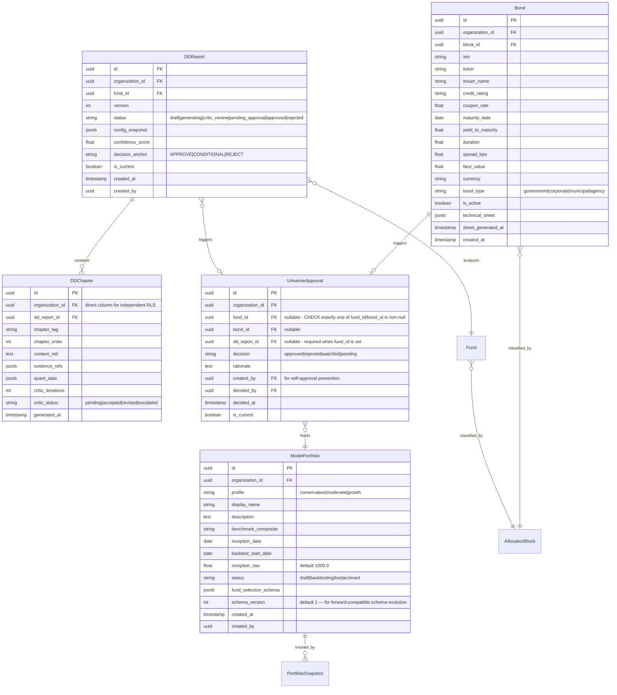

# feat: Wealth Vertical Complete Modularization

## Enhancement Summary

**Deepened on:** 2026-03-15
**Review agents used:** Architecture Strategist, Performance Oracle, Security Sentinel, Data Integrity Guardian, Code Simplicity Reviewer, Pattern Recognition Specialist, Best Practices Researcher, Deployment Verification Agent

### Critical Fixes Applied

1. **Migration numbering collision** — renamed from `0006` to `0007` (`0006_macro_reviews` already exists). Deploying a second `0006` would cause Alembic "multiple heads" error. (Data Integrity)
2. **DDChapter missing `organization_id`** — added direct column + RLS policy for independent tenant isolation. Join-based RLS through `dd_reports` is insufficient when `DDChapter` is queried directly. (Architecture + Security)
3. **Chapters reduced from 11 to 8** — removed ESG (no data provider), Peer Comparison (empty universe at launch), Liquidity Risk (folded into Risk Framework for `liquid_funds` vertical). Saves ~50% LLM calls per report. (Simplicity)
4. **Parallel chapter generation** — DAG pattern matching Credit's `asyncio.gather()` + `Semaphore`. Chapters 1-7 in parallel, chapter 8 (Recommendation) sequential after. Brings worst-case from ~275s to ~90s. (Performance — CRITICAL for <5min target)
5. **Critic extracted as sibling package** — `wealth/critic/` instead of nested in `dd_report/`. Mirrors Credit's `credit/critic/` exactly. Enables reuse by content production. (Pattern Recognition)
6. **UniverseApproval: separate nullable FKs** — replaced polymorphic `(asset_type, asset_id)` with `fund_id FK` + `bond_id FK` + CHECK(exactly one non-null). Preserves referential integrity + CASCADE. (Data Integrity)
7. **Partial unique indexes on `is_current`** — `CREATE UNIQUE INDEX ... WHERE is_current = true` on `dd_reports` and `universe_approvals`. Prevents application-level bugs from creating multiple "current" records. (Data Integrity)
8. **Security prerequisites added** — (a) Fix `PromptRegistry` to use `SandboxedEnvironment` (currently uses unsandboxed `Environment`). (b) Migrate all existing wealth routes from `get_db` to `get_db_with_rls` (5 routes bypass RLS). Both are pre-existing vulnerabilities. (Security — CRITICAL)
9. **SSE tenant scoping** — channel naming `wealth:dd:{org_id}:{report_id}`, verify ownership before subscription. (Security)
10. **Self-approval prevention** — enforce `decided_by != created_by` on governance endpoints. (Security)
11. **Phases compressed from 7 to 5** — merged Phase 1+2 (DD Report is one feature), collapsed Phase 6+7 into Phase 5 (Polish). Bond analysis deferred. (Simplicity)
12. **Bond analysis deferred** — `Bond` model kept in migration (zero cost), but `bond_analysis/` package, auto-approval flow, and bond API routes deferred until bond data provider exists. (Simplicity — YAGNI)
13. **Content production dissolved** — replaced 6-file package with standalone files. `investment_outlook.py` extends `macro_committee_engine.py`. `flash_report.py` and `manager_spotlight.py` are independent files. No `client_report.py` scaffold (YAGNI). (Simplicity)
14. **Feature flags for phased rollout** — `FEATURE_WEALTH_DD_REPORTS`, `FEATURE_WEALTH_UNIVERSE`, etc. Routes return 503 when flag disabled. Avoids all-or-nothing rollback. (Deployment)
15. **Brinson-Fachler with Carino linking** — upgraded from basic Brinson to Brinson-Fachler (relative benchmark adjustment) with Carino (1999) multi-period linking. Deferred to when benchmark data available. (Best Practices)
16. **Incremental live NAV** — daily worker stores previous NAV, fetches only latest day's returns. Full recomputation only on-demand. Reduces daily I/O from O(T×F×P) to O(F×P). (Performance)
17. **Per-chapter token budgets** — defined in `dd_report.yaml` calibration seed. ANALYTICAL chapters: 4000 tokens, DESCRIPTIVE: 2500. Passed as `max_tokens` to OpenAI API. 30s timeout per chapter. (Performance + Best Practices)
18. **Survivorship bias prevention** — `fetch_returns_matrix()` gets `include_inactive` parameter for bias-free backtests. (Best Practices)
19. **Chart rendering parallelism** — `ThreadPoolExecutor(max_workers=4)` for matplotlib charts. Cache shared charts between executive/institutional formats. (Performance)
20. **structlog migration** — existing scaffolds (`fund_analyzer.py`, `dd_report_engine.py`, `quant_analyzer.py`) migrated from `logging` to `structlog` in Phase 1. (Architecture + Pattern)
21. **Critic circuit breaker** — if total DD Report generation exceeds 3 minutes, remaining critic loops are aborted, chapters marked `critic_status: 'escalated'`, report persisted as-is for human review. Prevents indefinite SSE wait. (User feedback)
22. **fund_selection_schema versioning** — `schema_version: int` column on `ModelPortfolio`. `portfolio_builder` checks version and has migration path for old schemas. Prevents silent breakage when schema evolves. (User feedback)
23. **Prereq 0.2 is FIRST COMMIT** — RLS bypass in 5 wealth routes is an active production vulnerability, not a "nice to have" prerequisite. Must ship before any Phase 1 work. (User feedback — escalated priority)
24. **LiveNAV drift sentinel** — daily worker computes both incremental and spot-check full recompute. If delta exceeds 0.1% for any single day, triggers automatic full recompute + structlog alert. Catches retroactive NAV corrections in UCITS funds. (User feedback)

### Simplification Decisions

| Original | Changed To | Reason |
|---|---|---|
| 11 DD chapters | 8 chapters | ESG (no data), Peer Comparison (empty universe), Liquidity Risk (folded into Risk Framework) |
| 7 phases | 5 phases | Merge DD Report phases, collapse content+monitoring into Polish |
| `bond_analysis/` package | Deferred (Bond model kept) | No bond data provider, vertical is `liquid_funds` |
| `content_production/` package (6 files) | 3 standalone files | Over-packaged for 3 independent content types |
| `quant/` package (3 files) | Single `quant_analyzer.py` + functions in `quant_engine/` | Thin bridge doesn't justify a package |
| `attribution_service.py` in Phase 4 | Deferred | No benchmark constituent data available |
| `client_report.py` scaffold | Removed | YAGNI — requires client data models that don't exist |

## Overview

Build the complete Wealth Management analytical intelligence layer — covering the full investment lifecycle from Fund DD Reports through Asset Universe management, Model Portfolio construction with track-record, monitoring, fact-sheet generation, and proprietary content production.

The WM vertical has a mature operational/quant layer (12 DB models, 7 workers, 14 quant services) but **zero AI-powered analysis intelligence**. The DD Report Engine, Quant Analyzer, and Prompts are empty scaffolds. This plan transforms those scaffolds into a production system mirroring the Credit vertical's architecture (91 files, 13 packages).

**Key architectural decisions (see brainstorm):**
- Mirrored architecture to Credit vertical — each capability is an independent package
- Asset Universe is multi-class: Funds (full DD Report) + Bonds (deferred until data provider exists)
- DD Reports with 8 chapters + RAG + adversarial critic (reduced from 11 per simplicity review)
- Track-record = backtest + live forward + stress scenarios
- Fact-sheets in 2 formats: executive (2pg) + institutional (6pg)
- Content production: Investment Outlook, Flash Reports, Manager Spotlight
- 3 governance approval points
- Public APIs only for data (Lipper/LSEG future)
- Client Reports deferred (requires operational client data layer not yet built)

**Implementation note (2026-03-16):** Phases have sequential dependencies — Phase 2 depends on Phase 1 (UniverseApproval references DDReport), Phase 3 depends on Phase 2, etc. Execute phases sequentially. Within each phase, tasks with non-overlapping files can be parallelized (e.g., Task 1.1 + Task 1.2 in parallel, then Task 1.3+ sequentially). Do NOT parallelize across phases.

**Prerequisite:** Security prerequisites (0.1, 0.2, 0.3) must be completed before Phase 1. Prereq 0.2 (get_db → get_db_with_rls) is the absolute first commit.

## Problem Statement / Motivation

The Credit vertical is production-complete with deep analytical capabilities (IC memos, RAG retrieval, adversarial critic, knowledge graph, PDF generation). The Wealth vertical has operational infrastructure but cannot perform its core analytical function — evaluating funds, constructing model portfolios, and producing the fact-sheets that commercial teams need to demonstrate management quality to clients.

The addressable market for WM is potentially larger than Credit. Without analytical parity, the platform cannot serve wealth management clients.

## Proposed Solution

7 packages in `vertical_engines/wealth/`, new database models, domain layer extensions, calibration seeds, and profile expansion — delivered as a cohesive system across 5 implementation phases.

## Technical Approach

### Architecture

**4-layer architecture (proven pattern from Wealth Macro Intelligence Suite):**

```
Layer 4: Routes (async)           — API surface, triggers, downloads
    ↓ asyncio.to_thread()
Layer 3: vertical_engines/wealth/ — DD engine, portfolio builder, fact-sheet (sync)
    ↓ function calls
Layer 2: quant_engine/            — CVaR, scoring, drift, backtest, attribution (sync, pure)
    ↓ resolved at entry
Layer 1: ConfigService            — config from DB (async → passed as param to sync layers)
```

**Critical constraints (from CLAUDE.md + institutional learnings):**
- `BaseAnalyzer` methods accept sync `Session` — async callers use `asyncio.to_thread()`
- Config via `ConfigService.get()` only — never read YAML at runtime
- Prompts are Netz IP — `jinja2.SandboxedEnvironment`, never expose in API responses
- `@dataclass(frozen=True, slots=True)` for all result types crossing async/thread boundaries
- `lazy="raise"` on all ORM relationships, `expire_on_commit=False` always
- `structlog` everywhere (not stdlib logging)
- Never-raises contract on engines — return `status: 'NOT_ASSESSED'` on failure
- StorageClient for all file I/O (PDFs, reports)
- RLS subselect pattern `(SELECT current_setting(...))` on all new tables

### Database Model Changes (Migration 0008)

> **CRITICAL:** Migration `0006_macro_reviews` already exists AND migration `0007_governance_policy_seed` was added by the ai_engine cleanup plan (refactor/policy-loader-configservice). This migration MUST be `0008` with `down_revision = "0007"`. (Data Integrity Guardian finding — updated 2026-03-16)



**Additions to existing models:**
- `Fund`: add `approval_status` enum (`pending_dd`, `dd_complete`, `approved`, `rejected`, `watchlist`)
- `PortfolioSnapshot`: define `fund_selection` JSONB schema: `[{fund_id, block_id, weight, score}]`

### Security Prerequisites (before Phase 1)

> **CRITICAL pre-existing vulnerabilities** discovered by Security Sentinel. Must be fixed before any new wealth code ships.

##### Prereq 0.1: Fix PromptRegistry SandboxedEnvironment

**File:** MODIFY `backend/ai_engine/prompts/registry.py` (line 57)

The existing `PromptRegistry` uses `jinja2.Environment` (unsandboxed). All plan references to `SandboxedEnvironment` are aspirational — the actual code doesn't enforce it. Replace `Environment` with `SandboxedEnvironment` from `jinja2.sandbox`. Add unit test asserting the Environment type.

##### Prereq 0.2: Migrate Wealth Routes to get_db_with_rls — FIRST COMMIT

> **CRITICAL — ACTIVE PRODUCTION VULNERABILITY.** This is not a "nice to have" prerequisite. Any authenticated user can currently read any organization's funds, portfolios, allocations, and risk data. This must be the **first commit** of the project, before any Phase 1 work begins.

**Files:** MODIFY `backend/app/domains/wealth/routes/funds.py`, `portfolios.py`, `allocation.py`, `risk.py`, `analytics.py`

All 5 files import `get_db` instead of `get_db_with_rls`, completely bypassing tenant isolation. Replace all with `get_db_with_rls`. Only `macro.py` is correct.

##### Prereq 0.3: Migrate Scaffolds from logging to structlog

**Files:** MODIFY `backend/vertical_engines/wealth/fund_analyzer.py`, `dd_report_engine.py`, `quant_analyzer.py`

Replace `import logging` / `logging.getLogger(__name__)` with `structlog.get_logger()` to match Credit vertical conventions.

### Implementation Phases

---

#### Phase 1: DD Report Engine (merged original Phases 1+2)

**Goal:** Database models + DD Report engine producing real chapters with evidence injection + adversarial critic + confidence scoring + API routes. Ships a complete, usable feature.

**Depends on:** Security Prerequisites above. Pipeline LLM-Deterministic Alignment refactor Phase 1 (hybrid classifier) for document classification. DD Reports can start with manual document upload path while unified pipeline completes.

**Feature flag:** `FEATURE_WEALTH_DD_REPORTS` (routes return 503 when disabled)

##### Task 1.1: Database Migration (0007_wealth_analytical_models)

**Files:**
- CREATE `backend/app/core/db/migrations/versions/0008_wealth_analytical_models.py` (down_revision = "0007")

**Schema:**
- `dd_reports` table (DDReport model above)
- `dd_chapters` table (DDChapter model above)
- `bonds` table (Bond model above)
- `universe_approvals` table (UniverseApproval model above)
- `model_portfolios` table (ModelPortfolio model above)
- ALTER `funds_universe`: add `approval_status` column with CHECK constraint
- All tenant tables: RLS with `(SELECT current_setting('app.current_organization_id')::uuid)` subselect
- `dd_chapters` has direct `organization_id` column + own RLS policy (not join-based)
- `bonds` and `model_portfolios` have compound unique constraints
- `bonds` has `UNIQUE(organization_id, isin) WHERE isin IS NOT NULL`
- `dd_reports` has `UNIQUE(organization_id, fund_id) WHERE is_current = true` (partial unique index)
- `dd_reports` has `UNIQUE(organization_id, fund_id, version)` (version uniqueness)
- `universe_approvals` has `UNIQUE(organization_id, fund_id) WHERE is_current = true AND fund_id IS NOT NULL`
- `universe_approvals` has `CHECK((fund_id IS NOT NULL AND bond_id IS NULL) OR (fund_id IS NULL AND bond_id IS NOT NULL))`
- `universe_approvals` has `CHECK(fund_id IS NULL OR dd_report_id IS NOT NULL)` (fund approvals require DD Report)
- CHECK constraints on `dd_reports.status` and `universe_approvals.decision` enum values
- `Fund.approval_status` uses `server_default='pending_dd'` (avoids ACCESS EXCLUSIVE lock)
- Fix pre-existing bug: `PortfolioSnapshot` unique constraint must include `organization_id`

**Acceptance criteria:**
- [ ] `make migrate` succeeds
- [ ] Downgrade restores original state (drop order: dd_chapters → universe_approvals → dd_reports → bonds → model_portfolios → ALTER funds_universe)
- [ ] RLS uses subselect pattern on ALL new tables including `dd_chapters`
- [ ] `lazy="raise"` on all new relationships
- [ ] Partial unique indexes prevent multiple `is_current=true` records
- [ ] `alembic heads` returns exactly one head (0008)

##### Task 1.2: Domain Models + Schemas

**Files:**
- CREATE `backend/app/domains/wealth/models/dd_report.py` — DDReport, DDChapter SQLAlchemy models
- CREATE `backend/app/domains/wealth/models/bond.py` — Bond SQLAlchemy model
- CREATE `backend/app/domains/wealth/models/universe_approval.py` — UniverseApproval model
- CREATE `backend/app/domains/wealth/models/model_portfolio.py` — ModelPortfolio model
- MODIFY `backend/app/domains/wealth/models/fund.py` — add `approval_status` column
- MODIFY `backend/app/domains/wealth/models/__init__.py` — export new models
- CREATE `backend/app/domains/wealth/schemas/dd_report.py` — Pydantic schemas
- CREATE `backend/app/domains/wealth/schemas/bond.py` — Pydantic schemas
- CREATE `backend/app/domains/wealth/schemas/universe.py` — Pydantic schemas
- CREATE `backend/app/domains/wealth/schemas/model_portfolio.py` — Pydantic schemas

**Acceptance criteria:**
- [ ] All models use `OrganizationScopedMixin` (except global tables)
- [ ] All relationships have `lazy="raise"`
- [ ] All schemas use `model_validate()` pattern
- [ ] `make typecheck` passes

##### Task 1.3: DD Report Engine — Chapter Generation

**Files:**
- DELETE `backend/vertical_engines/wealth/dd_report_engine.py` (scaffold → replaced by package)
- CREATE `backend/vertical_engines/wealth/dd_report/__init__.py`
- CREATE `backend/vertical_engines/wealth/dd_report/dd_report_engine.py` — orchestrator
- CREATE `backend/vertical_engines/wealth/dd_report/chapters.py` — per-chapter LLM generation (named `chapters.py` per credit convention, not `chapter_engine.py`)
- CREATE `backend/vertical_engines/wealth/dd_report/evidence_pack.py` — frozen evidence surface (frozen dataclass, not dict like credit — intentional improvement)
- CREATE `backend/vertical_engines/wealth/dd_report/quant_injection.py` — bridge to quant_engine
- CREATE `backend/vertical_engines/wealth/dd_report/confidence_scoring.py` — deterministic scoring (merged from original Phase 2)
- CREATE `backend/vertical_engines/wealth/dd_report/models.py` — frozen dataclasses + `CallOpenAiFn` Protocol (shared with critic)

**Pattern (from credit `deep_review.py` 9-stage flow):**
1. Gather evidence corpus (fund documents via RAG + quant metrics via quant_engine)
2. Build frozen evidence pack (fund identity, strategy, performance, risk, fees, manager profile)
3. Quant injection: CVaR, Sharpe, Sortino, drawdown, scoring — from `quant_engine` services
4. **Parallel chapter generation (DAG pattern from Credit's `asyncio.gather()` + `Semaphore`):**
   - Phase A: chapters 1-7 in parallel (bounded by `_LLM_CONCURRENCY` semaphore, default 5)
   - Phase B: chapter 8 (Recommendation) sequential — synthesizes others, decision anchor is binding
   - Wall-clock: ~60-75s (3 concurrent batches) + ~20s (recommendation) = ~80-95s
5. Resume safety: skip cached chapters on re-run (check `DDChapter.content_md IS NOT NULL`)
6. Persist chapters atomically with `is_current` flag pattern + partial unique index
7. Compute confidence score (deterministic, no LLM)

**DD Report chapters (8 — reduced from 11 per simplicity review):**
1. Executive Summary (ANALYTICAL)
2. Investment Strategy & Process (DESCRIPTIVE)
3. Fund Manager Assessment (ANALYTICAL) — NEW: track record, team stability, AUM growth
4. Performance Analysis (ANALYTICAL)
5. Risk Management Framework (ANALYTICAL) — includes liquidity risk section for liquid funds
6. Fee Analysis (DESCRIPTIVE) — NEW: TER, performance fees, hidden costs
7. Operational Due Diligence (DESCRIPTIVE)
8. Recommendation (ANALYTICAL) — synthesis, decision anchor is binding

**Deferred chapters (add when data/universe exists):**
- Peer Comparison — requires populated universe with multiple funds per block
- ESG & Sustainability — requires commercial data provider (MSCI/Sustainalytics)

**Per-chapter token budgets (in `dd_report.yaml` calibration):**
- ANALYTICAL chapters: `max_tokens=4000`
- DESCRIPTIVE chapters: `max_tokens=2500`
- Executive Summary: `max_tokens=3000`
- Per-chapter timeout: 30 seconds

**Acceptance criteria:**
- [ ] DDReportEngine.generate() produces 8 chapters with real LLM content
- [ ] Chapters 1-7 generated in parallel (Semaphore-bounded), ch8 sequential
- [ ] Evidence pack is frozen dataclass before chapter generation
- [ ] Quant data injected from quant_engine services
- [ ] Resume safety: re-running skips completed chapters
- [ ] Per-chapter `max_tokens` passed to OpenAI API
- [ ] Never-raises contract: returns `status: 'NOT_ASSESSED'` on failure
- [ ] Confidence scoring produces 0-100 deterministic score
- [ ] Golden test captures output for one sample fund

##### Task 1.4: DD Report Prompts

**Files:**
- CREATE `backend/vertical_engines/wealth/prompts/__init__.py` — prompt registry
- CREATE `backend/vertical_engines/wealth/prompts/dd_chapters/executive_summary.j2`
- CREATE `backend/vertical_engines/wealth/prompts/dd_chapters/investment_strategy.j2`
- CREATE `backend/vertical_engines/wealth/prompts/dd_chapters/manager_assessment.j2`
- CREATE `backend/vertical_engines/wealth/prompts/dd_chapters/performance_analysis.j2`
- CREATE `backend/vertical_engines/wealth/prompts/dd_chapters/risk_framework.j2`
- CREATE `backend/vertical_engines/wealth/prompts/dd_chapters/fee_analysis.j2`
- CREATE `backend/vertical_engines/wealth/prompts/dd_chapters/operational_dd.j2`
- CREATE `backend/vertical_engines/wealth/prompts/dd_chapters/recommendation.j2`

**Pattern:** `jinja2.SandboxedEnvironment` (verified via Prereq 0.1), loaded via `prompt_registry.render("wealth/dd_chapters/{chapter_tag}.j2")`. Each template receives the filtered evidence pack + quant data for that chapter.

**Acceptance criteria:**
- [ ] All 8 templates render without error with sample evidence pack
- [ ] `SandboxedEnvironment` verified (unit test asserting type)
- [ ] Templates registered in prompt registry

##### Task 1.5: Calibration + Profile Seeds

**Files:**
- MODIFY `profiles/liquid_funds/profile.yaml` — expand from 7 to 8 chapters, add critic config
- CREATE `calibration/seeds/liquid_funds/calibration.yaml` — CVaR limits, portfolio profiles (externalize hardcoded defaults from `cvar_service.py`). **Schema-free: example seed only, all fields optional, any key/value can be added via VerticalConfigOverride without migrations.**
- CREATE `calibration/seeds/liquid_funds/scoring.yaml` — fund scoring weights (externalize from `scoring_service.py`). **Schema-free: example seed only.**
- CREATE `calibration/seeds/liquid_funds/dd_report.yaml` — chapter configs, critic thresholds, evidence requirements, per-chapter token budgets. **Schema-free: example seed only.**
- CREATE migration to seed these into `vertical_config_defaults` table

**Acceptance criteria:**
- [ ] `ConfigService.get("liquid_funds", "dd_report", org_id)` returns valid config
- [ ] Hardcoded fallbacks in `cvar_service.py` and `scoring_service.py` match seed values exactly
- [ ] Profile YAML has 8 chapter definitions with evidence requirements

##### Task 1.6: Critic Engine (sibling package — mirrors Credit's `credit/critic/`)

**Files:**
- CREATE `backend/vertical_engines/wealth/critic/__init__.py`
- CREATE `backend/vertical_engines/wealth/critic/service.py` — orchestrator (never-raises contract)
- CREATE `backend/vertical_engines/wealth/critic/models.py` — `CriticVerdict` frozen dataclass
- CREATE `backend/vertical_engines/wealth/critic/parser.py` — structured response parsing
- CREATE `backend/vertical_engines/wealth/critic/prompt_builder.py` — critic packet compression
- CREATE `backend/vertical_engines/wealth/prompts/critic/critic_prompt.j2`
- CREATE `backend/vertical_engines/wealth/prompts/critic/macro_consistency.j2`

> **Pattern note:** Extracted as sibling package (not nested in `dd_report/`) to mirror Credit's `credit/critic/` exactly and enable reuse by content production. (Pattern Recognition finding)

**Pattern (from credit `critic/service.py`):**
- `critique_dd_report()` — never-raises contract, returns `CriticVerdict`
- `CriticVerdict` frozen dataclass: `fatal_flaws`, `material_gaps`, `optimism_bias`, `data_quality_flags`, `confidence_score`, `overall_assessment`, `rewrite_required`
- Max 3 critic iterations per chapter (configurable via `dd_report.yaml`)
- Taxonomy: ACCEPT (passes) | REVISE (specific feedback, chapter regenerated) | ESCALATE (human review)
- **Circuit breaker:** if total DD Report wall-clock exceeds 3 minutes, abort remaining critic loops, mark chapters `critic_status: 'escalated'`, persist report as-is for human review. Publish `report_escalated` SSE event.
- Deterministic macro-consistency checks merged into verdict after LLM response
- `build_critic_packet()` compresses evidence for critic consumption
- LLM client injected via `CallOpenAiFn` Protocol (from `dd_report/models.py`)

**Acceptance criteria:**
- [ ] Critic produces structured verdict for sample DD Report
- [ ] Max iterations enforced (default 3)
- [ ] Circuit breaker triggers at 3-minute wall-clock and escalates remaining chapters
- [ ] ESCALATE status flags report for human review
- [ ] Never-raises contract respected
- [ ] Reusable by content production (no `dd_report/` imports in critic)

##### Task 1.7: DD Report API Routes

**Files:**
- CREATE `backend/app/domains/wealth/routes/dd_reports.py`
- MODIFY `backend/app/domains/wealth/routes/__init__.py` — register router

**Endpoints:**
- `POST /api/wealth/funds/{fund_id}/dd-reports` — trigger DD Report generation (async via `asyncio.to_thread`)
- `GET /api/wealth/funds/{fund_id}/dd-reports` — list reports for fund (with version history)
- `GET /api/wealth/dd-reports/{report_id}` — get full report with chapters
- `POST /api/wealth/dd-reports/{report_id}/regenerate` — force re-run with critic feedback
- `GET /api/wealth/dd-reports/{report_id}/stream` — SSE progress (chapter-by-chapter via Redis pub/sub)

**SSE pattern:** Publish to `wealth:dd:{organization_id}:{report_id}` channel (tenant-scoped). Verify actor's `organization_id` matches report's `organization_id` BEFORE subscribing. Events: `chapter_started`, `chapter_completed`, `critic_started`, `critic_verdict`, `report_completed`, `report_failed`.

**Acceptance criteria:**
- [ ] All endpoints use `response_model=` and `model_validate()`
- [ ] All routes use `get_db_with_rls` (NOT `get_db`)
- [ ] Generation runs via `asyncio.to_thread()` with `expire_on_commit=False` on sync session
- [ ] SSE stream provides real-time progress with tenant-scoped channels
- [ ] SSE endpoint verifies report ownership before subscription
- [ ] RLS enforced on all queries
- [ ] `make check` passes

---

#### Phase 2: Asset Universe (fund-only, bonds deferred)

**Goal:** Fund approval workflow with governance controls. Bond analysis deferred until data provider exists.

**Feature flag:** `FEATURE_WEALTH_UNIVERSE`

> **Simplification:** `bond_analysis/` package deferred. The `Bond` model exists in the migration (zero cost) but no engine, auto-approval flow, or bond API routes are built. Model portfolios start as fund-only. (Simplicity review)

##### Task 2.1: Asset Universe Service

**Files:**
- CREATE `backend/vertical_engines/wealth/asset_universe/__init__.py`
- CREATE `backend/vertical_engines/wealth/asset_universe/universe_service.py`
- CREATE `backend/vertical_engines/wealth/asset_universe/fund_approval.py`
- CREATE `backend/vertical_engines/wealth/asset_universe/models.py`

**Behavior:**
- `UniverseService.add_fund(fund_id, dd_report_id)` — creates pending UniverseApproval
- `UniverseService.approve_fund(approval_id, decision, rationale, decided_by)` — approves/rejects, updates Fund.approval_status. **Enforces `decided_by != created_by`** (self-approval prevention per Security finding). Uses `SELECT FOR UPDATE` on fund row.
- `UniverseService.list_universe(filters)` — approved funds classified by AllocationBlock (bonds added when data provider exists)
- `UniverseService.deactivate_asset(asset_type, asset_id)` — removes from universe, triggers rebalance evaluation

**Acceptance criteria:**
- [ ] Fund approval flow: DD Report → pending → approved/rejected
- [ ] Self-approval prevention enforced (`decided_by != created_by`)
- [ ] `SELECT FOR UPDATE` on fund row during approval (prevents concurrent state corruption)
- [ ] Deactivation triggers rebalance evaluation event
- [ ] Audit trail via UniverseApproval records with partial unique index on `is_current`

##### Task 2.2: Asset Universe API Routes

**Files:**
- CREATE `backend/app/domains/wealth/routes/universe.py`
- MODIFY `backend/app/domains/wealth/routes/__init__.py`

**Endpoints:**
- `GET /api/wealth/universe` — list all approved funds, filterable by block/geography/asset_class
- `POST /api/wealth/universe/funds/{fund_id}/approve` — approve fund for universe (requires IC role, self-approval blocked)
- `POST /api/wealth/universe/funds/{fund_id}/reject` — reject fund (requires IC role)
- `GET /api/wealth/universe/pending` — list pending approvals

**Acceptance criteria:**
- [ ] All endpoints use `response_model=`, `model_validate()`, and `get_db_with_rls`
- [ ] IC role required for approval/rejection
- [ ] Self-approval prevention: 403 if `decided_by == created_by`

---

#### Phase 3: Model Portfolio + Track-Record

**Goal:** Portfolio construction from universe assets, track-record computation (backtest + live + stress).

**Feature flag:** `FEATURE_WEALTH_MODEL_PORTFOLIOS`

##### Task 3.1: Model Portfolio Package

**Files:**
- CREATE `backend/vertical_engines/wealth/model_portfolio/__init__.py`
- CREATE `backend/vertical_engines/wealth/model_portfolio/portfolio_builder.py`
- CREATE `backend/vertical_engines/wealth/model_portfolio/track_record.py`
- CREATE `backend/vertical_engines/wealth/model_portfolio/stress_scenarios.py`
- CREATE `backend/vertical_engines/wealth/model_portfolio/models.py`

**Portfolio construction — fund selection algorithm:**
- Strategic allocation defines weights per AllocationBlock
- Within each block, select top N funds by `manager_score` (configurable, default 3)
- Funds weighted proportionally to score within block allocation
- `portfolio_builder.construct(db, profile, universe_assets, strategic_allocation, config) -> PortfolioComposition`
- Returns frozen `PortfolioComposition` with per-fund weights that sum to 1.0

**Track-record computation:**
- `track_record.compute_backtest(db, composition, lookback_days, config) -> BacktestResult` — uses `quant_engine/backtest_service.py` walk-forward CV
- `track_record.compute_live_nav(db, portfolio_id, as_of) -> LiveNAV` — **incremental**: daily worker stores previous NAV and fetches only latest day's returns. Full recomputation on-demand with `?recompute=true`. Formula: `NAV_t = NAV_{t-1} * (1 + sum(w_i * r_i_t))`. **Drift sentinel:** daily worker also spot-checks incremental NAV against full recompute for a random day. If delta exceeds 0.1%, triggers automatic full recompute + structlog alert. Catches retroactive NAV corrections in UCITS funds.
- `track_record.compute_stress(db, composition, scenarios, config) -> StressResult` — replays through historical crises. **Optimization**: fetch full returns matrix once (widest window 2007-10 to present), slice in memory per scenario (avoids 3 redundant DB round-trips)
- Minimum NAV history: 252 trading days (1 year). Funds with less history excluded from backtest period prior to their inception. Backtest inception capped at youngest fund's start date.

**Stress scenarios (from brainstorm):**
- 2008 GFC: 2007-10-01 to 2009-03-31
- 2020 COVID: 2020-02-15 to 2020-04-30
- 2022 Rate Hike: 2022-01-01 to 2022-12-31

**Acceptance criteria:**
- [ ] Portfolio construction produces valid weights summing to 1.0
- [ ] Score-weighted fund selection within blocks
- [ ] Backtest uses walk-forward CV from quant_engine
- [ ] Live NAV computes correctly from constituent returns
- [ ] Stress scenarios replay through historical windows
- [ ] Minimum history enforced
- [ ] All result types are frozen dataclasses

##### Task 3.2: Quant Analyzer Rewiring (single file, not package)

**Files:**
- MODIFY `backend/vertical_engines/wealth/quant_analyzer.py` — rewire scaffold to real quant_engine calls
- CREATE `backend/quant_engine/portfolio_metrics_service.py` — portfolio-level aggregation (generic, in quant_engine)
- CREATE `backend/quant_engine/peer_comparison_service.py` — fund peer group analysis (generic, in quant_engine)

> **Simplification:** Keep `quant_analyzer.py` as a single file bridge. Move `portfolio_metrics` and `peer_comparison` to `quant_engine/` where they are domain-agnostic and reusable across verticals. (Simplicity review)

**Quant analyzer wiring:**
- `QuantAnalyzer.analyze_portfolio()` calls: `cvar_service.compute_cvar_from_returns()`, `scoring_service.compute_fund_score()`, `drift_service.compute_drift()`, `regime_service.detect_regime()`
- `portfolio_metrics_service.aggregate()` computes portfolio-level Sharpe, Sortino, max drawdown, IR from constituent data
- `peer_comparison_service.compare()` ranks fund against peers — **batch query**: single `WHERE fund_id IN (...)` with `BETWEEN` for AUM filter. Add composite index on `funds_universe(block_id, is_active, approval_status)` in migration.

**Acceptance criteria:**
- [ ] QuantAnalyzer returns real metrics from quant_engine (not scaffold stubs)
- [ ] Portfolio metrics aggregate correctly
- [ ] Peer comparison uses batch query (no N+1)
- [ ] All results are frozen dataclasses

##### Task 3.3: Attribution Service (deferred — builds skeleton only)

> **Deferred implementation:** Brinson-Fachler with Carino multi-period linking requires benchmark constituent data that does not exist (no Bloomberg/Morningstar). Build the service skeleton with correct formulas but gate behind benchmark data availability. Institutional fact-sheet shows "Attribution requires benchmark data feed" placeholder until then. (Simplicity + Best Practices)

**Files:**
- CREATE `backend/quant_engine/attribution_service.py`

**Brinson-Fachler model (when data available):**
- `compute_attribution(portfolio_weights, benchmark_weights, portfolio_returns, benchmark_returns) -> AttributionResult`
- Allocation effect: `sum((w_p_i - w_b_i) * (r_b_i - R_b))` (Fachler adjustment using relative benchmark)
- Selection effect: `sum(w_b_i * (r_p_i - r_b_i))`
- Interaction effect: `sum((w_p_i - w_b_i) * (r_p_i - r_b_i))`
- Multi-period linking: Carino (1999) smoothing factors for correct compounding
- Numerical stability: `numpy.float64`, threshold `abs(w_diff) < 1e-6` → zero effect
- Pure sync, config as parameter

**Acceptance criteria:**
- [ ] Single-period attribution effects sum to total excess return (within 1e-4 tolerance)
- [ ] Carino linking preserves additivity across periods
- [ ] Pure function, no I/O
- [ ] Gracefully returns empty result when benchmark data unavailable

##### Task 3.4: Rebalance Execution Flow

**Files:**
- MODIFY `backend/app/domains/wealth/routes/portfolios.py` — add execution endpoint
- MODIFY `backend/app/domains/wealth/workers/drift_check.py` — trigger execution after approval

**Behavior:** After rebalance approval:
1. Re-run optimizer with current strategic + tactical weights
2. Apply fund selection algorithm from universe
3. Create new `PortfolioSnapshot` with updated `fund_selection` and weights
4. Record `RebalanceEvent` transition to `executed` status
5. Publish SSE alert: `rebalance_executed`

**Endpoint:** `POST /api/wealth/portfolios/{profile}/rebalance/{event_id}/execute`

**Acceptance criteria:**
- [ ] Execution only possible after approval status
- [ ] New snapshot created with optimizer output
- [ ] RebalanceEvent status transitions: proposed → approved → executed
- [ ] SSE notification on execution

##### Task 3.5: Model Portfolio API Routes

**Files:**
- CREATE `backend/app/domains/wealth/routes/model_portfolios.py`
- MODIFY `backend/app/domains/wealth/routes/__init__.py`

**Endpoints:**
- `POST /api/wealth/model-portfolios` — create model portfolio (IC role)
- `GET /api/wealth/model-portfolios` — list model portfolios
- `GET /api/wealth/model-portfolios/{id}` — get portfolio with composition
- `POST /api/wealth/model-portfolios/{id}/construct` — run fund selection from universe
- `GET /api/wealth/model-portfolios/{id}/track-record` — backtest + live + stress data
- `POST /api/wealth/model-portfolios/{id}/backtest` — trigger backtest computation
- `POST /api/wealth/model-portfolios/{id}/stress` — trigger stress scenarios

**Acceptance criteria:**
- [ ] All endpoints use `response_model=` and `model_validate()`
- [ ] IC role required for creation and construction
- [ ] Track-record endpoint returns all three components with clear delineation

---

#### Phase 4: Fact-Sheet PDF Generation

**Goal:** Two PDF formats for model portfolios — executive summary and institutional complete.

**Feature flag:** `FEATURE_WEALTH_FACT_SHEETS`

##### Task 4.1: Fact-Sheet Engine Package

**Files:**
- CREATE `backend/vertical_engines/wealth/fact_sheet/__init__.py`
- CREATE `backend/vertical_engines/wealth/fact_sheet/fact_sheet_engine.py` — orchestrator
- CREATE `backend/vertical_engines/wealth/fact_sheet/executive_renderer.py` — 1-2 page PDF
- CREATE `backend/vertical_engines/wealth/fact_sheet/institutional_renderer.py` — 4-6 page PDF
- CREATE `backend/vertical_engines/wealth/fact_sheet/chart_builder.py` — chart generation
- CREATE `backend/vertical_engines/wealth/fact_sheet/models.py` — FactSheetData dataclass

**PDF stack:** ReportLab (already used by credit PDFs via `ai_engine/pdf/pdf_base.py`). Reuse `pdf_base` building blocks: `create_netz_document()`, `build_netz_styles()`, `netz_header_footer()`, `build_institutional_table()`, `safe_text()`. Charts via matplotlib embedded as PNG at 150 DPI (300 DPI option for print).

**Chart rendering (Performance):** Render all charts in parallel using `ThreadPoolExecutor(max_workers=4)`. Cache shared charts between executive and institutional formats (NAV chart and regime overlay are identical). Use `constrained_layout=True` instead of `tight_layout()`. Use `rasterized=True` for dense time series (>1000 points).

**Executive Summary (1-2 pages):**
- Cover: portfolio name, profile, as-of date, Netz branding
- NAV chart vs composite benchmark (matplotlib line chart)
- Returns table: MTD, QTD, YTD, 1Y, 3Y, Since Inception (backtest marked with *)
- Allocation pie chart by AllocationBlock
- Top 10 holdings table
- Key risk metrics: Annualized Vol, Sharpe, MaxDD, CVaR 95%
- LLM-generated manager commentary (2-3 paragraphs)

**Institutional Complete (4-6 pages):**
- Everything from Executive plus:
- Attribution analysis table (Brinson decomposition by block)
- Regime overlay chart (current regime + historical)
- Stress scenario table (2008, COVID, 2022 drawdowns)
- Rebalance history timeline
- ESG placeholder section (populated when data available)
- Regulatory disclaimer footer

**Acceptance criteria:**
- [ ] Executive PDF renders correctly with all sections
- [ ] Institutional PDF renders correctly with all sections
- [ ] Backtest periods marked with asterisk (*) in returns table
- [ ] Charts render as high-quality embedded images
- [ ] Netz branding consistent with credit PDFs
- [ ] PDFs stored via StorageClient
- [ ] `make check` passes

##### Task 4.2: DD Report PDF Generation

**Files:**
- CREATE `backend/ai_engine/pdf/generate_dd_report_pdf.py`

**Pattern:** Same as `generate_deep_review_pdf.py` — loads DDReport + DDChapter from DB, renders markdown chapters via `memo_md_to_pdf`, uses `pdf_base` building blocks.

**Acceptance criteria:**
- [ ] DD Report PDF renders all 8 chapters
- [ ] Cover page with fund name, decision anchor badge, confidence score
- [ ] Netz institutional branding
- [ ] Stored via StorageClient

##### Task 4.3: Fact-Sheet Prompts

**Files:**
- CREATE `backend/vertical_engines/wealth/prompts/fact_sheet/manager_commentary.j2`
- CREATE `backend/vertical_engines/wealth/prompts/fact_sheet/outlook_snippet.j2`

**Acceptance criteria:**
- [ ] Commentary prompt receives portfolio metrics + regime context
- [ ] `SandboxedEnvironment` used

##### Task 4.4: Fact-Sheet API Routes + Worker

**Files:**
- CREATE `backend/app/domains/wealth/routes/fact_sheets.py`
- CREATE `backend/app/domains/wealth/workers/fact_sheet_gen.py`
- MODIFY `backend/app/domains/wealth/routes/__init__.py`

**Endpoints:**
- `POST /api/wealth/model-portfolios/{id}/fact-sheets` — trigger on-demand generation (exec or institutional)
- `GET /api/wealth/model-portfolios/{id}/fact-sheets` — list generated fact-sheets
- `GET /api/wealth/fact-sheets/{id}/download` — download PDF

**Worker:** Monthly scheduled generation for all active model portfolios. Uses PostgreSQL advisory lock to prevent concurrent runs.

**Acceptance criteria:**
- [ ] On-demand generation via API
- [ ] Scheduled monthly generation via worker
- [ ] PDF download endpoint serves correct content-type
- [ ] StorageClient for all PDF storage

---

#### Phase 5: Polish — Content Production + Monitoring + FundAnalyzer Rewiring

**Goal:** Proprietary content files (standalone, not package), monitoring hooks, FundAnalyzer rewiring. Cleanup phase.

**Feature flags:** `FEATURE_WEALTH_CONTENT`, `FEATURE_WEALTH_MONITORING`

##### Task 5.1: Content Production (standalone files, not package)

> **Simplification:** Dissolved `content_production/` package into standalone files. Each content type is independent with different triggers, cadences, and data sources. No `client_report.py` scaffold (YAGNI). (Simplicity review)

**Files:**
- CREATE `backend/vertical_engines/wealth/investment_outlook.py` — extends `macro_committee_engine.py` with LLM narrative
- CREATE `backend/vertical_engines/wealth/flash_report.py` — event-driven market flash reports
- CREATE `backend/vertical_engines/wealth/manager_spotlight.py` — deep-dive on single fund manager
- CREATE `backend/vertical_engines/wealth/prompts/content/investment_outlook.j2`
- CREATE `backend/vertical_engines/wealth/prompts/content/flash_report.j2`
- CREATE `backend/vertical_engines/wealth/prompts/content/manager_spotlight.j2`

**Investment Outlook (quarterly):** Extends `macro_committee_engine.py` structured data (WeeklyReportData) with LLM narrative. Sections: Global Macro Summary, Regional Outlook, Asset Class Views, Portfolio Positioning, Key Risks.

**Flash Report (event-driven):** Triggered manually or by regime change. 48h cooldown (reuse `check_emergency_cooldown`). **Must require human review before distribution** — download endpoint checks `status == 'approved'` before serving.

**Manager Spotlight:** Deep-dive using DD Report data + quant metrics + peer comparison.

**Content governance:** All content has `status` field (`draft` → `review` → `approved` → `published`). No auto-publish. IC approval required. Self-approval blocked.

##### Task 5.2: Content API Routes

**Files:**
- CREATE `backend/app/domains/wealth/routes/content.py`
- MODIFY `backend/app/domains/wealth/routes/__init__.py`

**Endpoints:**
- `POST /api/wealth/content/outlooks` — trigger Investment Outlook
- `POST /api/wealth/content/flash-reports` — trigger Flash Report
- `POST /api/wealth/content/spotlights` — trigger Manager Spotlight
- `GET /api/wealth/content` — list content with status
- `POST /api/wealth/content/{id}/approve` — approve (IC role, self-approval blocked)
- `GET /api/wealth/content/{id}/download` — download PDF (**checks `status >= approved` before serving**)

**Acceptance criteria:**
- [ ] All content types generate structured output + PDF
- [ ] Download endpoint returns 403 for draft/review content
- [ ] Approval workflow enforced
- [ ] Flash report cooldown enforced

##### Task 5.3: Monitoring Hooks

**Files:**
- CREATE `backend/vertical_engines/wealth/monitoring/__init__.py`
- CREATE `backend/vertical_engines/wealth/monitoring/alert_engine.py`
- CREATE `backend/vertical_engines/wealth/monitoring/drift_monitor.py`

**Alert engine:** Consumes existing worker events + adds DD Report expiry (>12 months since last DD), fund watchlist triggers, rebalance overdue. Publishes via Redis pub/sub.

**Drift monitor:** Bridge to existing `quant_engine/drift_service.py`. Adds universe-aware drift (deactivated fund → flag affected portfolios).

##### Task 5.4: FundAnalyzer Rewiring

**Files:**
- MODIFY `backend/vertical_engines/wealth/fund_analyzer.py` — rewire + structlog migration
- DELETE `backend/vertical_engines/wealth/dd_report_engine.py` (old scaffold, if not deleted in Phase 1)
- MODIFY `backend/vertical_engines/wealth/__init__.py` — update exports

**Rewire:**
- `run_deal_analysis()` → delegates to `dd_report.DDReportEngine.generate()`
- `run_portfolio_analysis()` → delegates to `quant_analyzer.analyze_portfolio()`
- Document `fund_id`/`deal_id` semantic mapping: `fund_id = org fund context`, `deal_id = target fund being evaluated`

**Acceptance criteria:**
- [ ] FundAnalyzer delegates to real implementations
- [ ] `ProfileLoader.get_engine_module("liquid_funds")` returns functional engine
- [ ] `make check` passes
- [ ] Integration test: full DD Report generation via FundAnalyzer interface

---

## System-Wide Impact

### Interaction Graph

```
Route handler (async)
  → asyncio.to_thread(FundAnalyzer.run_deal_analysis)
    → DDReportEngine.generate()
      → evidence_pack.build() → RAG retrieval (ai_engine) + quant_engine services
      → chapters.generate_chapter() × 8 (parallel DAG: 1-7 concurrent, 8 sequential)
      → critic.service.critique() → LLM call, max 3 iterations per flagged chapter
      → persist DDReport + DDChapter (sync Session)
    → Redis pub/sub → SSE stream to client
  → UniverseService.add_fund() → creates UniverseApproval (pending)

Worker (async, scheduled)
  → portfolio_eval.py → quant_engine services → PortfolioSnapshot
  → drift_check.py → quant_engine services → RebalanceEvent
  → fact_sheet_gen.py → fact_sheet_engine → PDF → StorageClient
```

### Error Propagation

- DDReportEngine: never-raises → returns `status: 'NOT_ASSESSED'`, logged via structlog
- Chapter failure: individual chapter marked `critic_status: 'escalated'`, report continues
- Quant engine failure: quant injection returns empty dict, chapter generated without quant data (degraded)
- PDF generation failure: logged, fact-sheet marked as failed, retry available
- Worker failure: PostgreSQL advisory lock prevents concurrent re-runs, next scheduled run retries

### State Lifecycle Risks

- **DDReport partial failure:** Resume safety via `DDChapter.content_md IS NOT NULL` check. Orphaned chapters cleaned up if report is regenerated.
- **PortfolioSnapshot → ModelPortfolio:** Snapshot references profile string, not ModelPortfolio FK. Renaming a profile would orphan snapshots. Mitigated by using CHECK constraint on profile values.
- **UniverseApproval `is_current` flag:** Multiple approvals for same asset. Only latest `is_current=True`. Concurrent approval race: use `SELECT FOR UPDATE` on fund row.

### API Surface Parity

New routes follow existing patterns in `routes/funds.py`, `routes/portfolios.py`. All use:
- `response_model=` on every endpoint
- `get_db_with_rls` for session
- `require_ic_member` decorator for governance endpoints
- Pydantic schemas with `model_validate()`

## Acceptance Criteria

### Functional Requirements

- [ ] DD Reports generate 8 chapters with real LLM content and evidence injection (parallel DAG)
- [ ] Adversarial critic challenges conclusions with max 3 iterations
- [ ] Asset Universe contains approved funds + auto-approved bonds
- [ ] Model Portfolios construct from universe with score-weighted fund selection
- [ ] Track-record shows backtest (marked), live NAV, and stress scenarios
- [ ] Fact-sheets render in 2 PDF formats (executive 2pg, institutional 6pg)
- [ ] Content production generates Investment Outlook, Flash Report, Manager Spotlight
- [ ] 3 governance approval points enforced
- [ ] All existing workers continue to function (no regression)

### Non-Functional Requirements

- [ ] DD Report generation completes in <3 minutes (8 chapters parallel + critic)
- [ ] Fact-sheet PDF generation completes in <30 seconds
- [ ] All new tables have RLS with subselect pattern
- [ ] All prompts use `SandboxedEnvironment`
- [ ] `make check` passes (lint + typecheck + test)

### Quality Gates

- [ ] Golden tests for DD Report output (one sample fund)
- [ ] Golden tests for fact-sheet data assembly
- [ ] Migration round-trip tested (upgrade + downgrade)
- [ ] Multi-agent code review (architecture, performance, security, data integrity)

## Dependencies & Prerequisites

1. **Security Prerequisites (Prereqs 0.1-0.3)** — Fix PromptRegistry SandboxedEnvironment, migrate wealth routes to `get_db_with_rls`, migrate scaffolds to structlog. **Must complete before Phase 1.**
2. **Pipeline LLM-Deterministic Alignment refactor** (separate branch) — Phase 1 (hybrid classifier) should complete before DD Report document ingestion is fully wired. DD Reports can start with manual document context while pipeline completes.
3. **Current migration head: `0006_macro_reviews`** — new migration is `0007` with `down_revision = "0006"`.
4. **Existing quant_engine services** — all implemented and tested. New additions: `attribution_service.py`, `portfolio_metrics_service.py`, `peer_comparison_service.py`.
5. **ReportLab + matplotlib** — already in dependencies (used by credit PDF generation).

## Risk Analysis & Mitigation

| Risk | Probability | Impact | Mitigation |
|---|---|---|---|
| DD Report quality insufficient for institutional clients | Medium | High | Iterative prompt refinement + golden tests + critic engine |
| LLM token costs exceed budget (8 chapters × critic iterations) | Medium | Medium | Per-chapter `max_tokens` in calibration, 30s timeout, configurable model tier |
| Backtest with insufficient fund history | High | Medium | Minimum 252-day requirement, clear "simulated" marking |
| ESG data unavailable from public APIs | High | Low | Placeholder chapter, populated when commercial data available |
| Pipeline refactor not complete when DD ingestion needed | Medium | Medium | Manual document context path as fallback |
| PDF rendering performance on large portfolios | Low | Medium | Chart caching, async generation via worker |

## Future Considerations

- **Client Reports** — requires operational client data models (client entity, portfolio-client mapping, cash flows). No scaffold created (YAGNI) — implement when data layer exists.
- **Bond Analysis** — `Bond` model exists in migration. Build `bond_analysis/` package when bond data provider is available. Auto-approval flow designed but not implemented.
- **Peer Comparison DD Chapter** — add when Asset Universe has enough funds per AllocationBlock for meaningful comparison.
- **ESG DD Chapter** — add when commercial ESG data provider contracted (MSCI/Sustainalytics).
- **Lipper/LSEG integration** — fund ratings data feed. `LipperRating` model already exists (empty). `lipper_service.py` in quant_engine ready.
- **Bloomberg/Morningstar** — commercial data enrichment. Engine architected for drop-in feeds.
- **Private markets expansion** — DevOps roadmap Phase 5. Would require new vertical engine or wealth sub-vertical.

## Sources & References

### Origin

- **Brainstorm document:** [docs/brainstorms/2026-03-15-wealth-vertical-complete-modularization-brainstorm.md](docs/brainstorms/2026-03-15-wealth-vertical-complete-modularization-brainstorm.md)
  - Key decisions: mirrored architecture, multi-class universe, expanded DD chapters, dual fact-sheet formats, backtest+live+stress track-record, 3 governance points, public APIs only, content production scope
  - Azure DevOps roadmap alignment validated (Phases 1, 2, 4 covered)

### Internal References

- Credit vertical reference: `backend/vertical_engines/credit/` (91 files, 13 packages)
- Credit deep review orchestrator: `backend/vertical_engines/credit/deep_review.py`
- Credit critic pattern: `backend/vertical_engines/credit/critic/service.py`
- Credit evidence pack: `backend/vertical_engines/credit/memo/evidence.py`
- Credit chapter generation: `backend/vertical_engines/credit/memo/chapters.py`
- BaseAnalyzer interface: `backend/vertical_engines/base/base_analyzer.py`
- PDF base module: `backend/ai_engine/pdf/pdf_base.py`
- ProfileLoader: `backend/ai_engine/profile_loader.py`
- Quant engine: `backend/quant_engine/` (14 services)
- Wealth domain: `backend/app/domains/wealth/` (models, routes, schemas, workers)

### Institutional Learnings Applied

- Wave 1 credit modularization: serial PR strategy, edgar-style DAG, golden tests
- Wealth Macro Intelligence Suite: 4-layer architecture, frozen dataclasses, 18-agent review bugs
- RLS subselect pattern: 1000x slowdown prevention
- Thread-safe rate limiting: threading.Lock on concurrent fetches
- Hybrid classifier: 3-layer (deterministic → TF-IDF → LLM) for document classification

### DevOps Roadmap Alignment

- Phase 1 > Manager DD Framework (ID:131) → `dd_report/` + `asset_universe/`
- Phase 1 > Strategic Model Portfolios Design (ID:132) → `model_portfolio/` + `quant/`
- Phase 2 > Data Infrastructure Setup (ID:135) → Global pipeline + quant_engine feeds
- Phase 2 > Analytical Toolkit (ID:136) → `monitoring/` + `dd_report/`
- Phase 2 > Proprietary Content Production (ID:137) → standalone content files (`investment_outlook.py`, `flash_report.py`, `manager_spotlight.py`)
- Phase 4 > Institutional Track Record (ID:143) → `model_portfolio/track_record.py`
- Phase 4 > Professional Client Reporting (ID:144) → `fact_sheet/`
