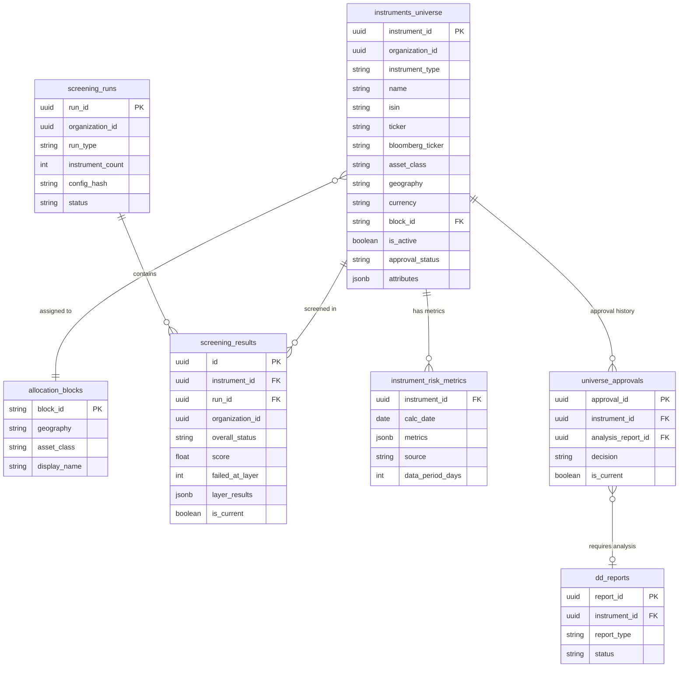

# feat: Wealth Instrument Screener Suite

## Enhancement Summary

**Deepened on:** 2026-03-16
**Research agents used:** 10 (JSONB patterns, yfinance, financial screening, Alembic migration, architecture strategist, performance oracle, security sentinel, data integrity guardian, data migration expert, code simplicity reviewer)

### Critical Changes (must apply before implementation)

1. **Split migration 0011 into 3 sequential migrations** (0011a create, 0011b data migrate, 0011c drop old) — 4 agents flagged single-migration risk
2. **Add `organization_id` + RLS to `instrument_screening_metrics`** — removing RLS is a tenant isolation regression (4 agents unanimous)
3. **Add `fetch_batch_history()` to provider protocol** — `yf.download()` batch is 30x faster (60min → 2min for 2000 instruments)
4. **CsvProvider is a separate import adapter, NOT `InstrumentDataProvider`** — Liskov violation
5. **Use hardcoded int `SCREENING_BATCH_LOCK_ID = 900_002`** — Python `hash()` is nondeterministic across processes
6. **21+ files reference `fund_id`** — plan's modification list is incomplete (full inventory below)
7. **TimescaleDB hypertables need explicit FK drop/recreate** — column rename alone insufficient

### High-Priority Improvements

8. **CSV formula injection defense** — sanitize cells starting with `=`, `+`, `-`, `@`
9. **Score normalization: percentile rank within peer group** (industry standard, not min-max)
10. **Watchlist hysteresis buffer** (+0.05 to prevent PASS/WATCHLIST oscillation)
11. **JSONB indexing: `jsonb_path_ops` GIN + partial expression B-tree indexes per type**
12. **CHECK constraints for required JSONB fields per type** (database-level enforcement)
13. **Move `quant_metrics.py` to `vertical_engines/wealth/shared_quant.py`** (Peer Group Engine also needs it)
14. **Move providers to `backend/app/services/providers/`** (matches existing infrastructure location)

### YAGNI Cuts for Sprint 1

15. **Remove OpenFIGI enricher** from Sprint 1 (add when users actually hit ISIN-only gap)
16. **Remove materialized count columns** from `screening_runs` (derive at read time)
17. **Remove name+type fuzzy dedup** from CSV (keep ISIN-only dedup)
18. **Remove JSONB FK rewrite from migration** (handle in app code with `fund_id`/`instrument_id` fallback)

### New Considerations Discovered

19. **MiFID II / SEC audit requirements** — immutable screening decisions with threshold snapshots, 7-year retention
20. **yfinance is NOT thread-safe** — global mutable `_DFS` dict; must use `yf.download(threads=True)` for batch, serialize `.info` calls
21. **Bond screening criteria** (Bloomberg standard): USD 300M+ outstanding, median-of-3 agency ratings, 1+ year remaining maturity
22. **Peer groups minimum 20 members** with hierarchical fallback (Morningstar/Lipper standard)
23. **JSONB migration: Decimal precision loss** — `aum_usd` Numeric(18,2) → JSONB float loses precision; use explicit `::text` cast
24. **`fund_selection_schema` is an array of objects** — needs `jsonb_agg()` element-level replacement, not `jsonb_set()`
25. **Batch worker: short transactions, batched commits of 200** — prevents 30-min connection pool starvation

---

## Overview

Build a deterministic multi-layer screening engine and supporting analytical engines that complete the wealth management investment funnel. The platform currently handles post-submission analysis (DD → Approval) but has zero pre-submission triage. This suite adds the missing top-of-funnel: automated screening of thousands of market instruments (funds, bonds, equities) down to a ranked candidate list before any human review.

Foundation: polymorphic `instruments_universe` data model replacing `funds_universe`, `YahooFinanceProvider` for market data, and `instrument_risk_metrics` for screening quant data.

## Problem Statement

1. **No screening funnel** — human ad-hoc judgment decides which instruments enter the DD pipeline. The system should automate this.
2. **Fund-only model** — `funds_universe` cannot represent bonds (sovereign, corporate, municipal) or equities (direct positions). Institutional WM needs all three.
3. **Approval assumes DD exists** — `UniverseApproval.dd_report_id` is NOT NULL, but bonds need a lighter Bond Brief (2 pages), not a full 8-chapter DD.
4. **Watchlist is static** — instruments in watchlist are never re-evaluated. No alerts on improvement or deterioration.
5. **Deactivation is a dead end** — `DeactivationResult.rebalance_needed` flag exists but triggers nothing.

## Proposed Solution

Six engines delivered across 5 sprints, built on a shared polymorphic data model:

| Sprint | Engine | Purpose |
|--------|--------|---------|
| 1 | **Screener Engine** + foundation | Deterministic 3-layer triage + instruments_universe + YahooFinanceProvider |
| 2 | **Peer Group Engine** | Auto peer identification + percentile ranking by instrument type |
| 3 | **Rebalancing Engine** | Impact analysis on removal/regime change, weight proposals within CVaR |
| 4 | **Watchlist Monitoring** | Periodic re-evaluation, transition alerts via SSE |
| 5 | **Mandate Fit + Fee Drag** | Client-specific eligibility + net fee impact calculator |

(See brainstorm: `docs/brainstorms/2026-03-16-wealth-instrument-screener-suite-brainstorm.md` for all key decisions D1-D8.)

## Technical Approach

### Architecture

```
vertical_engines/wealth/
  shared_quant.py             ← NEW (shared quant computation — used by screener, peer_group, rebalancing)
  screener/                   ← NEW (Sprint 1)
    service.py                  entry point: screen_universe(), screen_instrument()
    layer_evaluator.py          evaluates one layer against one instrument
    models.py                   CriterionResult, ScreeningResult
  peer_group/                 ← NEW (Sprint 2)
    service.py                  find_peers(), compute_rankings()
    peer_matcher.py             peer identification by type
    models.py                   PeerGroup, PeerRanking
  rebalancing/                ← NEW (Sprint 3)
    service.py                  compute_rebalance_impact(), propose_adjustments()
    impact_analyzer.py          what-if removal analysis
    weight_proposer.py          redistribution within CVaR constraints
    models.py                   RebalanceImpact, WeightProposal
  watchlist/                  ← NEW (Sprint 4)
    service.py                  monitor_watchlist(), evaluate_transitions()
    transition_detector.py      detects WATCHLIST → PASS or WATCHLIST → FAIL
    models.py                   WatchlistAlert, TransitionEvent
  mandate_fit/                ← NEW (Sprint 5)
    service.py                  compute_eligible_instruments()
    constraint_evaluator.py     client constraints vs instrument attributes
    models.py                   ClientProfile, MandateConstraints, EligibilityResult
  fee_drag/                   ← NEW (Sprint 5)
    service.py                  compute_fee_impact()
    models.py                   FeeDragResult, InstrumentFeeAnalysis

backend/app/
  domains/wealth/
    models/
      instrument.py           ← NEW (replaces fund.py)
      screening_result.py     ← NEW
    routes/
      instruments.py          ← NEW (replaces funds.py)
      screener.py             ← NEW
    schemas/
      instrument.py           ← NEW
      screening.py            ← NEW
    workers/
      ingestion.py            ← MODIFIED (instrument_id, multi-type)
      risk_calc.py            ← MODIFIED (instrument_id)
      screening_batch.py      ← NEW

  services/providers/          ← NEW (in existing services/ dir, matches storage_client.py location)
    protocol.py                 InstrumentDataProvider protocol (fetch_instrument, fetch_batch, fetch_batch_history)
    yahoo_finance_provider.py   YahooFinanceProvider (implements protocol)
    csv_import_adapter.py       CsvImportAdapter (separate from provider protocol — different concern)
```

### Implementation Phases

#### Phase 1A: Foundation — Data Model Migration (Migration 0011)

**Deliverables:** `instruments_universe` table, FK renames, `instrument_risk_metrics` table, `screening_results` table.

**Migration sequence — REVISED: Split into 3 sequential Alembic migrations:**

> **Research insight:** 4 review agents independently flagged single-migration risk. Split into additive → data migration → drop, with bake period between 0011b and 0011c.

### Migration 0011a — Additive (zero-risk, reversible)

```
PHASE A: Create instruments_universe table
  - UUID PK, organization_id (RLS), instrument_type, common fields, JSONB attributes
  - GIN index on attributes, partial index on (type, org, asset_class) WHERE is_active
  - RLS policy with (SELECT current_setting(...)) subselect

PHASE B: Data migration from funds_universe
  - INSERT INTO instruments_universe SELECT with jsonb_build_object() for attributes
  - Assert rowcount matches: SELECT COUNT(*) FROM funds_universe = SELECT COUNT(*) FROM instruments_universe WHERE instrument_type = 'fund'

PHASE C: Alter referencing tables
  - universe_approvals: rename fund_id → instrument_id, rename dd_report_id → analysis_report_id, DROP NOT NULL on analysis_report_id
  - dd_reports: rename fund_id → instrument_id, ADD report_type TEXT NOT NULL DEFAULT 'dd_report'
  - dd_chapters: update FK if needed (references dd_reports, not funds)
  - nav_timeseries: rename fund_id → instrument_id
  - fund_risk_metrics: rename fund_id → instrument_id, rename table → instrument_portfolio_metrics (or keep name, just rename column)
  - lipper_ratings: rename fund_id → instrument_id

PHASE D: Create new tables
  - instrument_risk_metrics (instrument_id, calc_date, metrics JSONB, source, data_period_days)
  - screening_results (instrument_id, run_id, run_type, layer_results JSONB, overall_status, score, config_hash, screened_at)
  - screening_runs (run_id, organization_id, run_type, instrument_count, started_at, completed_at, status)

PHASE E: Expand config_type CHECK constraint
  - Drop V4 constraint (from 0010), create V5 with all existing values + 'screening_layer1', 'screening_layer2', 'screening_layer3'

PHASE F: RLS on ALL new tables
  - screening_results: RLS on organization_id
  - screening_runs: RLS on organization_id
  - instrument_screening_metrics: RLS on organization_id (REVISED — 4 agents flagged removing RLS as tenant isolation regression)

PHASE G: Indexes
  - GIN with jsonb_path_ops on attributes (16% write overhead vs 79% for default jsonb_ops)
  - Partial expression B-tree indexes per type for hot screening paths
  - Partial unique index on screening_results (organization_id, instrument_id) WHERE is_current = TRUE
  - CHECK constraints for required JSONB fields per type using ?& operator
```

> **Research insight (JSONB indexing):** Use `jsonb_path_ops` GIN for containment queries (`@>`) + partial expression B-tree indexes for hot screening paths. At 2K-50K rows, expression indexes are faster for point lookups. GIN `jsonb_path_ops` is 20-30% of table size vs 60-80% for default `jsonb_ops`.

```sql
-- GIN for ad-hoc/flexible queries
CREATE INDEX idx_iu_attrs_gin ON instruments_universe USING gin (attributes jsonb_path_ops);

-- Partial expression indexes per type (screener hot paths)
CREATE INDEX idx_iu_fund_aum ON instruments_universe (((attributes->>'aum_usd')::numeric))
  WHERE instrument_type = 'fund' AND is_active;
CREATE INDEX idx_iu_bond_rating ON instruments_universe ((attributes->>'credit_rating_sp'))
  WHERE instrument_type = 'bond' AND is_active;
CREATE INDEX idx_iu_equity_mcap ON instruments_universe (((attributes->>'market_cap_usd')::numeric))
  WHERE instrument_type = 'equity' AND is_active;

-- CHECK constraints for required JSONB fields per type
ALTER TABLE instruments_universe ADD CONSTRAINT chk_fund_attrs
  CHECK (instrument_type != 'fund' OR (attributes ?& ARRAY['aum_usd', 'manager_name', 'inception_date']));
ALTER TABLE instruments_universe ADD CONSTRAINT chk_bond_attrs
  CHECK (instrument_type != 'bond' OR (attributes ?& ARRAY['maturity_date', 'coupon_rate_pct', 'issuer_name']));
ALTER TABLE instruments_universe ADD CONSTRAINT chk_equity_attrs
  CHECK (instrument_type != 'equity' OR (attributes ?& ARRAY['market_cap_usd', 'sector', 'exchange']));

-- Partial unique index for is_current invariant
CREATE UNIQUE INDEX uq_screening_results_current
  ON screening_results (organization_id, instrument_id) WHERE is_current = TRUE;
```

### Migration 0011b — Data Migration (DML-only, separate for safety)

```
PHASE A: Migrate fund data with explicit column mapping
  INSERT INTO instruments_universe SELECT with jsonb_build_object()
  - Strip NULLs with jsonb_strip_nulls() (sparse JSONB pattern)
  - Cast inception_date with to_char(inception_date, 'YYYY-MM-DD')
  - Cast aum_usd as text to preserve Decimal precision: 'aum_usd', aum_usd::text
  - COALESCE nullable NOT NULL targets: asset_class, geography, currency
  - Assert rowcount matches after INSERT

PHASE B: Rename FK columns across all tables
  For each table (nav_timeseries, fund_risk_metrics, lipper_ratings, dd_reports, universe_approvals):
    1. DROP FK constraint referencing funds_universe.fund_id
    2. RENAME COLUMN fund_id TO instrument_id
    3. ADD FK constraint referencing instruments_universe.instrument_id
  Note: TimescaleDB hypertables (nav_timeseries, fund_risk_metrics) handle column
  renames correctly but FKs must be explicitly dropped/recreated

PHASE C: Additional column changes
  - universe_approvals: RENAME dd_report_id TO analysis_report_id, DROP NOT NULL
  - dd_reports: ADD report_type TEXT NOT NULL DEFAULT 'dd_report'

PHASE D: JSONB FK references — DEFERRED
  - model_portfolios.fund_selection_schema: handle in app code with fallback
    (read both "fund_id" and "instrument_id" keys, 3-line OR check)
  - portfolio_snapshots.fund_selection: same fallback
  - Lazy migration in future cleanup PR

PHASE E: Expand config_type CHECK (V4 → V5)
  - Include all V4 values + screening types

PHASE F: Seed screening config defaults
```

> **Research insight (migration safety):** `SET LOCAL lock_timeout = '5s'` on all DDL phases to fail fast if long queries block ACCESS EXCLUSIVE lock. Column renames resolve by attnum (not name) — FKs keep working, but must be explicitly dropped/recreated for TimescaleDB hypertables.

### Migration 0011c — Drop Old Table (after bake period, separate PR)

```
PHASE A: Verify no application code references funds_universe
PHASE B: DROP TABLE funds_universe (after rowcount assertion)
PHASE C: Rename cosmetic indexes/constraints with "fund" in name
```

> **Downgrade:** `raise NotImplementedError("Irreversible after bond/equity data exists. Restore from backup.")`

### Complete fund_id Reference Inventory (21+ files)

> **Research insight:** Migration expert found 21+ files referencing `fund_id`. The plan's original modification list was incomplete.

```
backend/app/domains/wealth/
  models/fund.py                    → DELETE (replaced by instrument.py)
  models/universe_approval.py       → MODIFY (fund_id → instrument_id)
  models/dd_report.py               → MODIFY (fund_id → instrument_id)
  models/nav.py                     → MODIFY (fund_id → instrument_id)
  models/risk.py                    → MODIFY (fund_id → instrument_id)
  models/lipper.py                  → MODIFY (fund_id → instrument_id)
  routes/funds.py                   → DELETE (replaced by instruments.py)
  routes/universe.py                → MODIFY (fund_id → instrument_id)
  routes/content.py                 → MODIFY (14 fund_id references)
  routes/model_portfolios.py        → MODIFY (fund_id in _extract_fund_weights)
  workers/ingestion.py              → MODIFY (fund_id, multi-type)
  workers/risk_calc.py              → MODIFY (30+ fund_id references)
  workers/bayesian_cvar.py          → MODIFY (11 fund_id references)
  workers/portfolio_eval.py         → MODIFY (10 fund_id references)
  schemas/*.py                      → MODIFY (FundRead → InstrumentRead etc.)

backend/vertical_engines/wealth/
  fund_analyzer.py                  → MODIFY (fund_id references)
  quant_analyzer.py                 → MODIFY (10 fund_id references)
  manager_spotlight.py              → MODIFY (15 fund_id references)
  monitoring/drift_monitor.py       → MODIFY (Fund import, DriftAlert.fund_id)
  monitoring/alert_engine.py        → MODIFY (Fund import)
  dd_report/quant_injection.py      → MODIFY (fund_id references)
  dd_report/dd_report_engine.py     → MODIFY (fund_id references)
  dd_report/evidence_pack.py        → MODIFY (fund_id references)
  model_portfolio/track_record.py   → MODIFY (fund_id references)
  model_portfolio/portfolio_builder.py → MODIFY (fund_id references)
  fact_sheet/fact_sheet_engine.py    → MODIFY (fund_id in fund_selection_schema)

backend/tests/
  test_rls.py                       → MODIFY (references funds_universe by name)
```
```

**ORM model — `instruments_universe`:**

```python
# backend/app/domains/wealth/models/instrument.py

class Instrument(OrganizationScopedMixin, Base):
    __tablename__ = "instruments_universe"

    instrument_id: Mapped[uuid.UUID] = mapped_column(
        Uuid(as_uuid=True), primary_key=True, server_default=sa.text("gen_random_uuid()")
    )
    instrument_type: Mapped[str] = mapped_column(String(20), nullable=False)  # fund | bond | equity
    name: Mapped[str] = mapped_column(String(255), nullable=False)
    isin: Mapped[str | None] = mapped_column(String(12))
    ticker: Mapped[str | None] = mapped_column(String(20))
    bloomberg_ticker: Mapped[str | None] = mapped_column(String(30))
    asset_class: Mapped[str] = mapped_column(String(50), nullable=False)
    geography: Mapped[str] = mapped_column(String(50), nullable=False, index=True)
    currency: Mapped[str] = mapped_column(String(3), nullable=False, server_default="USD")
    block_id: Mapped[str | None] = mapped_column(
        String(80), ForeignKey("allocation_blocks.block_id"), index=True
    )
    is_active: Mapped[bool] = mapped_column(Boolean, server_default="true")
    approval_status: Mapped[str] = mapped_column(String(20), server_default="pending")
    attributes: Mapped[dict] = mapped_column(JSONB, nullable=False, server_default="{}")
    created_at: Mapped[datetime] = mapped_column(TIMESTAMPTZ, server_default=sa.func.now())
    updated_at: Mapped[datetime] = mapped_column(
        TIMESTAMPTZ, server_default=sa.func.now(), onupdate=sa.func.now()
    )
```

**Instrument screening metrics model (REVISED — renamed for clarity, added RLS):**

```python
# backend/app/domains/wealth/models/screening_metrics.py

class InstrumentScreeningMetrics(OrganizationScopedMixin, Base):
    __tablename__ = "instrument_screening_metrics"

    instrument_id: Mapped[uuid.UUID] = mapped_column(
        Uuid(as_uuid=True), ForeignKey("instruments_universe.instrument_id")
    )
    calc_date: Mapped[date] = mapped_column(Date, nullable=False)
    metrics: Mapped[dict] = mapped_column(JSONB, nullable=False)
    source: Mapped[str] = mapped_column(String(30), nullable=False)  # yahoo_finance | csv | computed
    data_period_days: Mapped[int | None] = mapped_column(Integer)
    created_at: Mapped[datetime] = mapped_column(TIMESTAMPTZ, server_default=sa.func.now())

    __table_args__ = (
        PrimaryKeyConstraint("instrument_id", "calc_date"),
    )
```

> **Research insight:** 4 agents (security, architecture, data integrity, migration expert) unanimously flagged that removing `organization_id` + RLS from this table is a tenant isolation regression. The existing `fund_risk_metrics` has `OrganizationScopedMixin`. Any query without a JOIN through `instruments_universe` leaks cross-tenant data.

**Screening results model:**

```python
# backend/app/domains/wealth/models/screening_result.py

class ScreeningRun(OrganizationScopedMixin, Base):
    __tablename__ = "screening_runs"

    run_id: Mapped[uuid.UUID] = mapped_column(Uuid(as_uuid=True), primary_key=True, ...)
    run_type: Mapped[str] = mapped_column(String(20))   # 'batch' | 'on_demand'
    instrument_count: Mapped[int] = mapped_column(Integer)
    # REVISED: removed passed_count/failed_count/watchlist_count — derive at read time via COUNT GROUP BY
    config_hash: Mapped[str] = mapped_column(String(64))   # SHA-256 of screening config
    started_at: Mapped[datetime] = mapped_column(TIMESTAMPTZ, server_default=sa.func.now())
    completed_at: Mapped[datetime | None] = mapped_column(TIMESTAMPTZ)
    status: Mapped[str] = mapped_column(String(20), server_default="running")

class ScreeningResult(OrganizationScopedMixin, Base):
    __tablename__ = "screening_results"

    id: Mapped[uuid.UUID] = mapped_column(Uuid(as_uuid=True), primary_key=True, ...)
    instrument_id: Mapped[uuid.UUID] = mapped_column(
        Uuid(as_uuid=True), ForeignKey("instruments_universe.instrument_id")
    )
    run_id: Mapped[uuid.UUID] = mapped_column(
        Uuid(as_uuid=True), ForeignKey("screening_runs.run_id")
    )
    overall_status: Mapped[str] = mapped_column(String(20))  # PASS | FAIL | WATCHLIST
    score: Mapped[float | None] = mapped_column(Numeric(5, 4))  # 0.0000-1.0000
    failed_at_layer: Mapped[int | None] = mapped_column(SmallInteger)
    layer_results: Mapped[dict] = mapped_column(JSONB)  # per-layer CriterionResult[]
    required_analysis_type: Mapped[str] = mapped_column(String(20))  # dd_report | bond_brief | none
    screened_at: Mapped[datetime] = mapped_column(TIMESTAMPTZ, server_default=sa.func.now())
    is_current: Mapped[bool] = mapped_column(Boolean, server_default="true")
```

**ERD:**



**Files to create/modify:**

| File | Action | Description |
|------|--------|-------------|
| `backend/app/domains/wealth/models/instrument.py` | CREATE | Instrument ORM model |
| `backend/app/domains/wealth/models/screening_result.py` | CREATE | ScreeningRun + ScreeningResult ORM models |
| `backend/app/domains/wealth/models/fund.py` | DELETE | Replaced by instrument.py |
| `backend/app/domains/wealth/models/universe_approval.py` | MODIFY | fund_id → instrument_id, dd_report_id → analysis_report_id nullable |
| `backend/app/domains/wealth/models/dd_report.py` | MODIFY | fund_id → instrument_id, add report_type |
| `backend/app/domains/wealth/models/nav.py` | MODIFY | fund_id → instrument_id |
| `backend/app/domains/wealth/models/risk.py` | MODIFY | fund_id → instrument_id |
| `backend/app/domains/wealth/models/__init__.py` | MODIFY | Update exports |
| `backend/app/core/db/migrations/versions/0011_instruments_universe.py` | CREATE | Full migration |

**Acceptance criteria:**
- [ ] `instruments_universe` table created with all indexes and RLS
- [ ] All existing fund data migrated with correct JSONB attributes
- [ ] All FK columns renamed (instrument_id) across 6+ tables
- [ ] `instrument_risk_metrics` table created
- [ ] `screening_results` + `screening_runs` tables created with RLS
- [ ] Config type CHECK expanded for screening types
- [ ] `model_portfolios.fund_selection_schema` JSONB keys migrated
- [ ] `funds_universe` dropped after assertion
- [ ] `alembic upgrade head` + `alembic downgrade -1` both work
- [ ] `python -c "from app.main import app"` passes post-migration

---

#### Phase 1B: Data Providers

**Deliverables:** `InstrumentDataProvider` protocol, `YahooFinanceProvider`, `CsvProvider`, `OpenFIGI enricher`.

```python
# backend/app/providers/protocol.py

from typing import Protocol, runtime_checkable
import pandas as pd

@runtime_checkable
class InstrumentDataProvider(Protocol):
    def fetch_instrument(self, ticker: str) -> RawInstrumentData: ...
    def fetch_batch(self, tickers: list[str]) -> list[RawInstrumentData]: ...
    def fetch_history(self, ticker: str, period: str = "3y") -> pd.DataFrame: ...

@dataclass(frozen=True, slots=True)
class RawInstrumentData:
    ticker: str | None
    isin: str | None
    name: str
    instrument_type: str          # fund | bond | equity
    asset_class: str
    geography: str
    currency: str
    source: str                   # yahoo_finance | csv | manual
    raw_attributes: dict[str, Any]
```

**YahooFinanceProvider:**
- `fetch_instrument(ticker)` — calls `yf.Ticker(ticker).info`, normalizes via `_extract_attributes()` by detected type
- `fetch_batch(tickers)` — batch download, returns list of `RawInstrumentData`
- `fetch_history(ticker, period)` — `yf.Ticker(ticker).history(period=period)` for quant metrics
- `_detect_type(info)` — heuristic: `quoteType` field (`ETF`/`MUTUALFUND` → fund, `EQUITY` → equity, `BOND` → bond)
- Rate limiting: `threading.Lock` + token bucket (max 30 concurrent, 2000/hour budget). From learnings: any stateful service in ThreadPoolExecutor needs Lock from day one.

**CsvProvider:**
- Accepts `io.BytesIO` from upload endpoint
- Validates required columns per instrument_type (template-defined)
- Returns `list[RawInstrumentData]` with row-by-row validation errors
- Error model: `CsvImportResult(imported: int, skipped: int, errors: list[CsvRowError])`
- Duplicate detection: ISIN match → update existing, no ISIN → name + type match → warn

**OpenFIGI enricher:**
- `resolve_isin(isin: str) -> str | None` — ISIN → ticker via OpenFIGI API (free, 20 req/min)
- Called before Yahoo fetch for CSV-imported instruments that have ISIN but no ticker
- Rate limited independently from Yahoo

**Files to create:**

| File | Action |
|------|--------|
| `backend/app/providers/__init__.py` | CREATE |
| `backend/app/providers/protocol.py` | CREATE |
| `backend/app/providers/yahoo_finance_provider.py` | CREATE |
| `backend/app/providers/csv_provider.py` | CREATE |
| `backend/app/providers/figi_enricher.py` | CREATE |

**Acceptance criteria:**
- [ ] `YahooFinanceProvider` fetches and normalizes fund, equity, and bond data
- [ ] `fetch_batch_history()` uses `yf.download(threads=True)` for 30x faster batch fetch
- [ ] `CsvImportAdapter` parses CSV with per-row validation, CSV formula injection sanitization, returns structured errors
- [ ] Rate limiting with `threading.Lock` + token bucket on YahooFinanceProvider
- [ ] `.info` calls serialized with 0.5s sleep (yfinance is NOT thread-safe — global `_DFS` dict)
- [ ] All provider data validated: NaN/Infinity rejected, AUM positive, fees 0-100%, ratings within known set

### Phase 1B Research Insights

**yfinance thread safety (CRITICAL):**
yfinance has a confirmed thread-safety bug (GitHub #2557). `yf.download()` uses a global mutable dictionary `_DFS`. Do NOT use `ThreadPoolExecutor` with yfinance calls. Use `yf.download(tickers, threads=True)` which manages its own internal threading safely. For `.info` fetches (no batch API exists), serialize with 0.5s sleep (~120 tickers/minute).

**Provider protocol (REVISED):**
```python
@runtime_checkable
class InstrumentDataProvider(Protocol):
    def fetch_instrument(self, ticker: str) -> RawInstrumentData: ...
    def fetch_batch(self, tickers: list[str]) -> list[RawInstrumentData]: ...
    def fetch_batch_history(self, tickers: list[str], period: str = "3y") -> dict[str, pd.DataFrame]: ...
```
`CsvImportAdapter` does NOT implement this protocol — CSV is an import mechanism, not a market data provider. Liskov violation to force both into the same interface.

**CSV formula injection defense:**
```python
_FORMULA_PREFIXES = frozenset({"=", "+", "-", "@", "\t", "\r"})

def _sanitize_cell(value: str) -> str:
    if value and value[0] in _FORMULA_PREFIXES:
        return "'" + value
    return value
```

**Data quality — defensive coding:**
```python
def safe_get(info: dict, key: str, default=None, coerce=None):
    val = info.get(key)
    if val is None or (isinstance(val, float) and (math.isnan(val) or math.isinf(val))):
        return default
    if coerce:
        try:
            return coerce(val)
        except (ValueError, TypeError):
            return default
    return val
```

**OpenFIGI deferred to Sprint 2+** (YAGNI — bonds use CSV, equities/funds have tickers).

---

#### Phase 1C: Screener Engine — Layers 1 + 2

**Deliverables:** Deterministic screening service with eliminatory and mandate filters.

**Screener service entry point:**

```python
# vertical_engines/wealth/screener/service.py

class ScreenerService:
    """Deterministic multi-layer instrument screener. No LLM."""

    def __init__(self, db: Session, config: dict[str, Any]):
        self._db = db
        self._config = config
        self._evaluator = LayerEvaluator(config)

    def screen_universe(
        self,
        organization_id: uuid.UUID,
        instrument_type: str | None = None,
        block_id: str | None = None,
    ) -> ScreeningRunResult:
        """Full universe screening. Called by batch job and on-demand."""
        ...

    def screen_instrument(
        self, instrument_id: uuid.UUID
    ) -> ScreeningResult:
        """Single instrument screening. Called after import."""
        ...
```

**Layer evaluation:**

```python
# vertical_engines/wealth/screener/layer_evaluator.py

class LayerEvaluator:
    """Evaluates screening criteria per layer. Pure logic, no I/O."""

    def evaluate_layer1(
        self, instrument_type: str, attributes: dict, criteria: dict
    ) -> list[CriterionResult]:
        """Eliminatory criteria. Any FAIL = immediate discard."""
        ...

    def evaluate_layer2(
        self, instrument_type: str, attributes: dict, block_id: str, criteria: dict
    ) -> list[CriterionResult]:
        """Mandate fit per block. Any FAIL = discard."""
        ...

    def evaluate_layer3(
        self, instrument_type: str, metrics: QuantMetrics | None, weights: dict
    ) -> tuple[float, list[CriterionResult]]:
        """Quant score. Returns (score, details). No elimination."""
        ...
```

**Watchlist threshold:** Instrument passes Layer 1 but fails Layer 2 by narrow margin (configurable, e.g., 10% of threshold) → WATCHLIST instead of FAIL. Example: max fee 2.0%, instrument has 2.15% → WATCHLIST (within 10% margin).

**Config structure (per brainstorm D6):**

```python
# ConfigService keys:
# ("liquid_funds", "screening_layer1", org_id) → per-tenant eliminatory criteria
# ("liquid_funds", "screening_layer2", org_id) → per-tenant, nested by block_id
# ("liquid_funds", "screening_layer3", org_id) → per-tenant quant weights
```

Layer 2 config resolves the per-block dimension via nested dict keys within a single ConfigService entry:
```yaml
# screening_layer2 config value
blocks:
  US_EQUITY:
    criteria:
      asset_class: equity
      geography: US
      max_pe_ratio: 40
  GLOBAL_FI:
    criteria:
      asset_class: fixed_income
      max_duration_years: 10
      min_yield_pct: 3.0
```

**Files to create:**

| File | Action |
|------|--------|
| `backend/vertical_engines/wealth/screener/__init__.py` | CREATE |
| `backend/vertical_engines/wealth/screener/service.py` | CREATE |
| `backend/vertical_engines/wealth/screener/layer_evaluator.py` | CREATE |
| `backend/vertical_engines/wealth/screener/models.py` | CREATE |

**Import-linter contracts to add in `pyproject.toml`:**

```toml
# Screener models must not import service
[[tool.importlinter.contracts]]
name = "Wealth screener models must not import screener service"
type = "forbidden"
source_modules = ["vertical_engines.wealth.screener.models"]
forbidden_modules = ["vertical_engines.wealth.screener.service"]

# Screener helpers must not import service
[[tool.importlinter.contracts]]
name = "Wealth screener helpers must not import screener service"
type = "forbidden"
source_modules = ["vertical_engines.wealth.screener.layer_evaluator"]
forbidden_modules = ["vertical_engines.wealth.screener.service"]

# Add to consolidated contracts
# (update existing "Wealth engine models" and "Wealth domain helpers" contracts)
```

**Acceptance criteria:**
- [ ] `screen_instrument()` evaluates Layer 1 → Layer 2, returns PASS/FAIL/WATCHLIST with per-criterion reasons
- [ ] `screen_universe()` batch evaluates all active instruments, persists ScreeningRun + ScreeningResults
- [ ] Layer 1 criteria configurable per tenant per instrument type
- [ ] Layer 2 criteria configurable per tenant per block
- [ ] Watchlist margin threshold configurable with hysteresis buffer
- [ ] Import-linter contracts pass
- [ ] Early exit: Layer 1 FAIL skips Layer 2 and Layer 3

### Phase 1C Research Insights

**Bond screening criteria (Bloomberg/MSCI standards):**

| Criterion | Institutional Standard | Notes |
|---|---|---|
| Outstanding amount | USD 300M+ (US corps), EUR 300M+ (Euro) | Ensures market liquidity |
| Credit rating floor | BBB- / Baa3 (IG), or BB+ (HY) | Median of 3 agencies if all rate; lower of 2 if only 2 |
| Remaining maturity | >= 1 year existing, >= 1.5 years new additions | Prevents near-maturity illiquidity |
| Bond type exclusions | No convertibles, private placements | Configurable per mandate |

**Equity screening criteria (Bloomberg/FTSE standards):**

| Criterion | Institutional Standard | Notes |
|---|---|---|
| Free float | Minimum 5-15% of shares outstanding | FTSE requires minimum free-float |
| Liquidity (ADTV) | Median daily traded value > threshold (3-month) | Exclude if not traded 10+ consecutive days |
| IPO seasoning | 3-6 months minimum trading history | Prevents screening on insufficient data |

**Watchlist hysteresis (industry standard):**

```python
# Prevent oscillation between PASS and WATCHLIST
HYSTERESIS_BUFFER = 0.05  # configurable

def determine_status(score: float, previous_status: str, thresholds: dict) -> str:
    pass_threshold = thresholds["pass_threshold"]     # e.g., 0.60
    watchlist_threshold = thresholds["watchlist_threshold"]  # e.g., 0.40

    if previous_status == "WATCHLIST":
        # Must exceed threshold + buffer to promote
        return "PASS" if score >= pass_threshold + HYSTERESIS_BUFFER else "WATCHLIST"
    elif previous_status == "PASS":
        # Must fall below threshold - buffer to demote
        return "WATCHLIST" if score < pass_threshold - HYSTERESIS_BUFFER else "PASS"
    else:
        # First screening — no hysteresis
        if score >= pass_threshold:
            return "PASS"
        elif score >= watchlist_threshold:
            return "WATCHLIST"
        return "FAIL"
```

**MiFID II / SEC audit trail requirements:**
- All screening decisions must include threshold snapshots (not FK references — decisions must be self-contained)
- `layer_results` JSONB must include `{criterion, expected, actual, passed}` per criterion
- `screening_results` should be effectively immutable — add UPDATE trigger that only allows `is_current` changes
- Retention: minimum 5 years (7 if regulator requests)

---

#### Phase 1D: Screener Engine — Layer 3 (Quant Scoring)

**Deliverables:** Quant metrics computation, Layer 3 scoring, `instrument_risk_metrics` persistence.

**Quant metrics (computed from provider history):**

```python
# vertical_engines/wealth/screener/quant_metrics.py

@dataclass(frozen=True, slots=True)
class QuantMetrics:
    sharpe_ratio: float
    annual_volatility_pct: float
    max_drawdown_pct: float
    pct_positive_months: float
    annual_return_pct: float
    data_period_days: int

def compute_quant_metrics(
    history: pd.DataFrame,
    risk_free_rate_annual: float = 0.05,
) -> QuantMetrics:
    """Compute quant metrics from price history. Pure function."""
    ...
```

**Bond-specific quant metrics:**

Bonds don't have NAV-based return series in the same way. Layer 3 for bonds uses yield-based metrics from JSONB attributes (sourced from CSV or manual entry):

```python
@dataclass(frozen=True, slots=True)
class BondQuantMetrics:
    spread_vs_benchmark_bps: float      # yield - risk-free rate
    liquidity_score: float              # outstanding / face_value proxy
    duration_efficiency: float          # yield per unit of duration
    data_source: str                    # 'csv' | 'yahoo' | 'manual'

def compute_bond_metrics(attributes: dict[str, Any]) -> BondQuantMetrics:
    """Compute bond screening metrics from attributes. No timeseries needed."""
    ...
```

**Layer 3 is type-specific** (per brainstorm D6):
- **Funds:** Sharpe, max_drawdown, pct_positive_months, correlation_diversification — weights configurable
- **Bonds:** spread_vs_benchmark, liquidity_score, duration_efficiency — weights configurable
- **Equities:** pe_relative_sector, roe, debt_equity, momentum_score — weights configurable

**Files to create/modify:**

| File | Action |
|------|--------|
| `backend/vertical_engines/wealth/screener/quant_metrics.py` | CREATE |
| `backend/vertical_engines/wealth/screener/service.py` | MODIFY (add Layer 3) |
| `backend/vertical_engines/wealth/screener/layer_evaluator.py` | MODIFY (add evaluate_layer3) |

**Acceptance criteria:**
- [ ] `compute_quant_metrics()` produces correct Sharpe, drawdown, volatility from price history
- [ ] `compute_bond_metrics()` produces yield-based scores from attributes
- [ ] Layer 3 scoring uses percentile rank within peer group (not raw values)
- [ ] Results persisted to `instrument_screening_metrics` table
- [ ] Full 3-layer screening produces ranked list with score 0.0-1.0
- [ ] Instruments without enough data get `score=None` and `status=WATCHLIST` (not FAIL)
- [ ] NaN/Infinity in quant metrics returns None (triggers WATCHLIST, not silent corruption)

### Phase 1D Research Insights

**Score normalization — percentile rank (industry standard):**

Min-max is sensitive to outliers; z-score is unbounded. Percentile rank within peer group is the Lipper/Morningstar standard:

```python
import numpy as np
from scipy.stats import percentileofscore

def composite_score(
    metrics: dict[str, float],
    peer_values: dict[str, list[float]],
    weights: dict[str, float],
    lower_is_better: frozenset[str] = frozenset({"max_drawdown_pct", "pe_ratio_ttm", "debt_to_equity"}),
    winsorize_pct: float = 0.01,
) -> float:
    """Composite score via percentile rank within peer group. 0.0-1.0."""
    score = 0.0
    for metric, value in metrics.items():
        if value is None or metric not in weights:
            continue
        peers = np.array(peer_values.get(metric, []))
        if len(peers) < 3:
            continue  # Insufficient peer data
        lo, hi = np.quantile(peers, [winsorize_pct, 1 - winsorize_pct])
        clipped = np.clip(value, lo, hi)
        peers_clipped = np.clip(peers, lo, hi)
        rank = percentileofscore(peers_clipped, clipped, kind="rank") / 100
        if metric in lower_is_better:
            rank = 1.0 - rank
        score += weights[metric] * rank
    return round(score, 4)
```

**Performance reality check:**
- Quant compute: ~0.005ms per instrument (not 500ms). 2000 instruments = 10ms total.
- Yahoo batch fetch: ~90s for 2000 tickers via `yf.download()` in 4 chunks of 500.
- The bottleneck is 100% network I/O, not CPU. Cache `instrument_screening_metrics` with `data_fetched_at` — only re-fetch instruments with stale data (>7 days).

---

#### Phase 1E: Routes, Workers, CSV Import

**Deliverables:** API endpoints, batch worker, CSV upload.

**Routes:**

```python
# backend/app/domains/wealth/routes/instruments.py

# GET  /wealth/instruments                    — list with filters (type, block, status)
# POST /wealth/instruments/import/yahoo       — import by ticker(s)
# POST /wealth/instruments/import/csv         — CSV batch upload
# GET  /wealth/instruments/{id}               — single instrument detail

# backend/app/domains/wealth/routes/screener.py

# POST /wealth/screener/run                   — trigger on-demand screening (single or batch)
# GET  /wealth/screener/runs                  — list screening runs
# GET  /wealth/screener/runs/{run_id}         — run detail with results
# GET  /wealth/screener/results               — latest results with filters (status, type, block)
# GET  /wealth/screener/results/{instrument_id} — screening history for instrument
```

**Batch worker (REVISED — short transactions, batched commits, hardcoded lock ID):**

```python
# backend/app/domains/wealth/workers/screening_batch.py

SCREENING_BATCH_LOCK_ID = 900_002  # Hardcoded — Python hash() is nondeterministic!

async def run_screening_batch(org_id: uuid.UUID) -> dict:
    """Weekly batch re-screening. Uses pg_try_advisory_lock (non-blocking)."""
    async with dedicated_connection() as lock_conn:
        # 1. Non-blocking lock — return 409 if already running
        acquired = await lock_conn.fetchval(
            "SELECT pg_try_advisory_lock($1)", SCREENING_BATCH_LOCK_ID
        )
        if not acquired:
            return {"status": "skipped", "reason": "batch already running"}

        try:
            # 2. Fetch config ONCE (frozen for entire run — prevents mid-batch inconsistency)
            config = await ConfigService(db).get("liquid_funds", "screening_layer1", org_id)
            config_hash = hashlib.sha256(json.dumps(config, sort_keys=True).encode()).hexdigest()

            # 3. Load all active instruments (short transaction)
            instruments = await load_active_instruments(org_id)

            # 4. Compute all layers (no DB session needed — pure logic)
            results = await asyncio.to_thread(evaluate_all, instruments, config)

            # 5. Write in batches of 200 (short transactions, no pool starvation)
            for batch in chunked(results, 200):
                async with async_session() as db:
                    # Atomic swap per batch — CTE prevents zero-current-results window
                    await atomic_swap_results(db, batch, run_id)
                    await db.commit()
        finally:
            await lock_conn.execute("SELECT pg_advisory_unlock($1)", SCREENING_BATCH_LOCK_ID)
```

**Concurrency between batch and on-demand:** Batch uses `pg_try_advisory_lock(900_002)` (non-blocking). On-demand does NOT acquire the lock — it writes individual results with a different `run_id`. Both can run concurrently. The `is_current` partial unique index prevents duplicates.

**is_current race condition fix (from data integrity review):** Use run_id-based queries as the primary mechanism. The query for "current results" should be:
```sql
SELECT * FROM screening_results
WHERE run_id = (
    SELECT run_id FROM screening_runs
    WHERE organization_id = $1 AND status = 'completed'
    ORDER BY completed_at DESC LIMIT 1
)
```
This way, even if a batch crashes between marking old results and inserting new ones, the previous completed run's results remain queryable. `is_current` is a denormalized optimization, not the single source of truth.

**CSV import endpoint:**

```python
# POST /wealth/instruments/import/csv
async def import_csv(
    file: UploadFile = File(...),
    instrument_type: str = Query(...),    # required: fund | bond | equity
    actor: Actor = Depends(get_actor),    # INVESTMENT_TEAM or ADMIN only
    ...
) -> CsvImportResponse:
    # 1. Validate file size (max 5MB)
    # 2. Parse via CsvProvider
    # 3. Enrich with OpenFIGI (ISIN → ticker) where ticker missing
    # 4. Upsert to instruments_universe (ISIN-based dedup)
    # 5. Trigger on-demand screening for imported instruments
    # 6. Return CsvImportResult with counts + errors
```

**Worker trigger route (for weekly batch):**

```python
# POST /wealth/workers/screening-batch
# Same pattern as existing workers.py: BackgroundTasks, 202 ACCEPTED, admin role required
```

**Files to create/modify:**

| File | Action |
|------|--------|
| `backend/app/domains/wealth/routes/instruments.py` | CREATE |
| `backend/app/domains/wealth/routes/screener.py` | CREATE |
| `backend/app/domains/wealth/routes/funds.py` | DELETE (replaced by instruments.py) |
| `backend/app/domains/wealth/routes/universe.py` | MODIFY (instrument_id references) |
| `backend/app/domains/wealth/routes/workers.py` | MODIFY (add screening-batch trigger) |
| `backend/app/domains/wealth/schemas/instrument.py` | CREATE |
| `backend/app/domains/wealth/schemas/screening.py` | CREATE |
| `backend/app/domains/wealth/workers/screening_batch.py` | CREATE |
| `backend/app/domains/wealth/workers/ingestion.py` | MODIFY (instrument_id, multi-type) |

**Acceptance criteria:**
- [ ] Import via Yahoo ticker works for equity + fund
- [ ] Import via CSV works for all types, especially bonds
- [ ] CSV returns structured errors per row (not 500)
- [ ] Screening triggers automatically after import
- [ ] Batch worker uses advisory lock
- [ ] On-demand + batch can run concurrently without corruption
- [ ] All routes require INVESTMENT_TEAM or ADMIN role
- [ ] `is_current` pattern on screening results matches universe_approvals pattern

---

#### Phase 1F: Seed Data + Config Defaults

**Deliverables:** Default screening config in ConfigService, YAML seed data.

**Seed files:**

```yaml
# calibration/seeds/liquid_funds/screening_layer1.yaml
fund:
  min_aum_usd: 100_000_000
  min_track_record_years: 3
  allowed_domiciles: [IE, LU, KY, US, GB]
  allowed_structures: [UCITS, Cayman_LP, Delaware_LP, SICAV]
  sanctions_check: true
bond:
  min_credit_rating: BBB-
  min_remaining_maturity_years: 1
  min_outstanding_usd: 50_000_000
  excluded_issuer_types: []
equity:
  min_market_cap_usd: 1_000_000_000
  allowed_exchanges: [NYSE, NASDAQ, LSE, XETRA, TSE, HKEX]
  min_free_float_pct: 25
  excluded_sectors: []

# calibration/seeds/liquid_funds/screening_layer2.yaml
blocks:
  US_EQUITY:
    asset_class: equity
    geography: US
    max_pe_ratio: 40
    min_dividend_yield_pct: 0
  GLOBAL_FI:
    asset_class: fixed_income
    max_duration_years: 10
    min_yield_pct: 3.0
  ALTERNATIVES:
    allowed_strategies: [long_short, market_neutral]
    max_management_fee_pct: 2.0
    max_performance_fee_pct: 20.0

# calibration/seeds/liquid_funds/screening_layer3.yaml
fund:
  weights:
    sharpe_ratio: 0.30
    max_drawdown: 0.25
    pct_positive_months: 0.20
    correlation_diversification: 0.25
  min_data_period_days: 756
bond:
  weights:
    spread_vs_benchmark: 0.40
    liquidity_score: 0.30
    duration_efficiency: 0.30
equity:
  weights:
    pe_relative_sector: 0.25
    roe: 0.25
    debt_equity: 0.20
    momentum_score: 0.30
```

**Acceptance criteria:**
- [ ] Seed data loaded into `vertical_config_defaults` via migration or seed script
- [ ] `ConfigService.get("liquid_funds", "screening_layer1", org_id)` returns defaults
- [ ] Tenant can override any value via admin API (existing Phase E infrastructure)

---

#### Phase 2: Peer Group Engine

**Deliverables:** Automatic peer identification + percentile ranking by instrument type.

**Peer criteria (per brainstorm D8 — configurable per type via ConfigService):**
- **Funds:** Same block + similar strategy + AUM within 0.5x-2x range
- **Bonds:** Same issuer_type + rating within 2 notches + duration within ±2y
- **Equities:** Same GICS sector + market_cap within same tier (mega/large/mid/small)

**Output:** `PeerRanking` with percentile on key metrics (return, risk-adjusted, volatility, Sharpe). Computed on-the-fly (not persisted). Minimum peer count = 20 (REVISED — industry standard; below that, merge up to parent group via hierarchical fallback). Exclusive assignment — each instrument in exactly one peer group.

**Integration:** Inject into DD Reports via `quant_injection.py` (already exists for fund quant data).

**Files to create:**

| File | Action |
|------|--------|
| `backend/vertical_engines/wealth/peer_group/__init__.py` | CREATE |
| `backend/vertical_engines/wealth/peer_group/service.py` | CREATE |
| `backend/vertical_engines/wealth/peer_group/peer_matcher.py` | CREATE |
| `backend/vertical_engines/wealth/peer_group/models.py` | CREATE |

**Import-linter contracts:** Same pattern as screener (models ↛ service, helpers ↛ service).

**Acceptance criteria:**
- [ ] `find_peers()` returns correct peer group by instrument type
- [ ] `compute_rankings()` produces percentile ranks on 4+ metrics
- [ ] Minimum peer count enforced (returns empty ranking below threshold)
- [ ] Peer criteria configurable per tenant via ConfigService
- [ ] DD Report quant injection includes peer rankings

---

#### Phase 3: Rebalancing Engine

**Deliverables:** Impact analysis on instrument removal or regime change, weight proposals within CVaR constraints.

**Connects existing infrastructure:**
- `DeactivationResult.rebalance_needed` flag → trigger
- `RebalanceEvent` records → output
- `StrategicAllocation` targets → constraints
- `PortfolioSnapshot` → current state
- `optimizer_service.optimize_portfolio()` → solver (reuses existing cvxpy optimizer)

**Logic:**
1. Identify affected model portfolios
2. Calculate weight gap from removed instrument
3. Call `optimizer_service` to redistribute within same block, respecting:
   - StrategicAllocation min/max bounds
   - CVaR limit per profile (via `cvar_service`)
4. If no feasible solution → flag for human intervention (don't force)

**Regime change trigger:** Highest-probability regime switches (e.g., `normal` → `stress`) sustained for 2+ consecutive evaluations. Configurable via `("liquid_funds", "rebalancing", org_id)`.

**Files to create:**

| File | Action |
|------|--------|
| `backend/vertical_engines/wealth/rebalancing/__init__.py` | CREATE |
| `backend/vertical_engines/wealth/rebalancing/service.py` | CREATE |
| `backend/vertical_engines/wealth/rebalancing/impact_analyzer.py` | CREATE |
| `backend/vertical_engines/wealth/rebalancing/weight_proposer.py` | CREATE |
| `backend/vertical_engines/wealth/rebalancing/models.py` | CREATE |
| `backend/vertical_engines/wealth/asset_universe/universe_service.py` | MODIFY (call rebalancing on deactivate) |

**Acceptance criteria:**
- [x] `deactivate_asset()` triggers rebalance impact computation
- [x] Weight proposals respect CVaR limits and allocation bounds
- [x] Infeasible rebalance flagged (not forced)
- [x] Regime change detection uses configurable threshold and consecutive count
- [x] Reuses existing `optimizer_service` (no duplicate solver)

---

#### Phase 4: Watchlist Monitoring Engine

**Deliverables:** Periodic re-evaluation of watchlisted instruments, transition alerts.

**Logic:**
1. Weekly job (same trigger pattern as screening batch, separate advisory lock)
2. Re-runs full 3-layer screening on all `approval_status = 'watchlist'` instruments
3. Compares new outcome to previous outcome:
   - **WATCHLIST → PASS:** Alert "candidate for DD initiation" (improvement)
   - **WATCHLIST → FAIL:** Alert "candidate for removal" (deterioration)
   - **WATCHLIST → WATCHLIST:** No alert (stable)
4. Publishes alerts via Redis pub/sub → SSE (existing infrastructure in `tracker.py`)

**Transition thresholds:** Same as screening thresholds (re-run screening, compare outcome). No separate threshold set — YAGNI.

**Files to create:**

| File | Action |
|------|--------|
| `backend/vertical_engines/wealth/watchlist/__init__.py` | CREATE |
| `backend/vertical_engines/wealth/watchlist/service.py` | CREATE |
| `backend/vertical_engines/wealth/watchlist/transition_detector.py` | CREATE |
| `backend/vertical_engines/wealth/watchlist/models.py` | CREATE |
| `backend/app/domains/wealth/workers/watchlist_batch.py` | CREATE |
| `backend/app/domains/wealth/routes/workers.py` | MODIFY (add watchlist trigger) |

**Acceptance criteria:**
- [ ] Weekly job re-screens all watchlisted instruments
- [ ] Transitions detected correctly (improvement, deterioration, stable)
- [ ] Alerts published via Redis pub/sub for SSE consumption
- [ ] Advisory lock prevents concurrent watchlist runs

---

#### Phase 5: Mandate Fit + Fee Drag

**Mandate Fit Engine:**
- Given a client profile (risk bucket, ESG requirements, domicile restrictions), filters approved universe
- Returns eligible instruments with suitability score
- Config: client profiles stored per tenant in ConfigService

**Fee Drag Calculator:**
- For each instrument: `gross_expected_return - management_fee - performance_fee_estimate = net_return`
- Fee data lives in JSONB `attributes` per instrument type (management_fee_pct, performance_fee_pct for funds; bid-ask spread estimate for bonds; brokerage estimate for equities)
- Identifies fee-inefficient instruments (high fee relative to delivered return)
- Portfolio-level aggregate fee drag

**Files to create:**

| File | Action |
|------|--------|
| `backend/vertical_engines/wealth/mandate_fit/__init__.py` | CREATE |
| `backend/vertical_engines/wealth/mandate_fit/service.py` | CREATE |
| `backend/vertical_engines/wealth/mandate_fit/constraint_evaluator.py` | CREATE |
| `backend/vertical_engines/wealth/mandate_fit/models.py` | CREATE |
| `backend/vertical_engines/wealth/fee_drag/__init__.py` | CREATE |
| `backend/vertical_engines/wealth/fee_drag/service.py` | CREATE |
| `backend/vertical_engines/wealth/fee_drag/models.py` | CREATE |

**Acceptance criteria:**
- [ ] Mandate fit correctly filters by risk bucket, ESG, domicile
- [ ] Fee drag identifies fee-inefficient instruments
- [ ] Portfolio-level aggregate fee drag calculation

---

## System-Wide Impact

### Interaction Graph

- **Import flow:** Route → Provider (Yahoo/CSV) → FIGI enricher → Instrument upsert → Screener on-demand → ScreeningResult persist → SSE notification
- **Batch flow:** Worker trigger → Advisory lock → Load all active instruments → Screener service (3 layers) → Bulk persist ScreeningResults → Release lock
- **Approval flow change:** UniverseService.add_instrument() → `_validate_analysis_requirement()` (type-conditional: fund→DD, bond→Brief, equity→DD) → UniverseApproval with nullable analysis_report_id
- **Deactivation flow change:** UniverseService.deactivate_asset() → RebalancingEngine.compute_impact() → WeightProposal persist → Alert via SSE

### Error Propagation

- **Yahoo Finance errors:** yfinance returns empty DataFrames on failure (no explicit 429). Provider wraps with try/except, returns `None` for failed instruments. Screener marks as "data_unavailable" — not FAIL, not PASS. Logged with structured warning.
- **CSV validation errors:** Row-by-row. Partial import: valid rows imported, invalid rows returned in error list. No transaction rollback on partial failure.
- **Screening config missing:** ConfigService cascade ensures fallback to defaults. If no default exists, screening raises `ConfigNotFoundError` → 500 (should never happen with seed data).
- **Advisory lock contention:** `pg_try_advisory_lock()` (non-blocking). If lock held, return 409 "batch already running".

### State Lifecycle Risks

- **Partial batch screening:** If batch crashes mid-run, `screening_runs.status` stays "running". Next batch attempt sees lock released (advisory lock is session-scoped, auto-released on disconnect). Stale "running" run detected by timeout (started_at > 1 hour ago) and marked "failed".
- **Instrument deletion during screening:** Not an issue — screening reads instruments at start, persists results by instrument_id FK. If instrument deleted between read and write, FK violation → that result skipped, logged.
- **Config change during batch:** Batch captures config hash at start. Results are consistent within a run. Next run uses updated config.

### API Surface Parity

| Existing endpoint | Change needed |
|---|---|
| `GET /wealth/funds` | Replace with `GET /wealth/instruments?type=fund` |
| `POST /wealth/universe/submit` | Rename fund_id → instrument_id in request body |
| `POST /wealth/universe/approve` | Same rename |
| `GET /wealth/universe` | Add `instrument_type` filter param |
| `POST /wealth/workers/risk-calc` | Update to use instrument_id |
| `POST /wealth/workers/ingestion` | Update to multi-type |

### Integration Test Scenarios

1. **Full funnel:** Import equity via Yahoo → Screen (3 layers) → PASS → Initiate DD → Complete DD → Submit for approval → Approve → Appears in universe list
2. **Bond CSV import + screening:** Upload CSV with 10 bonds → 3 pass Layer 1 → 2 pass Layer 2 → Ranked by Layer 3 → Bond Brief required for approval
3. **Batch re-screening detects AUM drop:** Fund had AUM 200M, Yahoo refresh shows 80M → Batch re-screen → Layer 1 FAIL (min AUM 100M) → Status changes from approved → flagged
4. **Concurrent batch + on-demand:** Start batch worker → While running, import new instrument → On-demand screening completes → Batch completes → Both results in screening_results with different run_ids
5. **Watchlist transition:** Fund in watchlist (failed Layer 2 by narrow margin) → Next week AUM increases → Watchlist monitor re-screens → PASS → Alert published

## Acceptance Criteria

### Functional Requirements

- [ ] Instruments of type fund, bond, equity can be created, imported, and screened
- [ ] 3-layer screening produces PASS/FAIL/WATCHLIST with per-criterion audit trail
- [ ] Screening criteria fully configurable per tenant via ConfigService
- [ ] Layer 2 criteria configurable per AllocationBlock
- [ ] Bond Brief (2 chapters) supported as lighter analysis requirement
- [ ] CSV import with row-level validation for bonds
- [ ] Weekly batch re-screening with advisory lock
- [ ] Peer groups computed by instrument type with configurable criteria
- [ ] Rebalancing proposals on instrument removal respect CVaR limits
- [ ] Watchlist monitoring detects transitions and publishes alerts
- [ ] Mandate fit filters approved universe by client profile
- [ ] Fee drag identifies fee-inefficient instruments

### Non-Functional Requirements

- [ ] Layer 1+2 screening < 0.1ms per instrument (pure dict comparisons — 2000 instruments in ~200ms)
- [ ] Layer 3 quant compute < 0.01ms per instrument from cached metrics (REVISED from 500ms — bottleneck is fetch, not compute)
- [ ] Batch screening of 2000 instruments Layer 1+2: < 2 seconds total (including DB I/O)
- [ ] Full batch with Layer 3 using `yf.download()` batch: < 5 minutes (REVISED from 30min — batch download is 30x faster)
- [ ] Advisory lock with hardcoded ID `900_002` prevents duplicate batch runs
- [ ] All new tables have RLS where tenant-scoped (including `instrument_screening_metrics`)
- [ ] yfinance rate limit respected: `yf.download()` chunks of 500 with 2s sleep between
- [ ] Batch worker uses short transactions (commits every 200 results) — no 30-min connection hold
- [ ] `screening_results` retention: partition by month, drop partitions older than 2 years (MiFID II: 5-7 years for audit, but `layer_results` JSONB is the audit record)

### Quality Gates

- [ ] All existing 536+ tests pass after migration
- [ ] New tests for each engine (target: 80+ new tests across all phases)
- [ ] Import-linter contracts pass for all new packages
- [ ] `make check` (lint + typecheck + test) passes
- [ ] Migration reversible (`alembic downgrade -1` works)

## Dependencies & Prerequisites

- **Migration 0010 must be applied** before 0011
- **yfinance** package added to requirements
- **No external API keys needed** for v1 (yfinance is unauthenticated, OpenFIGI free tier)
- **ConfigService admin API** (Phase E) should exist for tenant config customization — but defaults work without it
- **Existing optimizer_service** (cvxpy) used by rebalancing engine — already in place

## Risk Analysis & Mitigation

| Risk | Likelihood | Impact | Mitigation |
|------|-----------|--------|------------|
| yfinance ToS violation in production | High | Legal | Document as dev-only. Lipper migration planned for production. |
| Migration breaks existing fund queries | Medium | High | 3-step migration (additive → data → drop). Bake period between 0011b and 0011c. |
| JSONB query performance on large universes | Low | Medium | `jsonb_path_ops` GIN + partial expression B-tree indexes. Benchmark at 5K instruments. |
| Bond data quality from CSV | Medium | Medium | Strict validation, CSV formula injection defense, structured error reporting. |
| Advisory lock nondeterminism | **High** | High | **Use hardcoded int `900_002`, NOT `hash()`** — Python hash is nondeterministic across processes. |
| yfinance thread safety | High | Medium | yfinance is NOT thread-safe (confirmed bug #2557). Use `yf.download(threads=True)` only. Serialize `.info`. |
| Decimal precision loss in JSONB | Medium | Medium | Store `aum_usd` as text in JSONB (`::text` cast), parse in app layer. Or accept float precision. |
| Cross-tenant data leak via screening metrics | **Eliminated** | N/A | Added `organization_id` + RLS to `instrument_screening_metrics` (defense-in-depth). |
| is_current race condition on batch crash | Medium | High | Use `run_id`-based queries as primary. `is_current` is denormalized optimization, not source of truth. |
| 21+ files with stale fund_id references | High | High | Complete inventory documented. Systematic rename with grep verification. |

## Future Considerations

- **LipperProvider** replaces YahooFinanceProvider (zero engine changes, only provider swap)
- **BloombergProvider** for institutional clients with Bloomberg terminal
- **Real-time screening** on data feed events (requires pub/sub infrastructure)
- **ML-enhanced Layer 3** — optional LLM-based scoring overlay for qualitative signals (not in scope)
- **Compliance screening** — sanctions list integration, SFDR article filtering (can be added as Layer 1 criterion)

## Sources & References

### Origin

- **Brainstorm document:** [docs/brainstorms/2026-03-16-wealth-instrument-screener-suite-brainstorm.md](docs/brainstorms/2026-03-16-wealth-instrument-screener-suite-brainstorm.md)
  - Key decisions carried forward: D1 (polymorphic table), D3 (YahooFinanceProvider), D4 (instrument_risk_metrics), D5 (batch+on-demand), D6 (per-tenant+per-block config), D7 (nullable analysis_report_id), D8 (type-specific peer groups)

### Internal References

- Migration pattern: `backend/app/core/db/migrations/versions/0008_wealth_analytical_models.py`
- Service pattern: `backend/vertical_engines/wealth/asset_universe/universe_service.py`
- Frozen dataclass pattern: `backend/vertical_engines/wealth/asset_universe/models.py`
- ConfigService: `backend/app/core/config/config_service.py`
- Worker trigger: `backend/app/domains/wealth/routes/workers.py`
- Advisory lock pattern: `backend/vertical_engines/wealth/fact_sheet/fact_sheet_engine.py`
- Import-linter contracts: `pyproject.toml:118-308`

### Institutional Learnings Applied

- RLS subselect `(SELECT current_setting(...))` — from `docs/solutions/database-issues/alembic-monorepo-migration-fk-rls-ordering.md`
- Thread-safe rate limiter with `threading.Lock` — from `docs/solutions/runtime-errors/thread-unsafe-rate-limiter-FredService-20260315.md`
- Pydantic YAGNI checklist — from `docs/solutions/architecture-patterns/pydantic-migration-review-findings-PolicyThresholds-20260316.md`
- Race condition on status fields → `SELECT FOR UPDATE` — from `docs/solutions/architecture-patterns/wealth-macro-intelligence-suite.md`
- Advisory lock for worker dedup — from fact_sheet_gen pattern (hardcoded int, not hash())

### External Research Applied (from /deepen-plan agents)

**JSONB & PostgreSQL:**
- Crunchy Data: Indexing JSONB in Postgres (`jsonb_path_ops` vs `jsonb_ops` benchmarks)
- pganalyze: GIN Index performance analysis (write overhead, selectivity estimates)
- PostgreSQL docs: Generated columns, JSON types, GIN indexes

**Financial Screening:**
- Bloomberg Fixed Income Index Methodology (bond screening criteria)
- Bloomberg Global Equity Indices Methodology (equity screening criteria)
- FTSE Russell Ground Rules (free float, liquidity screens)
- Morningstar/Lipper classification standards (peer group formation, minimum group sizes)
- MiFID II recordkeeping requirements (ESMA guidelines, Article 16(7))
- SEC Rule 204-2 (investment decision documentation)
- Vanguard/Morgan Stanley: threshold-based rebalancing research

**yfinance:**
- GitHub issues #2557 (NOT thread-safe), #2431 (rate limiting), #2570 (missing data)
- OpenFIGI API documentation (batch resolution, rate limits)

**Alembic/Migration:**
- PostgreSQL: ALTER TABLE RENAME resolves FKs by attnum (column renames don't break FKs)
- TimescaleDB: hypertable column renames propagate to chunks, but FKs need explicit drop/recreate
- SET LOCAL lock_timeout pattern for DDL safety
