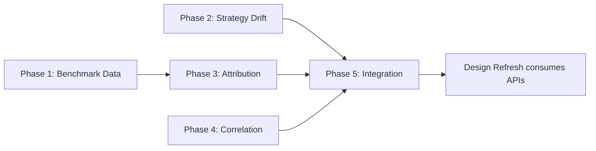

# feat: Wealth Senior Analyst Engines — Sprint 6

## Enhancement Summary

**Deepened on:** 2026-03-17
**Research agents used:** 12 (architecture-strategist, performance-oracle, security-sentinel, data-integrity-guardian, pattern-recognition-specialist, best-practices-researcher, framework-docs-researcher, 4 learnings agents, 1 stress-grading agent)

### Critical Corrections (from 12-agent review)

| # | Finding | Severity | Action |
|---|---------|----------|--------|
| 1 | Migration numbers 0010/0011 already exist | **BLOCKING** | Renumber to 0013 and 0014 |
| 2 | `analytics/` umbrella breaks one-package-per-engine convention | **HIGH** | Split into `attribution/` and `correlation/` packages |
| 3 | Correlation math is vertical-agnostic | **HIGH** | Move to `quant_engine/correlation_regime_service.py` |
| 4 | GET /strategy-drift/scan with write side-effects | **HIGH** | Change to POST, add advisory lock |
| 5 | Missing composite index on `nav_timeseries` | **HIGH** | Add `(instrument_id, nav_date DESC)` index in migration |
| 6 | Route collision: `/analytics/correlation` already exists | **MEDIUM** | Use `/analytics/correlation-regime/{profile}` |
| 7 | `is_current` flag race condition | **MEDIUM** | Add partial unique index `uq_drift_alerts_current` |
| 8 | RLS policy missing `WITH CHECK` clause | **MEDIUM** | Add both `USING` and `WITH CHECK` with `current_setting(..., true)` |
| 9 | Naming: `strategy_drift_detector.py` breaks `scan_*` convention | **LOW** | Rename to `strategy_drift_scanner.py` |
| 10 | `list` vs `tuple` in frozen dataclasses | **LOW** | Use `tuple` exclusively (majority convention) |

### Implementation Gaps (identified during execution)

| # | Gap | Phase | Resolution |
|---|-----|-------|------------|
| G1 | Invalid benchmark_ticker silently discarded as NaN >5% | 1 | Log as `error` with `benchmark_ticker_not_found`, not warning. Check `empty or isna().all()` before NaN ratio. |
| G2 | FundRiskMetrics may not have daily calc_dates — z-score needs ≥20 baseline points | 2 | Add prerequisite diagnostic query. If avg calc_dates < 20, Phase 2 needs backfill sub-task. |
| G3 | Carino total excess near zero with large opposing per-period excesses → k_total diverges | 3 | Guard: if `abs(k_total) < 1e-10` use simple average linking instead of Carino. Add test. |
| G4 | Forward-fill NAV gaps creates zero returns → distorts correlation | 4 | Use date intersection (`dropna(how="any")`) not forward-fill. Only days where ALL instruments have data. |
| G5 | StrategyDriftRead missing `alert_type` discriminator for frontend union typing | 2 | Add `alert_type: Literal["behavior_change"] = "behavior_change"` for discriminated union. |

### Key Research Enhancements

- **Attribution:** Policy benchmark approach validated as CFA CIPM standard. Add weight normalization check. Guard Carino edge case when per-period excess near zero.
- **Drift Detection:** Add CUSUM (ruptures library) as confirmatory method for 2-of-3 ensemble with z-score + existing DTW.
- **Correlation:** Apply Marchenko-Pastur denoising + Ledoit-Wolf shrinkage before computing diversification ratio. Add absorption ratio.
- **Data Quality:** yfinance validation pipeline (reject NaN >5%, zero prices; flag |return| >50%). Consider EODHD/Tiingo for production.

> **Frontend research preserved for Design Refresh:** HeatmapChart diverging color scale (optionsOverride), WaterfallChart (ECharts stacked bar pattern), `$state.raw` for large datasets, mobile matrix reduction. See frontend framework agent output archived in this plan's deepening session.

---

## Overview

Add diagnostic engines that replace senior analyst work in an investment committee workflow. The screener suite (Sprints 1–5) automates junior work — filtering, ranking, alerting. Sprint 6 adds the **"why"** layer: attribution analysis, strategy drift detection, and correlation regime monitoring.

Four engines, delivered in 5 phases (**backend only** — frontend consumed by Design Refresh plan `docs/plans/2026-03-16-feat-wealth-frontend-figma-design-refresh-plan.md`):

| Phase | Engine | Deliverable |
|---|---|---|
| 1 | Benchmark Data Foundation | `benchmark_nav` table + ingestor worker + nav_timeseries index |
| 2 | Strategy Drift Scanner | `strategy_drift_scanner.py` + API endpoints + schemas + tests |
| 3 | Attribution Analysis Activation | API endpoints + schemas + tests (engine already complete) |
| 4 | Correlation Regime Monitor | `correlation_regime_service.py` + API endpoints + schemas + tests |
| 5 | Integration | Route registration, import-linter contracts, integration tests |

> **Scope boundary:** Sprint 6 delivers backend engines and API contracts only. All frontend pages, components (WaterfallChart), and navigation changes belong to the Design Refresh plan. The API endpoints are the contract between Sprint 6 and Design Refresh:
>
> | Endpoint | Method | Design Refresh Consumer |
> |---|---|---|
> | `/analytics/strategy-drift/alerts?is_current=true` | GET | Risk Monitor Phase 4.3 |
> | `/analytics/strategy-drift/{instrument_id}` | GET | Risk Monitor drill-down |
> | `/analytics/strategy-drift/scan` | POST | Risk Monitor "Run Scan" button |
> | `/analytics/attribution/{profile}?start_date=&end_date=&granularity=` | GET | Analytics Phase 6.4 tab |
> | `/analytics/correlation-regime/{profile}` | GET | Analytics Phase 6 tab |
> | `/analytics/correlation-regime/{profile}/pair/{inst_a}/{inst_b}` | GET | Analytics drill-down |
> | `/workers/run-benchmark-ingest` | POST | Admin trigger |

## Problem Statement

The system knows **how much** a fund returned but not **why**. The committee cannot distinguish skill from luck (attribution), detect mandate violations before loss (strategy drift), or see diversification collapse during stress (correlation contagion). These are the three highest-value activities senior analysts perform daily.

(See brainstorm: `docs/brainstorms/2026-03-17-wealth-senior-analyst-engines-brainstorm.md` — priority ranking and data availability analysis.)

## Key Decisions (from brainstorm + SpecFlow + 12-agent review)

### D1: Separate `benchmark_nav` table (not synthetic instruments)

`NavTimeseries` has `OrganizationScopedMixin` + FK to `instruments_universe` (also org-scoped with RLS). Benchmarks are global. Inserting them into org-scoped tables would require either bypassing RLS or cloning per tenant — both are wrong.

**Decision:** New global `benchmark_nav` table, FK to `allocation_blocks.block_id`. No RLS. No `OrganizationScopedMixin`. Same pattern as `macro_data` and `allocation_blocks`.

### D2: Policy benchmark attribution (not market benchmark)

True Brinson-Fachler requires benchmark constituent weights per sector — data we don't have (no Bloomberg/Morningstar feed). The available data: one `benchmark_ticker` per `allocation_block` + `strategic_allocation` target weights.

**Decision:** Use "policy benchmark" approach:
- `benchmark_weights` = strategic allocation target weights per block
- `benchmark_returns` = per-block benchmark ticker returns from `benchmark_nav`

This is the standard institutional approach (CFA Institute CIPM curriculum methodology). The portfolio is evaluated against its own investment policy, not against a theoretical market decomposition.

> **Research insight:** Bloomberg PORT uses the same approach. Limitations: (1) assumes static benchmark between rebalancing dates, (2) no currency decomposition (Karnosky-Singer extension deferred), (3) interaction term may confuse non-quant audiences — present allocation + interaction combined as "total allocation effect" for committee reports. (Source: CFA Institute Performance Attribution Literature Review)

### D3: Z-score formula for strategy drift + CUSUM confirmation

```
z = (μ_recent - μ_baseline) / σ_baseline

where:
  μ_recent  = mean of metric over last 90 days of calc_dates
  μ_baseline = mean of metric over last 360 days of calc_dates
  σ_baseline = std of metric over last 360 days of calc_dates
```

Minimum sample: 20 calc_dates in baseline window, 5 in recent window. Below threshold → `insufficient_data` status.

Alert threshold: |z| > 2.0 (configurable via ConfigService).

> **Research insight:** Z-score alone has false positive risk from multiple testing (7 metrics × N funds). Add CUSUM (ruptures library, PELT algorithm with "rbf" cost function) as confirmatory method. Existing DTW in `drift_service.py` provides a third signal. Require **2-of-3 agreement** (z-score + CUSUM + DTW) before flagging. This ensemble approach is more robust than any single method. (Source: Adams & MacKay 2007, Survey of Methods for Time Series Change Point Detection)

### D4: Drift alerts persist to DB

New `strategy_drift_alert` table with `is_current` flag (pattern from `screening_result`). Enables historical tracking.

> **Data integrity insight:** Add partial unique index `uq_drift_alerts_current ON (organization_id, instrument_id) WHERE is_current = true` to prevent race condition where concurrent scans create duplicate current alerts. This is the same pattern used in `screening_results` migration 0012. (Source: data-integrity-guardian agent)

### D5: Correlation scoped to live model portfolio

`ModelPortfolio` with `status='live'` for the given profile determines the instrument list. At most one live portfolio per profile.

### D6: Historical normal = full history minus current window

Correlation regime comparison: baseline = all available history (up to 2 years) excluding the current 60d window.

> **Research insight:** Apply Marchenko-Pastur denoising to separate signal from noise eigenvalues. Replace eigenvalues below MP upper bound `λ_max = σ²(1 + √q)²` with their average. This prevents monitoring noise fluctuations instead of real regime shifts. Also apply Ledoit-Wolf shrinkage via `sklearn.covariance.LedoitWolf` for more stable correlation estimates with few observations. (Source: Marchenko & Pastur 1967, Ledoit & Wolf 2004)

### D7: Eigenvalue concentration thresholds (configurable)

- First eigenvalue explains >60% of total variance → `moderate_concentration`
- First eigenvalue explains >80% → `high_concentration`

> **Research insight:** Also compute Absorption Ratio (Kritzman & Li, 2010) = sum of variance explained by top k eigenvectors / total variance. AR > 0.80 = warning, AR > 0.90 = critical. This is the institutional standard for systemic risk monitoring. (Source: Kritzman & Li, "Skulls, Financial Turbulence, and Risk Management")

> **Boundary test requirement:** Golden tests for exact boundaries: 59.9% → diversified, 60.0% → diversified (strict `>`), 60.1% → moderate_concentration. Same pattern at 80%. (Source: credit-stress-grading-boundary learning)

### D8: Diversification ratio formula

Choueifaty DR = Σ(w_i × σ_i) / σ_portfolio. Alert when DR < 1.2 (barely diversified).

> **Research insight:** DR² can be interpreted as the effective number of independent risk factors. Complement with rolling window (126d) rather than 60d for more stable estimates. DCC-GARCH is unnecessary — research shows rolling windows yield similar results for N < 100 assets. (Source: Choueifaty & Coignard 2008, Yilmaz 2010)

### D9: Package structure follows one-package-per-engine (architecture review correction)

Original plan proposed `analytics/` as umbrella package. **Corrected:** Split into separate packages:
- `vertical_engines/wealth/attribution/` — attribution orchestrator
- `vertical_engines/wealth/correlation/` — correlation domain logic (calls `quant_engine/correlation_regime_service.py`)

Correlation math (eigenvalue decomposition, rolling correlation, diversification ratio) is vertical-agnostic and belongs in `quant_engine/`. The wealth-specific logic (resolving portfolio instruments, loading config) stays in `vertical_engines/wealth/correlation/`.

### D10: Use POST for drift scan (security review correction)

`GET /strategy-drift/scan` that persists alerts violates REST semantics and creates CSRF/race risks. Changed to `POST /strategy-drift/scan` with advisory lock serialization.

---

## Phase 1: Benchmark Data Foundation

**Goal:** Create `benchmark_nav` table and worker that populates it from yfinance. Unblocks attribution (Phase 3). Also adds missing index on `nav_timeseries`.

### 1.1 Migration: `0013_benchmark_nav`

**File:** `backend/alembic/versions/0013_benchmark_nav.py`

> **BLOCKING FIX:** Migration numbers 0010/0011 already exist (0010_tenant_asset_slug_rls_fix, 0011_instruments_data_migration). Current head is revision "0011". New migrations must be 0013 and 0014.

```python
# benchmark_nav table — global (no organization_id, no RLS)
# PK: (block_id, nav_date) — composite
# FK: block_id → allocation_blocks.block_id (ON DELETE RESTRICT, explicit)
# Fields:
#   nav: Numeric(18, 6), NOT NULL
#   return_1d: Numeric(12, 8), nullable
#   return_type: String(10), default "log"  # matches NavTimeseries pattern
#   source: String(30), default "yfinance"
#   created_at: DateTime (inline, NOT AuditMetaMixin — no created_by/updated_by for worker-only table)
#   updated_at: DateTime
#
# NO explicit ix_benchmark_nav_block_date — PK index covers (block_id, nav_date) queries
#
# Also in this migration: add missing performance index on nav_timeseries
# CREATE INDEX ix_nav_timeseries_instrument_date
#   ON nav_timeseries (instrument_id, nav_date DESC)
#   WHERE return_1d IS NOT NULL;
```

> **Data integrity insight:** Drop the originally planned `ix_benchmark_nav_block_date` — redundant with PK's automatic B-tree index. PostgreSQL can scan composite PK index in both directions. (Source: data-integrity-guardian)

> **Performance insight:** The `ix_nav_timeseries_instrument_date` index is CRITICAL — without it, all batch-fetch queries (risk_calc, optimizer, backtest, correlation) do partial sequential scans within TimescaleDB chunks. This index alone improves query performance for the entire wealth platform, not just Sprint 6. (Source: performance-oracle, CRITICAL-1)

**ERD:**

```mermaid
erDiagram
    allocation_blocks ||--o{ benchmark_nav : "has benchmark data"
    allocation_blocks {
        string block_id PK
        string benchmark_ticker
        string geography
        string asset_class
        boolean is_active
    }
    benchmark_nav {
        string block_id PK_FK
        date nav_date PK
        decimal nav
        decimal return_1d
        string return_type
        string source
        datetime created_at
        datetime updated_at
    }
```

### 1.2 ORM Model: `BenchmarkNav`

**File:** `backend/app/domains/wealth/models/benchmark_nav.py`

```python
# Inherits from Base ONLY (NOT OrganizationScopedMixin, NOT AuditMetaMixin)
# Composite PK: (block_id, nav_date)
# FK: block_id → allocation_blocks.block_id (lazy="raise", ondelete="RESTRICT")
# nav: Numeric(18, 6), nullable=False
# return_1d: Numeric(12, 8), nullable=True
# return_type: String(10), default="log"
# source: String(30), default="yfinance"
# created_at: DateTime, server_default=func.now()
# updated_at: DateTime, server_default=func.now(), onupdate=func.now()
```

Register in `backend/app/domains/wealth/models/__init__.py`.

### 1.3 Worker: `benchmark_ingest.py`

**File:** `backend/app/domains/wealth/workers/benchmark_ingest.py`

Follow `workers/ingestion.py` pattern exactly:

```python
# BENCHMARK_INGEST_LOCK_ID = 900_004  # hardcoded, deterministic (per learnings)
#
# async def run_benchmark_ingest() -> dict[str, int]:
#   1. Advisory lock (pg_try_advisory_lock, non-blocking — skip if running)
#   2. Query allocation_blocks WHERE benchmark_ticker IS NOT NULL AND is_active = true
#   3. VALIDATE: assert len(tickers) > 0 — fail loudly if no blocks configured
#   4. Deduplicate tickers (multiple blocks may share a ticker, e.g., SPY)
#   5. yf.download(tickers, period="2y", threads=True, auto_adjust=True) in executor
#   6. DATA VALIDATION per ticker:
#      a. Reject if > 5% NaN in close prices
#      b. Reject if any zero/negative prices
#      c. Flag (warn, don't reject) single-day returns > |50%|
#      d. Check no date gaps > 5 business days
#   7. Compute log returns: np.log(close / close.shift(1))
#   8. Map ticker → block_ids (one ticker may serve multiple blocks)
#   9. Batch upsert to benchmark_nav (on_conflict_do_update on PK)
#      Chunks of 200 rows per commit (prevent connection pool starvation)
#  10. Staleness check: blocks where latest nav_date > 5 business days old → log warning
#  11. Return {"blocks_updated": N, "rows_upserted": M, "stale_blocks": [...]}
```

> **Thread safety (from learnings):** yfinance is NOT thread-safe for `.info` calls (global mutable `_DFS` dict). `yf.download(threads=True)` is safe for batch. Never parallelize individual ticker fetches with ThreadPoolExecutor. If any shared mutable state is needed (progress counters, error accumulators), protect with `threading.Lock` from day one.

> **Config validation (from learnings):** Never use defensive fallbacks that mask empty data. If `allocation_blocks` returns no rows with `benchmark_ticker`, fail loudly — do not silently return `{"blocks_updated": 0}`. Assert at the start of the worker run.

> **Data quality (from best practices):** yfinance has ~98% success rate. Always use `auto_adjust=True` for adjusted prices. Consider adding EODHD ($20/mo) as primary production source with yfinance as fallback. Store `source` column to track provenance.

### 1.4 Worker Route

**File:** `backend/app/domains/wealth/routes/workers.py` (add to existing)

```python
# POST /api/v1/wealth/workers/run-benchmark-ingest
# Auth: _require_admin_role (Admin only — global resource)
# Body: None
# Response: WorkerScheduledResponse (HTTP 202)
# BackgroundTasks: run_benchmark_ingest()
```

> **Security note:** This triggers a global operation. In production, consider restricting to system-level admin only (not any org's admin) to prevent resource contention. At minimum, the advisory lock prevents concurrent runs.

### 1.5 Tests

**File:** `backend/tests/test_benchmark_ingest.py`

- `TestBenchmarkNavModel`: frozen-ness, field types, PK composite, no org_id
- `TestBenchmarkIngestWorker`:
  - Mock yf.download → verify upsert count, log return computation
  - Deduplication: SPY used by 3 blocks = 1 download, 3 block_id mappings
  - Empty ticker validation: no blocks with benchmark_ticker → raises, not silent no-op
  - Data validation: NaN > 5% → ticker rejected with warning
  - Data validation: zero price → ticker rejected
  - Data validation: |return| > 50% → warning logged, not rejected
- `TestStalenessDetection`: block with last nav_date 7 days ago → flagged as stale
- `TestAdvisoryLock`: concurrent trigger → second call is no-op (pg_try_advisory_lock returns False)
- Integration test: POST to `/workers/run-benchmark-ingest` with DEV_ACTOR_HEADER → 202

**Acceptance criteria:**
- [ ] `benchmark_nav` table created with migration 0013, no RLS, `down_revision="0011"`
- [ ] `ix_nav_timeseries_instrument_date` index added in same migration
- [ ] Worker populates benchmark data for all active blocks with benchmark_ticker
- [ ] Deduplicates tickers (SPY used by 3 blocks = 1 download)
- [ ] Advisory lock (BENCHMARK_INGEST_LOCK_ID = 900_004) prevents concurrent runs
- [ ] Data validation: rejects NaN/zero, flags extreme returns
- [ ] Fails loudly on empty ticker list
- [ ] Stale benchmark detection (>5 business days) logged as warning
- [ ] `make check` passes (lint + typecheck + tests)

---

## Phase 2: Strategy Drift Scanner

**Goal:** Detect when a fund's behavior changes vs. its own history. Answers: "this fund is no longer behaving like it used to."

### Prerequisite: FundRiskMetrics calc_date depth check

Before implementing, confirm that `fund_risk_metrics` has sufficient historical depth:

```sql
SELECT instrument_id, COUNT(DISTINCT calc_date) AS data_points,
       MIN(calc_date) AS oldest, MAX(calc_date) AS latest
FROM fund_risk_metrics
GROUP BY instrument_id
HAVING COUNT(DISTINCT calc_date) >= 1
ORDER BY data_points ASC
LIMIT 10;
```

If average data_points < 20, a backfill sub-task is required (run `run_risk_calc` repeatedly with historical date ranges). The scanner will return `insufficient_data` for instruments below the minimum, which is the correct graceful degradation — but the engine is useless if ALL instruments are below threshold.

### 2.1 Engine Models

**File:** `backend/vertical_engines/wealth/monitoring/strategy_drift_models.py`

```python
"""Strategy drift detection domain models.

Frozen dataclasses for cross-boundary safety. These are NOT ORM models —
ORM models live in backend/app/domains/wealth/models/.
"""
from __future__ import annotations

@dataclass(frozen=True, slots=True)
class MetricDrift:
    """Z-score result for a single metric."""
    metric_name: str          # e.g., "volatility_1y"
    recent_mean: float        # μ_recent (90d window)
    baseline_mean: float      # μ_baseline (360d window)
    baseline_std: float       # σ_baseline
    z_score: float            # (μ_recent - μ_baseline) / σ_baseline
    is_anomalous: bool        # |z| > threshold (strict greater-than)

@dataclass(frozen=True, slots=True)
class StrategyDriftResult:
    """Drift detection result for one instrument."""
    instrument_id: str
    instrument_name: str
    status: str               # "stable" | "drift_detected" | "insufficient_data"
    anomalous_count: int      # how many metrics exceeded threshold
    total_metrics: int
    metrics: tuple[MetricDrift, ...]    # tuple, not list (frozen convention)
    severity: str             # "none" | "moderate" (1-2 metrics) | "severe" (3+ metrics)
    detected_at: str          # ISO datetime

@dataclass(frozen=True, slots=True)
class StrategyDriftScanResult:
    """Scan results for all instruments."""
    scanned_count: int
    alerts: tuple[StrategyDriftResult, ...]  # only drift_detected items
    stable_count: int
    insufficient_data_count: int
    scan_timestamp: str
```

> **Pattern note:** Uses `tuple` for all sequences (not `list`). All newer sprint packages (peer_group, rebalancing, watchlist, mandate_fit, fee_drag) use this convention. `list` in frozen dataclasses is semantic contradiction — mutable field in immutable container. (Source: pattern-recognition agent)

### 2.2 Engine Service

**File:** `backend/vertical_engines/wealth/monitoring/strategy_drift_scanner.py`

> **Naming:** Renamed from `strategy_drift_detector.py` to match existing `scan_*` naming convention in monitoring package (`scan_drift` in `drift_monitor.py`, `scan_alerts` in `alert_engine.py`).

```python
"""Strategy drift scanner — detects fund behavior changes via z-score.

Compares recent metric distribution (90d) against baseline (360d).
Designed to run in asyncio.to_thread(). Pure sync, no DB, no I/O.
"""
from __future__ import annotations

import structlog  # not logging (structlog is the dominant convention)

# METRICS_TO_CHECK: tuple of FundRiskMetrics column names
# = ("volatility_1y", "max_drawdown_1y", "sharpe_1y",
#    "sortino_1y", "alpha_1y", "beta_1y", "tracking_error_1y")
#
# _EPSILON = 1e-10  # guard for σ_baseline near zero
#
# def scan_strategy_drift(
#     metrics_history: list[dict],   # FundRiskMetrics rows as dicts, sorted by calc_date
#     instrument_id: str,
#     instrument_name: str,
#     config: dict | None = None,
# ) -> StrategyDriftResult:
#     """Pure sync. No DB, no I/O.
#
#     Config keys (all from ConfigService, no hardcoded magic numbers):
#       recent_window_days: 90 (default)
#       baseline_window_days: 360 (default)
#       z_threshold: 2.0 (default)
#       min_baseline_points: 20 (default)
#       min_recent_points: 5 (default)
#
#     NOTE: severity='severe' requires >= 3 of 7 metrics anomalous (~43%).
#     If METRICS_TO_CHECK is reduced below 3, severe becomes unreachable.
#     """
#     1. Split metrics_history into recent (last recent_window_days) and baseline (last baseline_window_days)
#     2. Check minimum sample sizes → insufficient_data if below threshold
#     3. For each metric in METRICS_TO_CHECK:
#        a. Extract values from baseline and recent windows (skip None/NaN)
#        b. Compute μ_baseline, σ_baseline
#        c. if σ_baseline < _EPSILON: skip metric (avoid division by zero, don't count toward total)
#        d. z = (μ_recent - μ_baseline) / σ_baseline
#        e. is_anomalous = abs(z) > z_threshold  # strict greater-than, z=2.0 exactly is NOT anomalous
#     4. severity = "severe" if anomalous_count >= 3, "moderate" if >= 1, "none" if 0
#     5. Return StrategyDriftResult
#
# def scan_all_strategy_drift(
#     all_instruments_metrics: dict[str, list[dict]],
#     instrument_names: dict[str, str],
#     config: dict | None = None,
# ) -> StrategyDriftScanResult:
#     """Scan all instruments. Returns only drift_detected alerts."""
```

> **CUSUM enhancement (deferred to Phase 2b):** Add `ruptures` library with PELT algorithm as confirmatory method. The z-score is the fast screen; CUSUM detects sustained mean shifts. Existing DTW in `drift_service.py` is the third signal. Require 2-of-3 agreement before `drift_detected` status. This ensemble is much more robust than z-score alone. `ruptures` is BSD-licensed, well-maintained, and provides `rpt.Pelt(model="rbf", min_size=20).fit(signal).predict(pen=10)`. **Keep z-score as MVP; add CUSUM as fast-follow.**

**Import-linter:** `strategy_drift_scanner.py` must NOT import from any `service.py`. Imports only from `strategy_drift_models.py` and stdlib/numpy.

**Add to `pyproject.toml`:**
```toml
[[tool.importlinter.contracts]]
name = "Wealth monitoring drift models must not import scanner"
type = "forbidden"
source_modules = ["vertical_engines.wealth.monitoring.strategy_drift_models"]
forbidden_modules = ["vertical_engines.wealth.monitoring.strategy_drift_scanner"]
```

### 2.3 ORM: Strategy Drift Alert Table

**File:** `backend/app/domains/wealth/models/strategy_drift_alert.py`

```python
# strategy_drift_alerts table
# PK: id (UUID)
# FK: instrument_id → instruments_universe.instrument_id (lazy="raise", ondelete="CASCADE")
# organization_id + RLS (OrganizationScopedMixin)
# Fields:
#   status: String(20) — "drift_detected" | "stable" | "insufficient_data"
#   severity: String(20) — "none" | "moderate" | "severe"
#   anomalous_count: Integer
#   total_metrics: Integer
#   metric_details: JSONB — serialized list of MetricDrift
#   is_current: Boolean (default True) — latest alert per instrument
#   detected_at: DateTime
#   created_at, updated_at (inline, no AuditMetaMixin for worker-populated table)
```

**Migration:** `0014_strategy_drift_alerts.py` (`down_revision="0013"`)

```sql
-- RLS policy with correct pattern (WITH CHECK + current_setting(..., true)):
CREATE POLICY strategy_drift_alerts_org_isolation ON strategy_drift_alerts
    USING (organization_id = (SELECT current_setting('app.current_organization_id', true))::uuid)
    WITH CHECK (organization_id = (SELECT current_setting('app.current_organization_id', true))::uuid);

-- Partial unique index to prevent is_current race condition:
CREATE UNIQUE INDEX uq_drift_alerts_current
    ON strategy_drift_alerts (organization_id, instrument_id)
    WHERE is_current = true;

-- Composite index for dashboard queries:
CREATE INDEX ix_drift_alerts_severity
    ON strategy_drift_alerts (organization_id, severity)
    WHERE is_current = true;
```

> **Downgrade safety:** Must drop RLS policy and disable RLS BEFORE dropping table:
> 1. `DROP POLICY IF EXISTS strategy_drift_alerts_org_isolation ON strategy_drift_alerts`
> 2. `ALTER TABLE strategy_drift_alerts DISABLE ROW LEVEL SECURITY`
> 3. `op.drop_table("strategy_drift_alerts")`

### 2.4 Pydantic Schemas

**File:** `backend/app/domains/wealth/schemas/strategy_drift.py`

```python
class MetricDriftRead(BaseModel):
    model_config = ConfigDict(from_attributes=True, extra="ignore")
    metric_name: str
    recent_mean: float
    baseline_mean: float
    baseline_std: float
    z_score: float
    is_anomalous: bool

class StrategyDriftRead(BaseModel):
    model_config = ConfigDict(from_attributes=True, extra="ignore")
    alert_type: Literal["behavior_change"] = "behavior_change"  # discriminator for frontend union
    instrument_id: UUID
    instrument_name: str
    status: str
    anomalous_count: int
    total_metrics: int
    metrics: list[MetricDriftRead]
    severity: str
    detected_at: datetime

class StrategyDriftScanRead(BaseModel):
    model_config = ConfigDict(extra="ignore")
    scanned_count: int
    alerts: list[StrategyDriftRead]
    stable_count: int
    insufficient_data_count: int
    scan_timestamp: datetime
```

### 2.5 API Routes

**File:** `backend/app/domains/wealth/routes/strategy_drift.py`

```python
router = APIRouter(prefix="/analytics/strategy-drift", tags=["strategy-drift"])

# GET /api/v1/wealth/analytics/strategy-drift/{instrument_id}
# Auth: get_current_user + get_db_with_rls
# Query params: recent_days (int, default 90), baseline_days (int, default 360)
# Logic:
#   1. Load FundRiskMetrics for instrument_id, ordered by calc_date DESC, limit baseline_days
#   2. Run scan_strategy_drift() via asyncio.to_thread()
#   3. Return StrategyDriftRead
# Response: 200 | 404 instrument not found

# POST /api/v1/wealth/analytics/strategy-drift/scan
# Auth: get_current_user + get_db_with_rls
# Body: optional severity_filter, limit
# Logic:
#   1. Advisory lock (DRIFT_SCAN_LOCK_ID = 900_005) — serialize per-org scans
#   2. Load all active instruments for org
#   3. Batch-load FundRiskMetrics (single query with IN clause, not N+1)
#      NOTE: Use subquery for latest calc_dates only (avoid loading full history per instrument)
#   4. Run scan_all_strategy_drift() via asyncio.to_thread()
#   5. Persist results to strategy_drift_alerts:
#      a. UPDATE ... SET is_current = False WHERE org_id = X AND instrument_id IN (...)
#      b. INSERT new alerts with is_current = True
#      c. Partial unique index uq_drift_alerts_current catches concurrent duplicates
#   6. Return StrategyDriftScanRead
# Response: 200

# GET /api/v1/wealth/analytics/strategy-drift/alerts
# Auth: get_current_user + get_db_with_rls
# Query params: is_current (bool, default True), severity (str, optional)
# Logic: Read from strategy_drift_alerts table (persisted results)
# Response: 200 with list[StrategyDriftRead]
```

Register in `backend/app/main.py`:
```python
from app.domains.wealth.routes.strategy_drift import router as wealth_strategy_drift_router
api_v1.include_router(wealth_strategy_drift_router, prefix="/wealth")
```

### 2.6 Tests

**File:** `backend/tests/test_strategy_drift.py`

- `TestMetricDrift`: frozen dataclass, tuple fields immutable
- `TestScanStrategyDrift`:
  - Stable instrument (all z-scores < 2.0) → status="stable"
  - Drifting instrument (3+ metrics |z| > 2.0) → status="drift_detected", severity="severe"
  - Insufficient data (< 20 baseline points) → status="insufficient_data"
  - Edge: σ_baseline < epsilon → skip metric (don't count toward total)
  - Config override: z_threshold=1.5 → more sensitive detection
  - **Golden boundary tests:**
    - z = 1.99 → is_anomalous=False
    - z = 2.0 → is_anomalous=False (strict `>`)
    - z = 2.01 → is_anomalous=True
    - anomalous_count=0 → severity="none"
    - anomalous_count=1 → severity="moderate"
    - anomalous_count=2 → severity="moderate"
    - anomalous_count=3 → severity="severe"
- `TestScanAllStrategyDrift`: multi-instrument scan, only drift_detected in alerts
- `TestStrategyDriftSchemas`: Pydantic serialization round-trip
- Integration: POST `/analytics/strategy-drift/scan` → 200 with valid response shape

**Acceptance criteria:**
- [ ] `strategy_drift_scanner.py` is pure sync, no DB imports, uses structlog
- [ ] Z-score formula: z = (μ_recent - μ_baseline) / σ_baseline
- [ ] Strict greater-than: z=2.0 exactly is NOT anomalous
- [ ] Minimum sample guards: 20 baseline, 5 recent
- [ ] Alerts persist to `strategy_drift_alerts` with `is_current` flag
- [ ] Partial unique index prevents concurrent scan race condition
- [ ] POST endpoint with advisory lock (DRIFT_SCAN_LOCK_ID = 900_005)
- [ ] Batch metric loading (single IN query, not N+1)
- [ ] Import-linter contract added to pyproject.toml
- [ ] All golden boundary tests pass
- [ ] `make check` passes
- [ ] API contract documented: Design Refresh consumes `GET /alerts` (Phase 4.3) and `POST /scan`

---

## Phase 3: Attribution Analysis Activation

**Goal:** Wire the existing `attribution_service.py` to benchmark data from Phase 1 and expose via API + frontend.

### 3.1 Attribution Orchestrator

**File:** `backend/vertical_engines/wealth/attribution/service.py`

> **Structure:** Separate `attribution/` package (not `analytics/` umbrella). Follows one-package-per-engine convention.

```
vertical_engines/wealth/attribution/
    __init__.py
    models.py       # frozen dataclasses (if any beyond quant_engine's)
    service.py      # orchestrator entry point
```

```python
"""Attribution orchestrator — bridges DB data to quant_engine attribution.

Uses POLICY BENCHMARK approach (CFA CIPM standard):
  - benchmark_weights = strategic allocation target weights per block
  - benchmark_returns = per-block benchmark ticker returns from benchmark_nav
  - portfolio_weights = actual current weights (from fund positions)
  - portfolio_returns = weighted fund returns per block

Session injection pattern: route handler provides pre-fetched data.
Config resolved once at async entry point via ConfigService, passed down.
"""

# class AttributionService:
#     def __init__(self, config: dict | None = None) -> None:
#         self._config = config or {}
#
#     def compute_portfolio_attribution(
#         self,
#         strategic_allocations: list[dict],   # block_id, target_weight
#         fund_returns_by_block: dict[str, float],
#         benchmark_returns_by_block: dict[str, float],
#         block_labels: dict[str, str],
#         actual_weights_by_block: dict[str, float] | None = None,
#     ) -> AttributionResult:
#         """Single-period attribution.
#
#         1. Validate weights sum to ~1.0 (tolerance 1e-4):
#            assert abs(sum(benchmark_weights) - 1.0) < 1e-4
#            If not, add "cash/residual" sector to fully explain excess return
#         2. Build aligned numpy arrays (same block ordering)
#         3. portfolio_weights = actual_weights or strategic targets
#         4. benchmark_weights = strategic target weights
#         5. portfolio_returns = weighted average return of funds in each block
#         6. benchmark_returns = benchmark_nav return for each block
#         7. sector_labels = block display names
#         8. Return compute_attribution(portfolio_weights, benchmark_weights, ...)
#         """
#
#     def compute_multi_period(
#         self,
#         periods: list[tuple[date, date]],
#         ... per period data ...
#     ) -> AttributionResult:
#         """Multi-period with Carino linking.
#
#         Guards for Carino numerical stability:
#         1. Per-period excess near zero → k_t spike: clamp k_t to [-10, 10]
#         2. Total excess near zero with large opposing per-period excesses
#            (e.g., +5% Jan, -5% Feb → total ~0%): k_total diverges.
#            If abs(k_total) < 1e-10, fall back to simple average linking
#            instead of Carino smoothing. Add explicit test for this case.
#         """
```

> **Research insight:** Carry full precision internally during computation. Round only on final output (line 132-138 of `attribution_service.py` rounds per-sector per-period — accumulation error over 12+ months). Consider removing intermediate rounding.

**Import-linter contracts:**
```toml
[[tool.importlinter.contracts]]
name = "Wealth attribution models must not import service"
type = "forbidden"
source_modules = ["vertical_engines.wealth.attribution.models"]
forbidden_modules = ["vertical_engines.wealth.attribution.service"]
```

### 3.2 Pydantic Schemas

**File:** `backend/app/domains/wealth/schemas/attribution.py`

```python
class SectorAttributionRead(BaseModel):
    model_config = ConfigDict(extra="ignore")
    sector: str             # block display_name
    block_id: str
    allocation_effect: float
    selection_effect: float
    interaction_effect: float
    total_effect: float

class AttributionRead(BaseModel):
    model_config = ConfigDict(extra="ignore")
    profile: str
    start_date: date
    end_date: date
    granularity: str        # "monthly" | "quarterly"
    total_portfolio_return: float
    total_benchmark_return: float
    total_excess_return: float
    allocation_total: float
    selection_total: float
    interaction_total: float
    sectors: list[SectorAttributionRead]
    n_periods: int
    benchmark_available: bool
    benchmark_approach: str  # always "policy" for now
    # Committee-friendly view: allocation + interaction combined
    total_allocation_combined: float  # allocation_total + interaction_total
```

### 3.3 API Route

**File:** `backend/app/domains/wealth/routes/attribution.py`

```python
router = APIRouter(prefix="/analytics/attribution", tags=["attribution"])

# GET /api/v1/wealth/analytics/attribution/{profile}
# Auth: get_current_user + get_db_with_rls
# Query params:
#   start_date (date, default: 12 months ago)
#   end_date (date, default: today)
#   granularity (str, "monthly"|"quarterly", default: "monthly")
# Logic:
#   1. Load StrategicAllocation for profile (current effective allocations)
#   2. Load ModelPortfolio with status='live' for profile → fund_selection_schema
#   3. For each block:
#      a. Load NavTimeseries returns for instruments in that block (period range)
#      b. Compute weighted average fund return per block per period
#      c. Load BenchmarkNav returns for that block (period range)
#      d. Blocks missing benchmark data → excluded with warning, not 500
#   4. For each period (monthly/quarterly):
#      a. Run AttributionService.compute_portfolio_attribution() via asyncio.to_thread()
#   5. If multi-period: run compute_multi_period()
#   6. Return AttributionRead
# Response: 200 | 404 (no live portfolio) | 422 (no benchmark data for ANY block)
```

Register in `backend/app/main.py`.

### 3.4 Tests

**File:** `backend/tests/test_attribution.py`

> **Test naming:** Uses package name (`test_attribution`), not module name (`test_attribution_orchestrator`). Matches existing convention.

- `TestPolicyBenchmarkAttribution`:
  - 3 blocks, all have benchmark data → full Brinson breakdown
  - Allocation effect positive when overweight in outperforming block
  - Selection effect positive when block's funds outperform block's benchmark
  - Interaction effect signs correct
  - Weight normalization: sum(weights) != 1.0 → cash/residual sector added
  - Multi-period Carino linking preserves additivity
  - **Edge case:** per-period excess near zero → k_t clamped, no spike
  - **Edge case:** total excess near zero with large opposing per-period excesses (+5%, -5%) → k_total diverges → falls back to simple average linking
- `TestPartialBenchmarkCoverage`:
  - 3 blocks, 1 missing benchmark → partial result with 2 blocks
  - All missing → benchmark_available=False
- `TestAttributionSchemas`: Pydantic round-trip
- Integration: GET `/analytics/attribution/moderate` → 200 (with mock benchmark_nav data)

**Acceptance criteria:**
- [ ] Policy benchmark approach: strategic weights as benchmark weights
- [ ] Per-block benchmark returns from `benchmark_nav`
- [ ] Multi-period with Carino linking for monthly/quarterly
- [ ] Weight normalization check (sum ~1.0)
- [ ] Partial benchmark coverage handled gracefully (not 500)
- [ ] Import-linter contract for attribution/ package
- [ ] `make check` passes
- [ ] API contract documented: Design Refresh consumes `GET /attribution/{profile}` (Phase 6.4)

---

## Phase 4: Correlation Regime Monitor

**Goal:** Detect diversification collapse during stress by monitoring rolling correlations between portfolio instruments.

### 4.1 Quant Engine Service (vertical-agnostic math)

**File:** `backend/quant_engine/correlation_regime_service.py`

> **Architecture correction:** Correlation math (eigenvalue decomposition, rolling correlation, diversification ratio, Marchenko-Pastur denoising) is vertical-agnostic. It belongs in `quant_engine/`, not `vertical_engines/wealth/`. This follows the same pattern as `attribution_service.py`, `drift_service.py`, `cvar_service.py` — pure math that could serve any vertical.

```python
"""Correlation regime analysis — rolling correlation, eigenvalue concentration, diversification ratio.

Pure sync, no I/O, config as parameter.
Includes Marchenko-Pastur denoising and Ledoit-Wolf shrinkage.
"""

# def compute_correlation_regime(
#     returns_matrix: np.ndarray,        # (T, N) daily returns — T days, N instruments
#     weights: np.ndarray | None = None, # portfolio weights for DR calc
#     config: dict | None = None,
# ) -> CorrelationRegimeResult:
#     """Config keys:
#       window_days: 60 (default)
#       baseline_window_days: 504 (2 years, default)
#       contagion_threshold: 0.3 (default)
#       concentration_moderate: 0.6 (default)
#       concentration_high: 0.8 (default)
#       dr_alert_threshold: 1.2 (default)
#       min_observations: 45 (default)
#       apply_denoising: true (default)
#       apply_shrinkage: true (default)
#     """
#     1. Validate min observations (T >= min_observations)
#     2. Split returns into recent (last window_days) and baseline (rest)
#     3. Compute sample covariance matrix (recent window)
#     4. IF apply_shrinkage: apply Ledoit-Wolf shrinkage (sklearn.covariance.LedoitWolf)
#     5. Convert covariance to correlation matrix
#     6. IF apply_denoising: Marchenko-Pastur denoising
#        a. q = N / T_recent
#        b. lambda_max = (1 + sqrt(q))^2
#        c. Eigendecompose
#        d. Replace eigenvalues < lambda_max with their average
#        e. Reconstruct denoised correlation matrix
#     7. Same for baseline window
#     8. For each unique pair (i,j):
#        a. current_corr, baseline_corr, change
#        b. is_contagion = |change| > contagion_threshold AND current_corr > 0.7
#     9. Eigenvalue concentration on denoised current matrix:
#        a. first_ratio = eigenvalues[0] / sum(eigenvalues)
#        b. concentration_status (strict >: 0.60 exactly = "diversified")
#     10. Diversification ratio (if weights provided):
#        a. individual_vols = sqrt(diag(cov_matrix))
#        b. portfolio_vol = sqrt(w' @ cov @ w)
#        c. DR = dot(weights, individual_vols) / portfolio_vol
#     11. Absorption ratio: sum(top_k_eigenvalues) / sum(all_eigenvalues)
#     12. average correlation: mean of upper triangle
#     13. regime_shift = (avg_current - avg_baseline) > contagion_threshold
#     14. Return CorrelationRegimeResult
```

### 4.2 Wealth Domain Logic

**File:** `backend/vertical_engines/wealth/correlation/service.py`

```
vertical_engines/wealth/correlation/
    __init__.py
    models.py      # frozen dataclasses for correlation domain results
    service.py     # resolves portfolio → instruments, delegates to quant_engine
```

```python
"""Correlation regime service — wealth-specific orchestration.

Resolves portfolio instruments from ModelPortfolio, loads NavTimeseries,
delegates math to quant_engine/correlation_regime_service.py.
"""
# class CorrelationService:
#     def __init__(self, config: dict | None = None):
#         self._config = config or {}
#
#     def analyze_portfolio_correlation(
#         self,
#         instrument_ids: list[str],
#         instrument_names: list[str],
#         returns_by_instrument: dict[str, list[float]],  # pre-fetched
#         dates: list[date],
#         weights: list[float] | None = None,
#     ) -> CorrelationRegimeResult:
#         """Build returns matrix from pre-fetched data, delegate to quant_engine."""
```

**Import-linter contracts:**
```toml
[[tool.importlinter.contracts]]
name = "Wealth correlation models must not import service"
type = "forbidden"
source_modules = ["vertical_engines.wealth.correlation.models"]
forbidden_modules = ["vertical_engines.wealth.correlation.service"]
```

### 4.3 Domain Models

**File:** `backend/vertical_engines/wealth/correlation/models.py`

```python
@dataclass(frozen=True, slots=True)
class InstrumentCorrelation:
    instrument_a_id: str
    instrument_a_name: str
    instrument_b_id: str
    instrument_b_name: str
    current_correlation: float
    baseline_correlation: float
    correlation_change: float
    is_contagion: bool

@dataclass(frozen=True, slots=True)
class ConcentrationAnalysis:
    eigenvalues: tuple[float, ...]
    explained_variance_ratios: tuple[float, ...]
    first_eigenvalue_ratio: float
    concentration_status: str    # "diversified" | "moderate_concentration" | "high_concentration"
    diversification_ratio: float
    absorption_ratio: float      # added from research

@dataclass(frozen=True, slots=True)
class CorrelationRegimeResult:
    profile: str
    instrument_count: int
    window_days: int
    correlation_matrix: tuple[tuple[float, ...], ...]
    instrument_labels: tuple[str, ...]
    contagion_pairs: tuple[InstrumentCorrelation, ...]
    concentration: ConcentrationAnalysis
    average_correlation: float
    baseline_average_correlation: float
    regime_shift_detected: bool
    computed_at: str
```

### 4.4 Pydantic Schemas

**File:** `backend/app/domains/wealth/schemas/correlation_regime.py`

> **Naming:** `correlation_regime.py` (not `correlation.py`) to avoid confusion with existing correlation schemas in `analytics.py`.

```python
class InstrumentCorrelationRead(BaseModel):
    model_config = ConfigDict(extra="ignore")
    instrument_a_id: UUID
    instrument_a_name: str
    instrument_b_id: UUID
    instrument_b_name: str
    current_correlation: float
    baseline_correlation: float
    correlation_change: float
    is_contagion: bool

class ConcentrationRead(BaseModel):
    model_config = ConfigDict(extra="ignore")
    eigenvalues: list[float]
    explained_variance_ratios: list[float]
    first_eigenvalue_ratio: float
    concentration_status: str
    diversification_ratio: float
    absorption_ratio: float

class CorrelationRegimeRead(BaseModel):
    model_config = ConfigDict(extra="ignore")
    profile: str
    instrument_count: int
    window_days: int
    correlation_matrix: list[list[float]]
    instrument_labels: list[str]
    contagion_pairs: list[InstrumentCorrelationRead]
    concentration: ConcentrationRead
    average_correlation: float
    baseline_average_correlation: float
    regime_shift_detected: bool
    computed_at: datetime
```

### 4.5 API Route

**File:** `backend/app/domains/wealth/routes/correlation_regime.py`

```python
router = APIRouter(prefix="/analytics/correlation-regime", tags=["correlation-regime"])

# GET /api/v1/wealth/analytics/correlation-regime/{profile}
# Auth: get_current_user + get_db_with_rls
# Query params: window_days (int, default 60), baseline_days (int, default 504)
# Logic:
#   1. Load ModelPortfolio with status='live' for profile
#   2. Extract instrument_ids from fund_selection_schema
#   3. Load NavTimeseries.return_1d for all instruments (last baseline_days)
#   4. Build returns matrix (T x N) using date intersection only:
#      - Align on dates where ALL instruments have return data
#      - Use dropna(how="any") — NOT forward-fill (creates zero returns, distorts correlation)
#      - Instruments with different trading calendars (BR vs US) → intersection is correct set
#   5. Load current portfolio weights from PortfolioSnapshot
#   6. Run CorrelationService.analyze_portfolio_correlation() via asyncio.to_thread()
#   7. Return CorrelationRegimeRead
# Response: 200 | 404 (no live portfolio) | 422 (insufficient NAV data)

# GET /api/v1/wealth/analytics/correlation-regime/{profile}/pair/{inst_a}/{inst_b}
# Pair detail: time series of rolling correlation between two instruments
# For charting drill-down
```

> **Route naming:** Uses `/correlation-regime/` to avoid collision with existing `GET /analytics/correlation` (block-level correlation in `analytics.py`). (Source: pattern-recognition agent)

Register in `backend/app/main.py`.

### 4.6 Tests

**File:** `backend/tests/test_correlation.py`

- `TestCorrelationMatrix`:
  - Identity correlation for identical return series
  - Zero correlation for independent random series (within tolerance)
  - Negative correlation for inverse series
- `TestMarchenkoPasturDenoising`:
  - Random noise matrix → all eigenvalues below MP bound → denoised to constant
  - Matrix with clear signal → signal eigenvalue preserved above bound
- `TestContagionDetection`:
  - Pair with correlation jump 0.3→0.8 → is_contagion=True
  - Pair with stable high correlation (0.7→0.7) → not contagion (no change)
- `TestConcentrationAnalysis` + **golden boundary tests:**
  - All returns identical → first eigenvalue ~100% → high_concentration
  - Independent returns → eigenvalues roughly equal → diversified
  - first_eigenvalue_ratio = 0.60 → "diversified" (strict `>`)
  - first_eigenvalue_ratio = 0.601 → "moderate_concentration"
  - first_eigenvalue_ratio = 0.80 → "moderate_concentration" (strict `>`)
  - first_eigenvalue_ratio = 0.801 → "high_concentration"
- `TestDiversificationRatio`:
  - Equal-weight uncorrelated assets → DR > 1
  - Single asset → DR = 1.0
  - DR = 1.2 → no alert (strict `<`)
  - DR = 1.19 → alert
- `TestMinObservations`: fewer than 45 days → insufficient_data error
- Integration: GET `/analytics/correlation-regime/moderate` → 200

**Acceptance criteria:**
- [ ] `quant_engine/correlation_regime_service.py` is pure sync, no wealth imports
- [ ] Marchenko-Pastur denoising applied by default (configurable)
- [ ] Ledoit-Wolf shrinkage applied (via sklearn.covariance.LedoitWolf)
- [ ] Contagion: |change| > threshold AND current > 0.7
- [ ] Eigenvalue concentration with configurable thresholds (from ConfigService)
- [ ] Choueifaty DR + absorption ratio
- [ ] Pair drill-down endpoint for time-series charting
- [ ] Import-linter contracts for correlation/ package
- [ ] All golden boundary tests pass
- [ ] `make check` passes

---

## Phase 5: Integration

**Goal:** Route registration, import-linter contracts, and backend integration tests. No frontend changes — those belong to Design Refresh.

### 5.1 Route Registration

**File:** `backend/app/main.py`

```python
from app.domains.wealth.routes.strategy_drift import router as wealth_strategy_drift_router
from app.domains.wealth.routes.attribution import router as wealth_attribution_router
from app.domains.wealth.routes.correlation_regime import router as wealth_correlation_regime_router

api_v1.include_router(wealth_strategy_drift_router, prefix="/wealth")
api_v1.include_router(wealth_attribution_router, prefix="/wealth")
api_v1.include_router(wealth_correlation_regime_router, prefix="/wealth")
```

### 5.2 Import-Linter Contracts

**File:** `pyproject.toml` — add to existing contracts:

```toml
# Strategy drift (monitoring package)
[[tool.importlinter.contracts]]
name = "Wealth monitoring drift models must not import scanner"
type = "forbidden"
source_modules = ["vertical_engines.wealth.monitoring.strategy_drift_models"]
forbidden_modules = ["vertical_engines.wealth.monitoring.strategy_drift_scanner"]

# Attribution package
[[tool.importlinter.contracts]]
name = "Wealth attribution models must not import service"
type = "forbidden"
source_modules = ["vertical_engines.wealth.attribution.models"]
forbidden_modules = ["vertical_engines.wealth.attribution.service"]

# Correlation package
[[tool.importlinter.contracts]]
name = "Wealth correlation models must not import service"
type = "forbidden"
source_modules = ["vertical_engines.wealth.correlation.models"]
forbidden_modules = ["vertical_engines.wealth.correlation.service"]
```

### 5.3 Integration Tests

**File:** `backend/tests/test_senior_analyst_integration.py`

- Full pipeline: ingest benchmarks → compute risk metrics → scan drift → compute attribution → compute correlation
- Verify all endpoints return 200 with valid response shapes
- Verify RLS isolation: org A cannot see org B's drift alerts
- Verify benchmark_nav is accessible by all orgs (global table)
- Verify partial data scenarios (some blocks missing benchmarks, some instruments insufficient history)

**Acceptance criteria:**
- [ ] All 3 route modules registered in main.py
- [ ] Import-linter contracts added and enforced
- [ ] Full pipeline integration test passing
- [ ] RLS isolation verified
- [ ] `make check` passes (all tests, lint, typecheck)

---

## System-Wide Impact

### Interaction Graph

```
POST /workers/run-benchmark-ingest
  → run_benchmark_ingest()
    → yf.download() (external I/O, ThreadPoolExecutor)
    → data validation (NaN, zero, extreme returns)
    → upsert benchmark_nav (chunked commits, 200/batch)
    → staleness check

GET /analytics/attribution/{profile}
  → load StrategicAllocation (RLS)
  → load ModelPortfolio.fund_selection_schema (RLS)
  → load NavTimeseries (RLS, uses new ix_nav_timeseries_instrument_date index)
  → load BenchmarkNav (global, no RLS)
  → AttributionService.compute_portfolio_attribution() [vertical_engine]
    → compute_attribution() [quant_engine, existing, no change]
  → return AttributionRead

POST /analytics/strategy-drift/scan
  → advisory lock (DRIFT_SCAN_LOCK_ID = 900_005)
  → load active instruments (RLS)
  → batch load FundRiskMetrics (single IN query)
  → scan_all_strategy_drift() [vertical_engine]
  → persist to strategy_drift_alerts (UPDATE is_current=False, INSERT new)
  → return StrategyDriftScanRead

GET /analytics/correlation-regime/{profile}
  → load ModelPortfolio (RLS)
  → load NavTimeseries returns (RLS, batch, uses new index)
  → load PortfolioSnapshot weights
  → CorrelationService → compute_correlation_regime() [quant_engine]
    → Ledoit-Wolf shrinkage → MP denoising → eigenvalue analysis → DR
  → return CorrelationRegimeRead
```

### Error Propagation

| Error | Source | Handling |
|---|---|---|
| yfinance timeout/rate limit | benchmark_ingest worker | Retry 3x with backoff; partial success logged; empty result = fail loudly |
| Missing benchmark_nav for block | attribution route | Block excluded; partial result; benchmark_available=False if all missing |
| FundRiskMetrics insufficient history | strategy_drift route | `insufficient_data` status per instrument, not error |
| NavTimeseries gaps (missing days) | correlation route | Forward-fill NaN before computing correlation |
| Division by zero (σ_baseline ≈ 0) | strategy_drift_scanner | Skip metric, do not count toward anomalous_count |
| Concurrent drift scan | strategy_drift route | Advisory lock + partial unique index prevent duplicates |

### State Lifecycle

- `benchmark_nav`: append-only (upsert on PK). No orphan risk — old data stays valid.
- `strategy_drift_alerts`: `is_current` flag with partial unique index. Atomically transitioned.
- No new caches, no new Redis state, no new SSE channels.

---

## New Files Summary

### Backend

| File | Type | Phase |
|---|---|---|
| `alembic/versions/0013_benchmark_nav.py` | migration | 1 |
| `alembic/versions/0014_strategy_drift_alerts.py` | migration | 2 |
| `app/domains/wealth/models/benchmark_nav.py` | ORM model | 1 |
| `app/domains/wealth/models/strategy_drift_alert.py` | ORM model | 2 |
| `app/domains/wealth/workers/benchmark_ingest.py` | worker | 1 |
| `app/domains/wealth/schemas/strategy_drift.py` | Pydantic | 2 |
| `app/domains/wealth/schemas/attribution.py` | Pydantic | 3 |
| `app/domains/wealth/schemas/correlation_regime.py` | Pydantic | 4 |
| `app/domains/wealth/routes/strategy_drift.py` | API routes | 2 |
| `app/domains/wealth/routes/attribution.py` | API routes | 3 |
| `app/domains/wealth/routes/correlation_regime.py` | API routes | 4 |
| `vertical_engines/wealth/monitoring/strategy_drift_models.py` | engine models | 2 |
| `vertical_engines/wealth/monitoring/strategy_drift_scanner.py` | engine logic | 2 |
| `vertical_engines/wealth/attribution/__init__.py` | package | 3 |
| `vertical_engines/wealth/attribution/models.py` | engine models | 3 |
| `vertical_engines/wealth/attribution/service.py` | engine logic | 3 |
| `vertical_engines/wealth/correlation/__init__.py` | package | 4 |
| `vertical_engines/wealth/correlation/models.py` | engine models | 4 |
| `vertical_engines/wealth/correlation/service.py` | engine logic | 4 |
| `quant_engine/correlation_regime_service.py` | quant math | 4 |
| `tests/test_benchmark_ingest.py` | tests | 1 |
| `tests/test_strategy_drift.py` | tests | 2 |
| `tests/test_attribution.py` | tests | 3 |
| `tests/test_correlation.py` | tests | 4 |
| `tests/test_senior_analyst_integration.py` | integration | 5 |

### Modified Files

| File | Change | Phase |
|---|---|---|
| `app/domains/wealth/models/__init__.py` | Register BenchmarkNav, StrategyDriftAlert | 1, 2 |
| `app/domains/wealth/routes/workers.py` | Add run-benchmark-ingest endpoint | 1 |
| `app/main.py` | Register 3 new route modules | 5 |
| `pyproject.toml` | Add import-linter contracts for attribution/, correlation/, monitoring/ | 5 |

> **Frontend files deferred to Design Refresh:** WaterfallChart.svelte, all +page.svelte/+page.server.ts files, nav items, chart exports. See `docs/plans/2026-03-16-feat-wealth-frontend-figma-design-refresh-plan.md`.

---

## Dependencies & Prerequisites

- **Phase 1 unblocks Phase 3** (attribution needs benchmark_nav data)
- **Phase 2 is independent** (can run in parallel with Phase 1)
- **Phase 4 is independent** (only needs NavTimeseries, already populated)
- **Phase 5 depends on all prior phases** (route registration + integration tests)



**Parallelization opportunity:** Phases 1+2 can execute concurrently. Phases 3+4 can execute concurrently (after Phase 1 completes).

> **Cross-plan dependency:** Design Refresh (Phases 4.3, 6, 6.4) depends on Sprint 6 API endpoints being deployed. Sprint 6 must merge before Design Refresh frontend phases start consuming these endpoints.

---

## Sources & References

### Origin

- **Brainstorm document:** [docs/brainstorms/2026-03-17-wealth-senior-analyst-engines-brainstorm.md](docs/brainstorms/2026-03-17-wealth-senior-analyst-engines-brainstorm.md)

### Internal References

- Attribution service (complete): `backend/quant_engine/attribution_service.py:56-154`
- Ingestion worker pattern: `backend/app/domains/wealth/workers/ingestion.py`
- Drift monitor pattern: `backend/vertical_engines/wealth/monitoring/drift_monitor.py`
- Screener route pattern: `backend/app/domains/wealth/routes/screener.py`
- Screening result is_current pattern: `backend/app/domains/wealth/models/screening_result.py`
- Advisory lock pattern: `backend/app/domains/wealth/workers/drift_check.py`

### Institutional Learnings Applied

- Thread-safe rate limiter: `docs/solutions/runtime-errors/thread-unsafe-rate-limiter-FredService-20260315.md`
- Config case mismatch: `docs/solutions/runtime-errors/fred-api-key-case-mismatch-MarketDataEngine-20260315.md`
- Stress grading boundaries: `docs/solutions/logic-errors/credit-stress-grading-boundary-StressSeverity-20260315.md`
- RLS subselect 1000x slowdown: `docs/solutions/performance-issues/rls-subselect-1000x-slowdown-Database-20260315.md`
- Migration FK ordering: `docs/solutions/database-issues/alembic-monorepo-migration-fk-rls-ordering.md`
- Vertical engine extraction: `docs/solutions/architecture-patterns/vertical-engine-extraction-patterns.md`
- Macro intelligence suite: `docs/solutions/architecture-patterns/wealth-macro-intelligence-suite.md`

### Academic References (from best practices research)

- Brinson, Hood, Beebower (1986): "Determinants of Portfolio Performance" — foundational attribution
- Carino (1999): "Combining Attribution Effects Over Time" — multi-period linking
- Choueifaty & Coignard (2008): "Toward Maximum Diversification" — diversification ratio
- Kritzman & Li (2010): "Skulls, Financial Turbulence, and Risk Management" — absorption ratio
- Marchenko & Pastur (1967): Distribution of eigenvalues — correlation denoising null model
- Ledoit & Wolf (2004): "Well-conditioned estimator for large covariance matrices" — shrinkage
- Adams & MacKay (2007): "Bayesian Online Changepoint Detection" — CUSUM alternative
