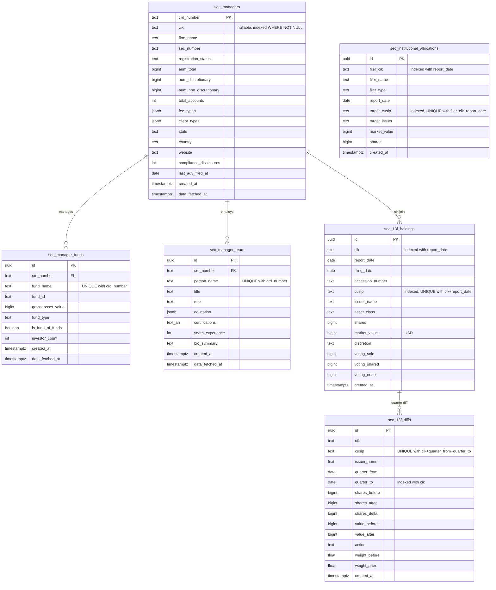

# SEC Data Providers Layer

## Enhancement Summary

**Deepened on:** 2026-03-20
**Research agents used:** 8 (IAPD API validation, edgartools 13F, SEC rate limiting, PostgreSQL upsert, institutional learnings, architecture review, security audit, performance analysis)

### Critical Corrections

1. **IAPD API endpoints are wrong.** The plan assumed REST endpoints (`/summary/{crd}`, `/brochures/{crd}`, `/schedule-d/{crd}`) that return 403. The IAPD API only exposes a **search endpoint** (`/search/firm?query=...`). Detailed Form ADV data (AUM, fees, private funds, compliance) comes from **monthly bulk CSV downloads** from SEC FOIA, not from REST API calls. Form ADV is NOT on EDGAR — it's filed through IARD/FINRA. `adv_service.py` must be redesigned as a hybrid: IAPD search for discovery + bulk CSV ingestion for detailed data + PDF download for brochures.

2. **EFTS tier doesn't exist in current CIK resolver.** The current `cik_resolver.py` only has edgartools ticker + fuzzy + blob index. The `_search_form_d()` EFTS call is in `service.py`, not in CIK resolution. Tier 3 (EFTS) must be implemented as **new code**, not migrated.

3. **Phase 9 (package setup) must be Phase 1.** `data_providers` must be in pyproject.toml `include` and import-linter `root_packages` before any code is written, otherwise `make check` breaks at every intermediate phase.

4. **`app.*` import restriction too broad.** Services need `app.shared.models` for ORM access. Restriction should be `app.domains.*`, not `app.*`. Matches `quant_engine` precedent.

### Key Improvements from Research

5. **edgartools `compare_holdings()` already computes QoQ diffs** with Status (NEW/CLOSED/INCREASED/DECREASED/UNCHANGED). Manual diff computation may be unnecessary — evaluate whether edgartools output can be persisted directly to `sec_13f_diffs`.

6. **SEC returns 403 (not 429) on rate limit**, with **10-minute IP block** that extends with continued requests. `_classify_error()` must treat 403 from SEC domains as rate limit, not auth failure. edgartools has built-in 9 req/s limiter via pyrate_limiter.

7. **Split diff computation into separate transaction.** Performance analysis shows inline computation creates 5-10s transactions with 1000+ writes. Two transactions (holdings → commit → diffs → commit) is safer with negligible orphan risk.

8. **Dedicated SEC thread pool** (`max_workers=4`, thread prefix `sec-data`). Default executor is heavily consumed by existing services (deep_review uses 11 threads). Prevents starvation.

9. **Covering indexes** for cross-manager queries: `(cusip, report_date) INCLUDE (cik, shares, market_value)` on `sec_13f_holdings`. Enables index-only scans for portfolio overlap analysis.

10. **Stale-but-serve pattern** for IAPD/ADV calls. Return cached data immediately even if past TTL, trigger background refresh. Only block on complete cache miss.

11. **Bulk upsert via UNNEST** instead of row-by-row INSERT. asyncpg parameter limit is 32767; chunk at 2000 rows. Saves ~250ms per filing (500 round trips → 1).

### Security Hardening

12. **Harden `sanitize_entity_name()`** — add strict character allowlist (`^[a-zA-Z0-9\s.,'-&()]+$`), reject EFTS query operators and quotes that could inject into SEC search queries.

13. **Local fallback rate limiter** when Redis is unavailable — in-process token bucket at `10 / expected_worker_count` instead of unlimited throughput.

14. **Per-tenant SEC API budget** — daily call cap in Redis (`sec:budget:{org_id}:{date}`), rate-limit `force_refresh=True` per entity.

15. **Upsert guard** — `WHERE data_fetched_at < EXCLUDED.data_fetched_at` on all ON CONFLICT DO UPDATE to prevent stale data overwriting fresh data in concurrent scenarios.

### Dependency Fixes

16. **`edgartools` not in CI install** — `pip install -e ".[dev,ai,quant]"` doesn't include `edgar` optional group. Either add to CI or preserve lazy import pattern.

17. **`rapidfuzz` not in pyproject.toml** — used by CIK resolver fuzzy matching but not declared. Add or preserve try/except.

18. **`nest-asyncio` interference** — edgartools patches event loop, potential uvicorn conflict. Already flagged in edgar upgrade plan.

### ORM Convention Clarifications

19. **No `AuditMetaMixin`** on SEC tables. Use explicit `created_at` column only. `data_fetched_at` replaces `updated_at` semantically. Matches `MacroSnapshot` pattern.

20. **Add `data_fetched_at` to `sec_13f_holdings`** — currently missing. Needed for amendment tracking and staleness checks consistent with ADV tables.

21. **`sec_managers ↔ sec_13f_holdings` is a logical join (no FK)**. CIK in 13F comes from EDGAR; manager may not be in ADV catalog (or vice versa). ERD should annotate as "logical join, no FK."

---

## Overview

Create `backend/data_providers/sec/` — a new top-level package providing shared SEC data infrastructure consumed by both Credit and Wealth verticals. Three services (Form ADV/IAPD, 13F-HR holdings, institutional ownership) plus shared SEC infra (CIK resolver, rate limiters, User-Agent). Includes full refactor of `credit/edgar/` to consume the new shared layer — zero tolerance for duplicate CIK resolvers.

Replaces the need for paid providers like eVestment for US Investment Manager intelligence. All data is public SEC filings.

(See brainstorm: `docs/brainstorms/2026-03-20-sec-data-providers-brainstorm.md`)

## Problem Statement

The current EDGAR integration (`vertical_engines/credit/edgar/`) serves credit underwriting only — 10-K financials, going concern, insider signals. The Wealth vertical needs the same SEC infrastructure (CIK resolution, rate limiting) plus entirely different filings (Form ADV for manager profiles, 13F-HR for holdings) that the credit package does not fetch. Import-linter prevents wealth from importing credit code. The result: either duplicate infrastructure or a new shared layer.

Additionally, the system lacks:
- **Manager catalog data** — firm registration, AUM, fee structure, team bios, compliance history (Form ADV / IAPD)
- **Portfolio holdings history** — quarterly holdings snapshots for style drift, concentration, peer comparison (13F-HR)
- **Institutional ownership** — which endowments/pensions invest in which managers (13F reverse lookup)

All available for free from SEC APIs.

## Proposed Solution

New `backend/data_providers/` layer with `sec/` sub-package. Shared infrastructure migrated from `credit/edgar/`. Three async services for data ingestion. Six global PostgreSQL tables. Import-linter contracts enforcing isolation.

(Approach B from brainstorm — chosen over quant_engine placement and vertical expansion. See brainstorm for alternatives considered.)

## Technical Approach

### Architecture

```
data_providers/sec/
    shared.py              ← CIK resolver, rate limiters (EDGAR + IAPD), User-Agent, sanitize_entity_name
    adv_service.py         ← Hybrid: IAPD search API + SEC FOIA bulk CSV + PDF reports
    thirteenf_service.py   ← 13F-HR: holdings snapshots, quarter diffs, aggregation
    institutional_service.py ← 13F reverse: endowment/pension allocations
    models.py              ← Frozen dataclasses (CikResolution + all new types)
```

### Key Design Decisions

| Decision | Rationale |
|---|---|
| `CikResolution` moves to `data_providers/sec/models.py` | Cannot stay in `credit/edgar/models.py` (would force data_providers → vertical import). `credit/edgar/models.py` re-exports for backward compat. |
| Blob index tier eliminated | The 4-tier CIK resolver drops to 3 tiers (ticker → fuzzy → EFTS). Blob index was a static snapshot doing the same job as Tier 2 (edgartools fuzzy) but with stale data — false confidence is worse than not resolving. Tier 4 (EFTS) covers structural misses that Tier 2 can't (searches filing content, not just entity index). Eliminates `app.services.blob_storage` dependency entirely — `shared.py` stays standalone with zero DI needed. (See brainstorm: "Blob index tier eliminated from CIK resolver") |
| Separate rate limiters per SEC host | IAPD (api.adviserinfo.sec.gov) = 2 req/s. EDGAR (efts.sec.gov) = 8 req/s. Different hosts, different limits. Redis keys: `iapd:rate:{second}` vs `edgar:rate:{second}`. |
| TTL-based staleness with `force_refresh` | Services check `data_fetched_at` before hitting SEC API. TTL: 7 days (ADV), 45 days (13F). `force_refresh=True` bypasses cache. Prevents redundant API calls during ad-hoc consumption. |
| `sec_13f_diffs` computed inline | On holdings ingestion, diffs computed against previous quarter in same transaction. No window of holdings-without-diffs. |
| `models.py` monolithic, split if grows | Single file for now. 13F and institutional share types (endowment is 13F filer subset). Split into `models/adv.py`, `models/thirteenf.py` if file exceeds ~300 lines. Conscious decision per brainstorm. |
| All tables global (no org_id, no RLS) | Public SEC data. Consistent with `macro_data`, `benchmark_nav`, `allocation_blocks`. |

### Implementation Phases

#### Phase 1: Shared SEC Infrastructure (`data_providers/sec/shared.py` + `models.py`)

Migrate CIK resolver + rate limiting from `credit/edgar/` to the new shared layer. This is the foundation — everything else depends on it.

**Tasks:**

- [ ] Create `backend/data_providers/__init__.py` (empty)
- [ ] Create `backend/data_providers/sec/__init__.py` (empty)
- [ ] Create `backend/data_providers/sec/models.py` with:
  - `CikResolution` (migrated from `credit/edgar/models.py`)
  - `AdvManager`, `AdvFund`, `AdvTeamMember` (frozen dataclasses for ADV data)
  - `ThirteenFHolding`, `ThirteenFDiff` (frozen dataclasses for 13F data)
  - `InstitutionalAllocation` (frozen dataclass for reverse 13F)
  - `SeriesFetchResult` (generic wrapper: data + warnings + staleness metadata)
- [ ] Create `backend/data_providers/sec/shared.py` with:
  - `SEC_USER_AGENT = "Netz Analysis Engine tech@netzco.com"`
  - `SEC_EDGAR_RATE_LIMIT = 8` (req/s, conservative under SEC 10/s)
  - `SEC_IAPD_RATE_LIMIT = 2` (req/s, conservative for undocumented API)
  - `check_edgar_rate(max_per_second)` — Redis sliding window, key `edgar:rate:{second}`, silent fallback
  - `check_iapd_rate(max_per_second)` — Redis sliding window, key `iapd:rate:{second}`, silent fallback
  - `sanitize_entity_name(name)` — migrated from `credit/edgar/cik_resolver.py`
  - `resolve_cik(entity_name, ticker)` — 3-tier cascade (blob index tier eliminated):
    1. edgartools `Company(ticker)` → confidence=1.0
    2. edgartools `find(name)` + rapidfuzz ≥0.85 → confidence=ratio/100
    3. EFTS full-text search (last resort) — searches filing content, not just entity index
  - No DI parameters needed — `shared.py` is fully standalone (no `app.*`, no StorageClient)
  - `_normalize_light(name)`, `_normalize_heavy(name)` — copied from current `cik_resolver.py` (still used by fuzzy matching logic)

**Files created:**
- `backend/data_providers/__init__.py`
- `backend/data_providers/sec/__init__.py`
- `backend/data_providers/sec/models.py`
- `backend/data_providers/sec/shared.py`

**Success criteria:**
- `resolve_cik()` in `shared.py` produces identical results to `credit/edgar/cik_resolver.py:resolve_cik()` for Tiers 1, 2, and 4. Tier 3 (blob index) intentionally removed — test cases that relied on blob index fallback now fall through to EFTS (Tier 4) or return not_found.
- Rate limiters work with Redis available and gracefully degrade without it
- `shared.py` and `models.py` have zero imports from `app.*` (fully standalone). Service modules (`adv_service.py`, `thirteenf_service.py`, `institutional_service.py`) may import `app.shared.models` and `app.core.db` for ORM access.

---

#### Phase 2: credit/edgar Refactor

Refactor `credit/edgar/` to consume `data_providers.sec.shared`. Delete `cik_resolver.py`. All 1405 existing tests must pass unchanged.

**Tasks:**

- [ ] Update `backend/vertical_engines/credit/edgar/models.py`:
  - Add re-export: `from data_providers.sec.models import CikResolution` (backward compat for any external imports)
- [ ] Delete `backend/vertical_engines/credit/edgar/cik_resolver.py`
- [ ] Update `backend/vertical_engines/credit/edgar/service.py`:
  - Replace `from vertical_engines.credit.edgar.cik_resolver import resolve_cik` with `from data_providers.sec.shared import resolve_cik`
  - Replace `_check_distributed_rate()` with `from data_providers.sec.shared import check_edgar_rate` and call `check_edgar_rate()`
  - Replace `_SEC_USER_AGENT` with `from data_providers.sec.shared import SEC_USER_AGENT`
  - Call `resolve_cik(name, ticker)` directly — no DI/blob_loader needed (blob index tier eliminated)
- [ ] Update `backend/vertical_engines/credit/edgar/entity_extraction.py`:
  - Replace `from vertical_engines.credit.edgar.cik_resolver import sanitize_entity_name` with `from data_providers.sec.shared import sanitize_entity_name`
- [ ] Update `backend/vertical_engines/credit/edgar/__init__.py`:
  - Remove `cik_resolver` from lazy imports (module deleted)
  - Keep all existing public API exports (`fetch_edgar_data`, `fetch_edgar_multi_entity`, `extract_searchable_entities`, `build_edgar_multi_entity_context`)
- [ ] Update `backend/tests/test_edgar_package.py`:
  - Replace `from vertical_engines.credit.edgar.cik_resolver import sanitize_entity_name` with `from data_providers.sec.shared import sanitize_entity_name`
- [ ] Run `make check` — all 1405 tests must pass, lint clean, types clean, import-linter green

**Files modified:**
- `backend/vertical_engines/credit/edgar/models.py` (add re-export)
- `backend/vertical_engines/credit/edgar/service.py` (import changes + blob_loader injection)
- `backend/vertical_engines/credit/edgar/entity_extraction.py` (import change)
- `backend/vertical_engines/credit/edgar/__init__.py` (remove cik_resolver lazy import)
- `backend/tests/test_edgar_package.py` (import change)

**Files deleted:**
- `backend/vertical_engines/credit/edgar/cik_resolver.py`

**Success criteria:**
- `cik_resolver.py` deleted — single CIK resolver in `data_providers.sec.shared`
- `make check` green (all 1405 tests pass)
- No `_check_distributed_rate` or `_SEC_USER_AGENT` in `credit/edgar/service.py`
- `credit/edgar/` has zero CIK resolution logic — only credit-specific analysis (financials, going_concern, insider_signals)

---

#### Phase 3: Import-Linter Contracts

Declare the new package in the import graph and enforce isolation.

**Tasks:**

- [ ] Update `pyproject.toml` `[tool.importlinter]` section:

```toml
[tool.importlinter]
root_packages = ["vertical_engines", "quant_engine", "app", "data_providers"]

# NEW: data_providers must not import verticals, app domains, or quant_engine
# NOTE: data_providers CAN import app.shared.models and app.core.db (matches quant_engine precedent)
[[tool.importlinter.contracts]]
name = "Data providers must not import verticals or app domains or quant_engine"
type = "forbidden"
source_modules = ["data_providers"]
forbidden_modules = ["vertical_engines", "app.domains", "quant_engine"]
# app.shared and app.core are NOT forbidden — ORM models and DB sessions live there
```

- [ ] Run `make architecture` to verify all contracts pass
- [ ] Verify existing contracts still hold (no regressions)

**Files modified:**
- `pyproject.toml`

**Success criteria:**
- `make architecture` green
- `data_providers` cannot import verticals, app domains, or quant_engine (prevents circular dependencies)
- Both verticals can import `data_providers` (one-way dependency, verified by absence of blocking contract)

---

#### Phase 4: Alembic Migration (6 Global Tables)

Create the database schema for all SEC data tables.

**Tasks:**

- [ ] Create migration file `backend/app/core/db/migrations/versions/XXXX_sec_data_providers_tables.py`:

```python
# TABLE: sec_managers (global, no RLS) — Form ADV manager catalog
# TABLE: sec_manager_funds (global, no RLS) — ADV Schedule D private funds
# TABLE: sec_manager_team (global, no RLS) — ADV Part 2A team bios
# TABLE: sec_13f_holdings (global, no RLS) — 13F quarterly holdings
# TABLE: sec_13f_diffs (global, no RLS) — Quarter-over-quarter changes
# TABLE: sec_institutional_allocations (global, no RLS) — Institutional 13F reverse
```

**Schema with all constraints and indexes (resolved from brainstorm + SpecFlow gaps):**

```sql
-- sec_managers
CREATE TABLE sec_managers (
    crd_number TEXT PRIMARY KEY,
    cik TEXT,
    firm_name TEXT NOT NULL,
    sec_number TEXT,
    registration_status TEXT,
    aum_total BIGINT,
    aum_discretionary BIGINT,
    aum_non_discretionary BIGINT,
    total_accounts INTEGER,
    fee_types JSONB,
    client_types JSONB,
    state TEXT,
    country TEXT,
    website TEXT,
    compliance_disclosures INTEGER,
    last_adv_filed_at DATE,
    created_at TIMESTAMPTZ NOT NULL DEFAULT now(),
    data_fetched_at TIMESTAMPTZ NOT NULL DEFAULT now()
);
CREATE INDEX idx_sec_managers_cik ON sec_managers (cik) WHERE cik IS NOT NULL;

-- sec_manager_funds
CREATE TABLE sec_manager_funds (
    id UUID PRIMARY KEY DEFAULT gen_random_uuid(),
    crd_number TEXT NOT NULL REFERENCES sec_managers(crd_number) ON DELETE CASCADE,
    fund_name TEXT NOT NULL,
    fund_id TEXT,
    gross_asset_value BIGINT,
    fund_type TEXT,
    is_fund_of_funds BOOLEAN,
    investor_count INTEGER,
    created_at TIMESTAMPTZ NOT NULL DEFAULT now(),
    data_fetched_at TIMESTAMPTZ NOT NULL DEFAULT now(),
    UNIQUE (crd_number, fund_name)
);

-- sec_manager_team
CREATE TABLE sec_manager_team (
    id UUID PRIMARY KEY DEFAULT gen_random_uuid(),
    crd_number TEXT NOT NULL REFERENCES sec_managers(crd_number) ON DELETE CASCADE,
    person_name TEXT NOT NULL,
    title TEXT,
    role TEXT,
    education JSONB,
    certifications TEXT[],
    years_experience INTEGER,
    bio_summary TEXT,
    created_at TIMESTAMPTZ NOT NULL DEFAULT now(),
    data_fetched_at TIMESTAMPTZ NOT NULL DEFAULT now(),
    UNIQUE (crd_number, person_name)
);

-- sec_13f_holdings
CREATE TABLE sec_13f_holdings (
    id UUID PRIMARY KEY DEFAULT gen_random_uuid(),
    cik TEXT NOT NULL,
    report_date DATE NOT NULL,
    filing_date DATE NOT NULL,
    accession_number TEXT NOT NULL,
    cusip TEXT NOT NULL,
    issuer_name TEXT NOT NULL,
    asset_class TEXT,
    shares BIGINT,
    market_value BIGINT,      -- USD (edgartools reports in thousands; service multiplies ×1000)
    discretion TEXT,
    voting_sole BIGINT,
    voting_shared BIGINT,
    voting_none BIGINT,
    created_at TIMESTAMPTZ NOT NULL DEFAULT now(),
    data_fetched_at TIMESTAMPTZ NOT NULL DEFAULT now(),
    UNIQUE (cik, report_date, cusip)
);
CREATE INDEX idx_sec_13f_holdings_cik_report_date ON sec_13f_holdings (cik, report_date);
-- Covering index for cross-manager portfolio overlap queries
CREATE INDEX idx_sec_13f_holdings_cusip_report_date ON sec_13f_holdings (cusip, report_date)
    INCLUDE (cik, shares, market_value);

-- sec_13f_diffs
CREATE TABLE sec_13f_diffs (
    id UUID PRIMARY KEY DEFAULT gen_random_uuid(),
    cik TEXT NOT NULL,
    cusip TEXT NOT NULL,
    issuer_name TEXT NOT NULL,
    quarter_from DATE NOT NULL,
    quarter_to DATE NOT NULL,
    shares_before BIGINT,
    shares_after BIGINT,
    shares_delta BIGINT,
    value_before BIGINT,
    value_after BIGINT,
    action TEXT NOT NULL,      -- NEW_POSITION, INCREASED, DECREASED, EXITED, UNCHANGED
    weight_before FLOAT,
    weight_after FLOAT,
    created_at TIMESTAMPTZ NOT NULL DEFAULT now(),
    UNIQUE (cik, cusip, quarter_from, quarter_to)
);
CREATE INDEX idx_sec_13f_diffs_cik_quarter_to ON sec_13f_diffs (cik, quarter_to);
-- Reverse lookup: which managers changed position in CUSIP X
CREATE INDEX idx_sec_13f_diffs_cusip_quarter_to ON sec_13f_diffs (cusip, quarter_to);

-- sec_institutional_allocations
CREATE TABLE sec_institutional_allocations (
    id UUID PRIMARY KEY DEFAULT gen_random_uuid(),
    filer_cik TEXT NOT NULL,
    filer_name TEXT NOT NULL,
    filer_type TEXT,
    report_date DATE NOT NULL,
    target_cusip TEXT NOT NULL,
    target_issuer TEXT NOT NULL,
    market_value BIGINT,
    shares BIGINT,
    created_at TIMESTAMPTZ NOT NULL DEFAULT now(),
    UNIQUE (filer_cik, report_date, target_cusip)
);
-- Covering index for reverse lookup (who holds this security)
CREATE INDEX idx_sec_inst_alloc_target_cusip_date ON sec_institutional_allocations (target_cusip, report_date DESC)
    INCLUDE (filer_cik, filer_name, filer_type, market_value, shares);
CREATE INDEX idx_sec_inst_alloc_filer_cik_date ON sec_institutional_allocations (filer_cik, report_date);
```

- [ ] Create ORM models in `backend/app/shared/models.py`:
  - All models: `Base` (no `IdMixin` for `sec_managers` which has natural PK, `IdMixin` for the rest)
  - Docstring: `"GLOBAL TABLE: No organization_id, no RLS."`
  - `lazy="raise"` on all relationships
  - All FK relationships use `ON DELETE CASCADE`
- [ ] Update `backend/tests/test_global_table_isolation.py`:
  - Add all 6 tables to `GLOBAL_TABLE_MODELS`
  - Add allowed consumers to `ALLOWLISTED_GLOBAL_TABLE_CONSUMERS`: `data_providers.sec.adv_service`, `data_providers.sec.thirteenf_service`, `data_providers.sec.institutional_service`
- [ ] Update `backend/app/core/db/rls_audit.py`:
  - Add all 6 table names to `GLOBAL_TABLES` frozenset
- [ ] Run `make migrate` and verify migration applies cleanly
- [ ] Run `make check`

**Files created:**
- `backend/app/core/db/migrations/versions/XXXX_sec_data_providers_tables.py`

**Files modified:**
- `backend/app/shared/models.py` (6 new ORM models)
- `backend/tests/test_global_table_isolation.py` (add to GLOBAL_TABLE_MODELS + allowlist)
- `backend/app/core/db/rls_audit.py` (add to GLOBAL_TABLES)

**Success criteria:**
- `make migrate` applies cleanly (up and down)
- All 6 tables created with correct indexes and unique constraints
- `test_global_table_isolation` passes with new tables
- RLS audit does not flag new global tables

---

#### Phase 5: ADV Service (`data_providers/sec/adv_service.py`)

Form ADV data — manager catalog, private funds, team. **Hybrid approach** required due to IAPD API limitations discovered during research.

### Research Insight: IAPD API Only Exposes Search

The plan originally assumed REST endpoints (`/summary/{crd}`, `/brochures/{crd}`, `/schedule-d/{crd}`) — **these return 403**. The IAPD API is the backend for an Angular SPA, not a public REST API. Only the search endpoint works:

```
GET https://api.adviserinfo.sec.gov/search/firm?query={term}&hl=true&nrows=25&start=0&wt=json
```

Response returns: CRD, SEC number, firm name, other names, scope (ACTIVE/INACTIVE), disclosure flag, branch count, office address. **Does NOT return AUM, fees, compliance disclosures, or private fund data.**

Detailed Form ADV data (AUM, fees, funds, compliance) is available from:
1. **Bulk CSV/ZIP downloads** (monthly, free): `https://www.sec.gov/foia-services/frequently-requested-documents/form-adv-data`
2. **PDF reports** per CRD: `https://reports.adviserinfo.sec.gov/reports/ADV/{crd}/PDF/{crd}.pdf`
3. Form ADV is filed through **IARD (FINRA)**, NOT EDGAR. Cannot use edgartools for ADV.

### Revised Architecture: Hybrid ADV Ingestion

```
AdvService
  ├── search_managers()       ← IAPD search API (real-time, basic info only)
  ├── ingest_bulk_adv()       ← Monthly CSV download from SEC FOIA (full data)
  ├── fetch_manager_pdf()     ← PDF report per CRD (OCR for brochure/team)
  └── fetch_manager()         ← Returns from DB (populated by bulk + PDF ingestion)
```

**Tasks:**

- [ ] Create `backend/data_providers/sec/adv_service.py`:

```python
class AdvService:
    """Form ADV data service — hybrid IAPD search + bulk CSV + PDF reports.

    The IAPD API only exposes a search endpoint (basic identification).
    Detailed data (AUM, fees, private funds, compliance) comes from monthly
    bulk CSV downloads published by SEC FOIA. Team bios come from Part 2A
    PDF brochures (OCR via Mistral).

    Async service. Lifecycle: Instantiate ONCE in FastAPI lifespan().
    """

    IAPD_SEARCH_URL = "https://api.adviserinfo.sec.gov/search/firm"
    BULK_CSV_URL = "https://www.sec.gov/foia-services/frequently-requested-documents/form-adv-data"
    PDF_REPORT_URL = "https://reports.adviserinfo.sec.gov/reports/ADV/{crd}/PDF/{crd}.pdf"

    def __init__(
        self,
        http_client: httpx.AsyncClient,
        db_session_factory: Callable,
        rate_limiter: Callable | None = None,
    ): ...

    async def search_managers(
        self, query: str, *, limit: int = 25,
    ) -> list[AdvManager]:
        """Search IAPD by firm name. Returns basic identification only
        (CRD, name, address, scope). Does NOT return AUM or fees.
        For full data, managers must be ingested via bulk CSV."""

    async def ingest_bulk_adv(self, csv_path: str | None = None) -> int:
        """Ingest Form ADV data from monthly SEC FOIA bulk CSV.
        Downloads if csv_path is None. Parses CSV with Form ADV
        question-number columns (e.g., Q5F2A = discretionary AUM).
        Upserts to sec_managers and sec_manager_funds.
        Returns count of managers upserted."""

    async def fetch_manager(
        self,
        crd_number: str,
        *,
        force_refresh: bool = False,
        staleness_ttl_days: int = 7,
    ) -> AdvManager | None:
        """Return manager from DB. Does NOT call IAPD API.
        Data populated by ingest_bulk_adv() (monthly worker).
        Returns None if manager not in DB. Never raises."""

    async def fetch_manager_funds(
        self, crd_number: str,
    ) -> list[AdvFund]:
        """Return Schedule D funds from DB (populated by bulk ingestion)."""

    async def fetch_manager_team(
        self, crd_number: str, *, force_refresh: bool = False,
    ) -> list[AdvTeamMember]:
        """Fetch team from DB. If empty and force_refresh, download Part 2A
        PDF from reports.adviserinfo.sec.gov and extract via Mistral OCR.
        Stub in M1 if OCR extraction is too complex."""
```

- [ ] Implement IAPD search API integration:
  - `GET /search/firm?query={term}&hl=true&nrows={limit}&start=0&wt=json`
  - Parse: `response["hits"]["hits"][*]["_source"]` for `firm_source_id` (CRD), `firm_name`, `firm_ia_scope`, `firm_ia_sec_number`, `firm_ia_address_details` (JSON string — must `json.loads()`)
  - Validate CRD as `^\d{1,10}$` before use as PK
  - Rate limit at 2 req/s via `check_iapd_rate`
- [ ] Implement bulk CSV ingestion:
  - Download monthly ZIP from SEC FOIA (e.g., `ia030226.zip`)
  - Parse CSV — columns use Form ADV question numbers:
    - `Q5F2A` = discretionary AUM, `Q5F2C` = total AUM
    - `TtlEmp` = total employees
    - `Q5E` = fee types (percentage, hourly, fixed, performance)
    - `Q5D` = client types
  - Upsert to `sec_managers` and `sec_manager_funds` (Schedule D in separate CSV table within ZIP)
  - UNNEST bulk upsert for efficiency (thousands of managers per monthly file)
- [ ] Implement stale-but-serve pattern:
  - `fetch_manager()` returns from DB immediately (never calls IAPD)
  - Data freshness depends on bulk ingestion frequency (monthly worker in M2)
  - `force_refresh` on `fetch_manager_team` triggers PDF download + OCR
- [ ] Implement error handling (never-raises pattern):
  - IAPD search: HTTP errors → retry with backoff, 403 from SEC = rate limit (not auth)
  - Bulk CSV download: network error → return count=0 with warning
  - PDF download: 404 → manager has no brochure (common), log info not warning
- [ ] For `fetch_manager_team`: stub in M1 — return empty list with `# TODO: Part 2A PDF OCR`. Document that team extraction requires Mistral OCR pipeline integration (M2 scope).

**Files created:**
- `backend/data_providers/sec/adv_service.py`

**Success criteria:**
- `search_managers()` returns basic results from IAPD search API
- `ingest_bulk_adv()` parses SEC FOIA CSV and upserts to sec_managers + sec_manager_funds
- `fetch_manager()` reads from DB only (no API calls in hot path)
- Never raises — all errors logged + returns None/empty
- Rate limited at 2 req/s for IAPD search, no rate limit needed for bulk CSV download
- CRD numbers validated as `^\d{1,10}$`

---

#### Phase 6: 13F Service (`data_providers/sec/thirteenf_service.py`)

13F-HR filing parser via edgartools — holdings, diffs, aggregation.

**Tasks:**

- [ ] Create `backend/data_providers/sec/thirteenf_service.py`:

```python
class ThirteenFService:
    """13F-HR holdings parser via edgartools.

    Sync service — dispatched via asyncio.to_thread() from async callers.
    Uses edgartools Company().get_filings(form="13F-HR") for filing access.
    Rate limit: shared EDGAR rate limiter (8 req/s).

    Lifecycle: Instantiate ONCE. Config injected as parameter.
    """

    def __init__(
        self,
        db_session_factory: Callable,
        rate_check: Callable | None = None,  # defaults to check_edgar_rate
    ): ...

    def fetch_holdings(
        self,
        cik: str,
        *,
        quarters: int = 8,  # default 2-year lookback
        force_refresh: bool = False,
        staleness_ttl_days: int = 45,
    ) -> list[ThirteenFHolding]:
        """Fetch quarterly 13F holdings for a filer. Never raises."""

    def compute_diffs(
        self,
        cik: str,
        quarter_from: date,
        quarter_to: date,
    ) -> list[ThirteenFDiff]:
        """Compute quarter-over-quarter diffs. Persists to sec_13f_diffs."""

    def get_sector_aggregation(
        self,
        cik: str,
        report_date: date,
    ) -> dict[str, float]:
        """Aggregate holdings by sector. Returns {sector: weight}."""

    def get_concentration_metrics(
        self,
        cik: str,
        report_date: date,
    ) -> dict[str, float]:
        """HHI, top-10 concentration, position count."""
```

- [ ] Implement edgartools 13F parsing:
  - `company.get_filings(form="13F-HR").head(quarters)` — limit filings
  - **Check `report.has_infotable()` before accessing `.holdings`** — 13F-NT filings have no holdings
  - `filing.obj()` returns `ThirteenF` with `.holdings` DataFrame (aggregated, one row per CUSIP)
  - Use `.holdings` (not `.infotable`) — `.infotable` has per-manager-per-security rows
  - DataFrame columns: `Issuer`, `Ticker`, `Cusip`, `Value` (thousands), `SharesPrnAmount`, `Type`, `PutCall`
  - **Value is in thousands** — multiply ×1000 for USD: `df["market_value_usd"] = df["Value"] * 1_000`
  - Also multiply `report.total_value * 1_000` for portfolio total
  - Handle amended filings (`13F-HR/A`): fetch with `amendments=False` to exclude, or take latest per `report_period`
  - Filter by `report_period` (quarter-end) for temporal analysis, NOT `filing_date` (can lag 45 days)
  - Bulk upsert via UNNEST (chunk at 2000 rows for asyncpg parameter limit):
    ```python
    stmt = pg_insert(Sec13FHolding).values(rows)
    stmt = stmt.on_conflict_do_update(
        index_elements=["cik", "report_date", "cusip"],
        set_={"data_fetched_at": stmt.excluded.data_fetched_at},
        where=(Sec13FHolding.data_fetched_at < stmt.excluded.data_fetched_at),
    )
    ```
- [ ] Implement diff computation — **evaluate edgartools `compare_holdings()` first**:
  - edgartools provides `report.compare_holdings()` → DataFrame with `Status` (NEW/CLOSED/INCREASED/DECREASED/UNCHANGED), `ShareChange`, `ShareChangePct`, `ValueChange`, `ValueChangePct`
  - **If edgartools output maps cleanly to `sec_13f_diffs` schema, use it directly** — no manual computation needed
  - If not (missing weight calculation, custom aggregation needed), compute manually from DB
  - **Split into separate transaction** from holdings upsert (performance: avoids 5-10s transactions with 1000+ writes). Orphan holdings-without-diffs is safe; re-ingestion recomputes.
  - Persist to `sec_13f_diffs` with `ON CONFLICT (cik, cusip, quarter_from, quarter_to) DO UPDATE`
- [ ] Dispatch via dedicated SEC thread pool, NOT `asyncio.to_thread()` default executor:
  ```python
  # In shared.py
  _sec_executor = ThreadPoolExecutor(max_workers=4, thread_name_prefix="sec-data")
  async def run_in_sec_thread(fn, *args):
      loop = asyncio.get_running_loop()
      return await loop.run_in_executor(_sec_executor, functools.partial(fn, *args))
  ```
  - Prevents default executor starvation (deep_review uses 11 threads, credit services use 15+)
- [ ] edgartools gotchas to handle:
  - `nest-asyncio` patches event loop — potential uvicorn conflict (already flagged in edgar upgrade plan)
  - edgartools has built-in 9 req/s limiter via pyrate_limiter (per-process only; our Redis limiter coordinates across workers)
  - edgartools has 3-tier caching (submissions 10min, indexes 30min, archives permanent) — avoid double-caching
  - Large portfolios (Vanguard 24K+ holdings): network I/O dominates, enforce holdings-per-filing cap (15,000)

**Files created:**
- `backend/data_providers/sec/thirteenf_service.py`

**Success criteria:**
- Parses 13F-HR holdings via edgartools correctly
- market_value stored in USD (×1000 multiplied, documented in column comment)
- Diffs computed inline on ingestion, no orphan states
- Upsert prevents duplicates on re-ingestion
- Never raises

---

#### Phase 7: Institutional Service (`data_providers/sec/institutional_service.py`)

13F reverse lookup — discover institutional filers, map their allocations to managers.

### Coverage Model

The reverse lookup works by matching `target_cusip` in `sec_institutional_allocations` against securities associated with a manager's CIK. CUSIP-based coverage applies when the manager has registered securities in the US:

- **BDCs (Business Development Companies)** — listed on exchange, have CUSIP, institutional 13F filers hold them directly
- **REITs and credit REITs** — idem
- **Hybrid funds with public sleeve** — equity/bond portion carries CUSIP even if direct deals do not
- **Master fund US with offshore feeders** — the US-registered master appears in institutional 13F filings; the feeder→master look-through captures institutional exposure that would otherwise be invisible

**Not captured:**
- Direct private credit deals (bilateral loans, unlisted CLO participations)
- Structures domiciled exclusively offshore with no US-registered master fund

For the Netz manager universe, partial coverage is expected. `find_investors_in_manager()` must distinguish between "no institutional holder found" and "manager has no traceable public securities" — these are different outcomes and must be communicated differently to callers.

**Tasks:**

- [ ] Create `backend/data_providers/sec/institutional_service.py`:

```python
class InstitutionalService:
    """13F reverse lookup — institutional investor allocations.

    Async service for filer discovery (EFTS search), delegates to
    ThirteenFService for actual 13F parsing.

    Coverage: managers with US-registered securities (BDCs, REITs, master funds,
    hybrid funds with public sleeve). Direct private credit deals and purely
    offshore structures without a US master do not appear in 13F holdings.

    Rate limit: shared EDGAR rate limiter (8 req/s).
    """

    def __init__(
        self,
        http_client: httpx.AsyncClient,
        thirteenf_service: ThirteenFService,
        db_session_factory: Callable,
    ): ...

    async def discover_institutional_filers(
        self,
        *,
        filer_types: list[str] | None = None,  # ["endowment", "pension", "foundation"]
        limit: int = 100,
    ) -> list[dict[str, str]]:
        """Search EFTS for institutional 13F filers by keyword.

        Keywords: "endowment", "pension", "foundation", "sovereign", "insurance".
        Returns list of {cik, filer_name, filer_type} dicts.
        filer_type classified from entity name keywords — logged as WARNING if ambiguous.
        """

    async def fetch_allocations(
        self,
        filer_cik: str,
        filer_name: str,
        filer_type: str,
        *,
        quarters: int = 4,
        force_refresh: bool = False,
    ) -> list[InstitutionalAllocation]:
        """Fetch 13F holdings for an institutional filer and persist as allocations.

        Delegates to ThirteenFService.fetch_holdings() — no duplication of parsing logic.
        Maps ThirteenFHolding -> InstitutionalAllocation with filer context attached.
        Upserts to sec_institutional_allocations.
        Never raises.
        """

    async def find_investors_in_manager(
        self,
        manager_cik: str,
    ) -> InstitutionalOwnershipResult:
        """Reverse lookup: which institutions hold securities of this manager?

        Behavior:
        - If manager_cik has no 13F filings on EDGAR -> returns result with
          coverage=CoverageType.NO_PUBLIC_SECURITIES, investors=[]
          (manager has no traceable public securities — not the same as zero investors)
        - If manager_cik has 13F filings but no institutional holders found ->
          returns result with coverage=CoverageType.PUBLIC_SECURITIES_NO_HOLDERS, investors=[]
        - If institutional holders found -> coverage=CoverageType.FOUND, investors=[...]

        Callers must check coverage type before interpreting empty investors list.
        """
```

- [ ] Define `InstitutionalOwnershipResult` in `models.py`:

```python
from enum import Enum

class CoverageType(str, Enum):
    FOUND = "found"
    PUBLIC_SECURITIES_NO_HOLDERS = "public_securities_no_holders"
    NO_PUBLIC_SECURITIES = "no_public_securities"

@dataclass(frozen=True)
class InstitutionalOwnershipResult:
    manager_cik: str
    coverage: CoverageType
    investors: list[InstitutionalAllocation]
    note: str | None = None  # e.g., "BDC with listed shares" or "no US master fund detected"
```

- [ ] Implement EFTS filer discovery:
  - `https://efts.sec.gov/LATEST/search-index?forms=13F-HR&q="endowment" OR "pension" OR "foundation"`
  - Parse results for CIK + filer name
  - Classify `filer_type` from entity name keywords (endowment/pension/foundation/sovereign/insurance)
  - Log WARNING when classification is ambiguous (entity name matches multiple types)
  - Rate limit via `check_edgar_rate()`
- [ ] Implement `find_investors_in_manager()` with coverage detection:

```python
async def find_investors_in_manager(self, manager_cik: str) -> InstitutionalOwnershipResult:
    # Step 1: Check if manager has any 13F filings (proxy for public securities)
    has_13f = await self._manager_has_13f_filings(manager_cik)
    if not has_13f:
        logger.info(
            "manager_cik=%s has no 13F filings on EDGAR — "
            "likely no US-registered public securities (direct deals or offshore-only structure). "
            "BDCs, REITs, and US master funds would appear here.",
            manager_cik,
        )
        return InstitutionalOwnershipResult(
            manager_cik=manager_cik,
            coverage=CoverageType.NO_PUBLIC_SECURITIES,
            investors=[],
            note="No 13F filings found. Manager may operate via direct deals, "
                 "offshore feeders without US master, or below $100M AUM threshold.",
        )

    # Step 2: Query sec_institutional_allocations for CUSIPs associated with this manager
    # CUSIPs sourced from sec_13f_holdings WHERE cik = manager_cik
    allocations = await self._query_institutional_holders(manager_cik)
    if not allocations:
        return InstitutionalOwnershipResult(
            manager_cik=manager_cik,
            coverage=CoverageType.PUBLIC_SECURITIES_NO_HOLDERS,
            investors=[],
            note="Manager has public securities but no institutional 13F filers "
                 "hold them in tracked portfolios.",
        )

    return InstitutionalOwnershipResult(
        manager_cik=manager_cik,
        coverage=CoverageType.FOUND,
        investors=allocations,
    )
```

- [ ] Implement feeder→master look-through heuristic:
  - When `find_investors_in_manager()` returns `NO_PUBLIC_SECURITIES`, check if manager name contains keywords ("master", "LP", "LLC") suggesting a US master fund structure
  - If detected: attempt CIK resolution on the base entity name stripped of feeder-specific suffixes (e.g., "Ares Capital Master Fund" → search for "Ares Capital")
  - Log resolved master CIK if found, include in `note` field of result
  - **Best-effort only** — not a blocking step, never raises
- [ ] Delegate 13F parsing to `ThirteenFService.fetch_holdings()` — no duplication of edgartools logic
- [ ] Map holdings to `sec_institutional_allocations` via upsert:
  - `ON CONFLICT (filer_cik, report_date, target_cusip) DO UPDATE` with `data_fetched_at` guard
  - Bulk upsert via UNNEST (same pattern as 13F holdings, chunk at 2000 rows)

**Files created:**
- `backend/data_providers/sec/institutional_service.py`

**Files modified:**
- `backend/data_providers/sec/models.py` — add `CoverageType` enum + `InstitutionalOwnershipResult` dataclass

**Success criteria:**
- Discovers institutional filers via EFTS keyword search
- Delegates to ThirteenFService for 13F parsing (zero duplication)
- Persists to sec_institutional_allocations with upsert
- `find_investors_in_manager()` returns `InstitutionalOwnershipResult` with correct `CoverageType` in all three scenarios
- Empty investors list never returned without coverage context — callers always know why
- Feeder→master heuristic logged when triggered (best-effort, non-blocking)
- Never raises

---

#### Phase 8: Tests

Comprehensive test suite following established patterns.

**Tasks:**

- [ ] Create `backend/tests/test_data_providers_shared.py`:
  - Test `resolve_cik()` — all 3 tiers (ticker, fuzzy, EFTS). No blob index tier.
  - Test `sanitize_entity_name()` — all edge cases (migrated from test_edgar_package.py assertions)
  - Test rate limiters with mocked Redis (available + unavailable)
  - Test `CikResolution` dataclass
  - Verify `resolve_cik()` produces identical results to old `cik_resolver.py` for all existing test inputs (regression suite)
- [ ] Create `backend/tests/test_data_providers_adv.py`:
  - Use `httpx.MockTransport` pattern (from test_ofr_hedge_fund_service.py)
  - Test `fetch_manager()` — happy path, not found, API error, cached/stale
  - Test `search_managers()` — results parsing, empty results
  - Test upsert semantics — concurrent fetch returns consistent data
  - `@pytest.mark.asyncio` for all async tests
- [ ] Create `backend/tests/test_data_providers_thirteenf.py`:
  - Mock edgartools `Company` + `ThirteenF` objects
  - Test `fetch_holdings()` — parsing, market_value ×1000 conversion, upsert
  - Test `compute_diffs()` — all action types (NEW_POSITION, INCREASED, DECREASED, EXITED, UNCHANGED)
  - Test weight computation — before/after weights sum to ~1.0
  - Test staleness check — cached vs force_refresh
- [ ] Create `backend/tests/test_data_providers_institutional.py`:
  - Mock EFTS responses for filer discovery
  - Test `discover_institutional_filers()` — keyword matching, filer_type classification
  - Test `fetch_allocations()` — delegates to ThirteenFService correctly
  - Test `find_investors_in_manager()` — reverse lookup query
- [ ] Run `make check` — all tests pass, including existing 1405

**Files created:**
- `backend/tests/test_data_providers_shared.py`
- `backend/tests/test_data_providers_adv.py`
- `backend/tests/test_data_providers_thirteenf.py`
- `backend/tests/test_data_providers_institutional.py`

**Success criteria:**
- Full test coverage for all public methods in all 4 modules
- Regression suite proving CIK resolver migration produces identical results
- `make check` green (existing 1405 + new tests)

---

#### Phase 9: Package Setup

Wire the new package into the project.

**Tasks:**

- [ ] Update `pyproject.toml` `[project]` dependencies if needed (httpx, edgartools already present)
- [ ] Update `backend/setup.py` or `pyproject.toml` package discovery to include `data_providers`
- [ ] Verify `pip install -e ".[dev,ai,quant]"` includes new package
- [ ] Final `make check` — lint + typecheck + architecture + all tests

**Success criteria:**
- `data_providers` importable after `pip install -e .`
- `make check` fully green
- No mypy errors in new code

## System-Wide Impact

### Interaction Graph

```
User/Worker triggers vertical engine
  → vertical engine calls data_providers.sec.*_service
    → service checks DB staleness (sec_* tables)
      → if stale: calls SEC API (IAPD or EDGAR via edgartools)
        → rate limiter (Redis sliding window, silent fallback)
        → response parsed → upsert to sec_* tables
      → if fresh: returns from DB
    → returns frozen dataclasses to vertical engine
  → vertical engine uses data in evidence pack / analysis / prompt context
```

### Error Propagation

- SEC API errors → never-raises pattern → return None/empty + log warning
- Redis unavailable → local in-process token bucket fallback at `10 / expected_worker_count` req/s (not unlimited). Log WARNING when fallback activates.
- DB errors → propagate to caller (vertical engine handles via its own never-raises wrapper)
- edgartools errors → caught in try/except → return empty + warning (same pattern as credit/edgar)

### State Lifecycle Risks

- **Partial ingestion:** If ADV fetch succeeds but fund fetch fails, `sec_managers` has data but `sec_manager_funds` is empty. Acceptable — consumers check for None/empty.
- **Stale diffs:** If holdings are re-ingested but diff computation fails, `sec_13f_diffs` has old data. Mitigated by separate transaction with idempotent re-computation on next ingestion.
- **Concurrent upserts:** `ON CONFLICT DO UPDATE` handles race conditions. `data_fetched_at` updates to latest fetch time.

### API Surface Parity

No existing API endpoints affected. New API endpoints (M3 scope) will serve the sec_* table data to frontends.

### Integration Test Scenarios

1. **CIK resolver regression:** Call `resolve_cik("Ares Management")` via old path (before refactor) and new path (after) — results must match
2. **Concurrent ADV fetch:** Two async tasks fetch same CRD simultaneously — both succeed, DB has one row (upsert)
3. **13F diff across quarters:** Ingest Q3 2025, then Q4 2025 — diffs computed correctly, no duplicates
4. **Stale cache bypass:** Set `data_fetched_at` to 30 days ago, call `fetch_manager(force_refresh=False)` — returns cached. Call with `force_refresh=True` — re-fetches.
5. **Rate limit exhaustion:** Fire 20 requests in 1 second — rate limiter sleeps, no SEC 403 errors (SEC returns 403, not 429, with 10-minute IP block)
6. **Redis down fallback:** Disable Redis, trigger SEC fetch — local rate limiter activates, requests proceed at reduced rate (not unlimited)
7. **Bulk CSV ingestion:** Download monthly ADV CSV, parse and upsert 5000+ managers — all upserted correctly with UNNEST bulk pattern

## Acceptance Criteria

### Functional Requirements

- [ ] `data_providers/sec/shared.py` provides single-point CIK resolution consumed by credit/edgar and all new services
- [ ] `credit/edgar/cik_resolver.py` deleted — zero duplication
- [ ] `adv_service.py` provides manager catalog via hybrid ingestion: IAPD search API (discovery) + SEC FOIA bulk CSV (full data) + PDF reports (brochures/team)
- [ ] `thirteenf_service.py` parses 13F-HR holdings via edgartools with quarter-over-quarter diffs
- [ ] `institutional_service.py` discovers institutional filers and maps their allocations
- [ ] All 6 global tables created with proper indexes and unique constraints
- [ ] Staleness TTL prevents redundant SEC API calls
- [ ] Never-raises pattern on all public methods

### Non-Functional Requirements

- [ ] Rate limits respected: EDGAR 8 req/s, IAPD 2 req/s
- [ ] All services work with Redis unavailable (rate limiter fallback)
- [ ] Timeouts: 20s per SEC API request
- [ ] No imports from `app.domains.*`, `vertical_engines.*`, or `quant_engine.*` in `data_providers/`. Services may import `app.shared.models` and `app.core.db` (matches `quant_engine` precedent).

### Quality Gates

- [ ] `make check` fully green (lint + typecheck + architecture + all tests)
- [ ] import-linter contract: `data_providers` isolated from verticals/app/quant
- [ ] CIK resolver regression suite: identical results pre/post migration
- [ ] All existing 1405 tests pass unchanged

## Dependencies & Prerequisites

- `edgartools` — already installed (used by credit/edgar)
- `httpx` — already installed
- `rapidfuzz` — already installed (used by CIK resolver fuzzy matching)
- `redis` — already installed (used by rate limiter)
- PostgreSQL 16 — already running (dev via docker-compose)
- Alembic — already configured

No new dependencies required.

## Risk Analysis & Mitigation

| Risk | Probability | Impact | Mitigation |
|---|---|---|---|
| IAPD API instability (undocumented) | Medium | Medium | Fallback: direct EDGAR ADV filing parsing. Monitor in M1. Log all IAPD errors with status codes. |
| CIK resolver regression | Low | High | Regression test suite comparing old vs new resolver on all existing test inputs. Run before deleting cik_resolver.py. |
| Part 2A team extraction requires OCR | High | Low | Stub `fetch_manager_team` if IAPD provides no structured data. Flag as open question. Team data is enhancement, not blocker. |
| SEC rate limit hit (429) | Low | Medium | Dual rate limiters (EDGAR + IAPD), conservative limits (8 and 2 req/s), exponential backoff retry. |
| 13F market_value unit confusion | Medium | High | Document clearly: "edgartools reports in thousands; service multiplies ×1000; column stores USD." Column comment in migration. |
| import-linter new edge breaks existing contracts | Low | Medium | Run `make architecture` after every phase. |

## Future Considerations (M2 + M3)

**M2 — Vertical Engine Integration:**
- Credit deep_review Stage 10: inject ADV data into sponsor analysis evidence pack
- Wealth DD report: wire ADV + 13F into evidence_pack.py (ch02, ch03, ch07)
- Wealth manager_spotlight: full ADV + 13F + institutional profile
- Background workers: ADV refresh (weekly), 13F update (quarterly), institutional scan (quarterly)

**M3 — Analytics + Frontend:**
- Quant engine: 13F-based attribution, cross-manager overlap, concentration metrics
- Style drift: 13F diffs as input alongside DTW returns-based drift
- API endpoints: REST routes for manager search, holdings, institutional ownership
- Frontend: manager intelligence pages (profile, holdings timeline, peer comparison)

(See brainstorm M2/M3 sections for full scope.)

## ERD



## Sources & References

### Origin

- **Brainstorm document:** [docs/brainstorms/2026-03-20-sec-data-providers-brainstorm.md](docs/brainstorms/2026-03-20-sec-data-providers-brainstorm.md) — Key decisions carried forward: Approach B (new data_providers layer), M1 includes credit/edgar refactor (zero tech debt), global tables without RLS, separate rate limiters per SEC host.

### Internal References

- `backend/vertical_engines/credit/edgar/cik_resolver.py` — CIK resolver being migrated (307 lines)
- `backend/vertical_engines/credit/edgar/service.py` — EDGAR service with rate limiter (386 lines)
- `backend/vertical_engines/credit/edgar/entity_extraction.py:20` — imports `sanitize_entity_name` (must update)
- `backend/tests/test_edgar_package.py:14` — imports `sanitize_entity_name` (must update)
- `backend/quant_engine/ofr_hedge_fund_service.py` — async service pattern template (httpx.AsyncClient, MockTransport tests)
- `backend/quant_engine/fiscal_data_service.py:39-73` — `AsyncTokenBucketRateLimiter` pattern
- `backend/app/shared/models.py` — global table ORM model pattern
- `backend/tests/test_global_table_isolation.py` — GLOBAL_TABLE_MODELS + allowlist
- `backend/app/core/db/rls_audit.py:67-80` — GLOBAL_TABLES frozenset
- `pyproject.toml:132-470` — import-linter contracts

### External References

- SEC IAPD API: `https://api.adviserinfo.sec.gov`
- SEC EDGAR EFTS: `https://efts.sec.gov/LATEST/search-index`
- edgartools docs: 13F-HR parsing via `Company.get_filings(form="13F-HR")` → `filing.obj().holdings`
- SEC rate limit policy: 10 req/s with descriptive User-Agent

### Related Documents

- `docs/reference/deep-review-optimization-plan-2026-03-20.md` — Credit signal-aware optimization (consumes EDGAR data)
- `docs/reference/wm-ddreport-optimization-2026-03-20.md` — Wealth source-aware optimization (anticipates new providers)
- `docs/solutions/architecture-patterns/monolith-to-modular-package-with-library-migration.md` — EDGAR modularization patterns (PR #4-#5)
- `docs/solutions/runtime-errors/thread-unsafe-rate-limiter-FredService-20260315.md` — Thread-safe rate limiter pattern
