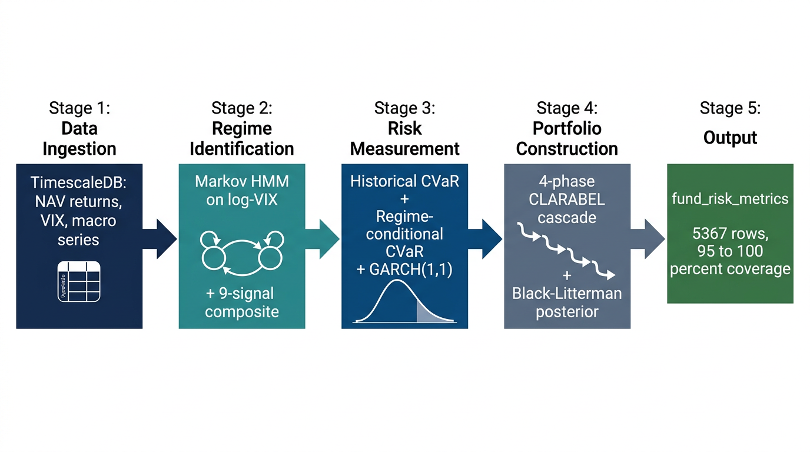
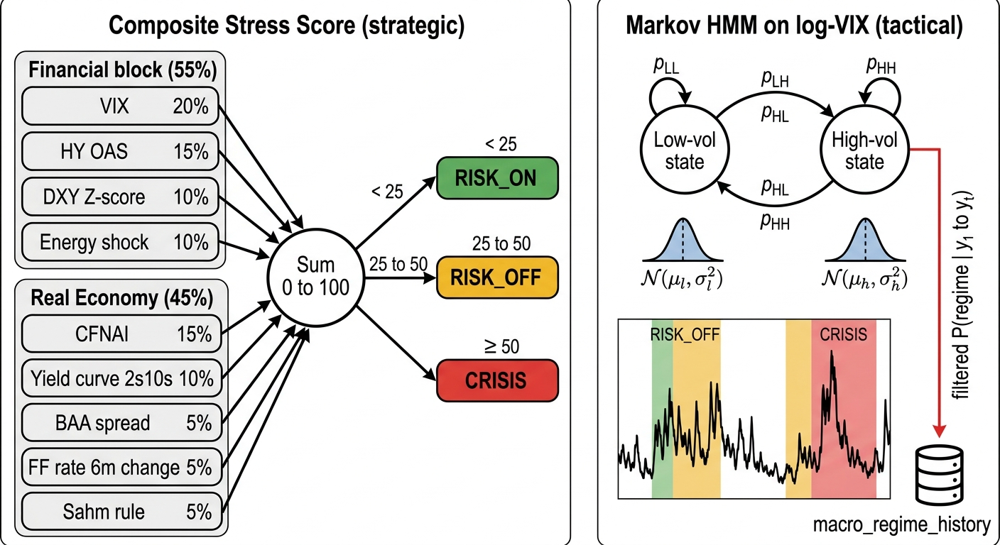
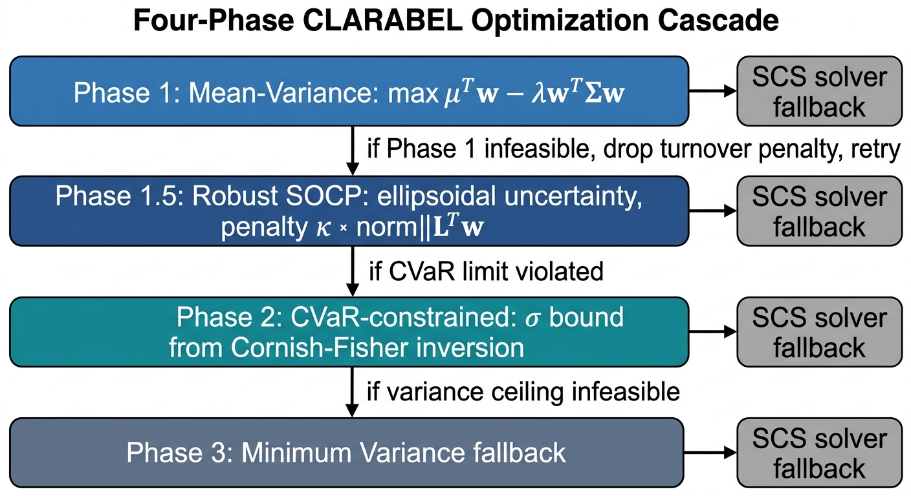
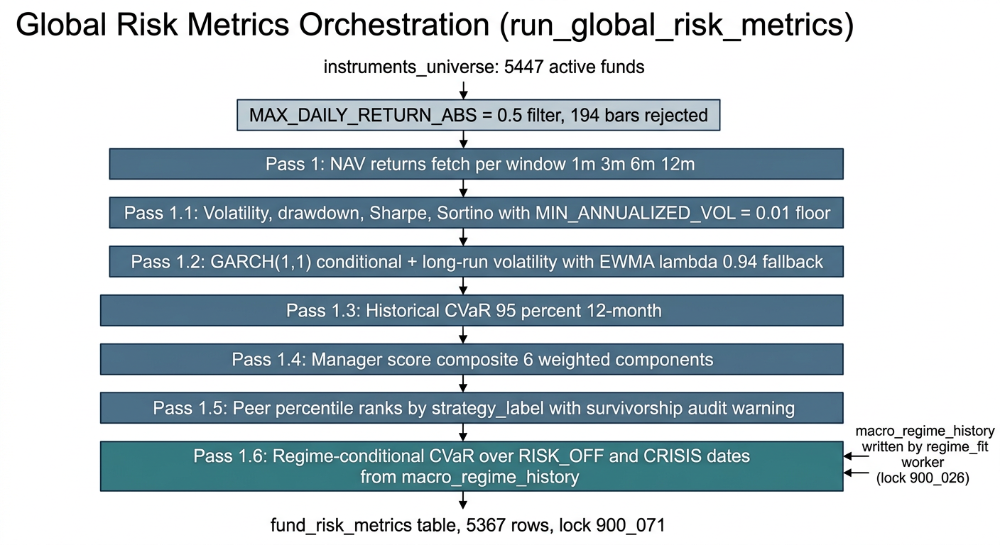

# The Netz Quantitative Engine: Methodological Reference and Current-State Report

**Document type:** Technical report
**Date:** 2026-04-08
**Status:** Engine stabilised; local validation complete, production deploy pending
**Authors:** Netz Research
**Companion reference:** `docs/reference/fund-risk-metrics-state-2026-04-08.md`

---



*Figure 1. Graphical abstract. The five-stage pipeline of the Netz quantitative engine. Inputs are sourced from TimescaleDB hypertables populated by background workers; regimes are identified by the Markov hidden Markov model on log-VIX and the nine-signal composite stress score; risk metrics combine historical CVaR, regime-conditional CVaR, and GARCH(1,1) conditional volatility; portfolio construction uses the four-phase CLARABEL cascade with a Black–Litterman posterior; outputs land in `fund_risk_metrics` with 95 % to 100 % per-column coverage at the 2026-04-08 snapshot.*

## Abstract

This report documents the methodological layer of the Netz quantitative engine as of April 2026, following the S1–S5 stabilisation sprint and two data-quality remediations applied on 2026-04-08. The engine is organised as a library of domain-agnostic services (`backend/quant_engine/`) consumed by vertical orchestrators for risk calculation, portfolio construction, and monitoring. It implements rolling and regime-conditional Conditional Value-at-Risk, GARCH(1,1) conditional volatility with an EWMA fallback, a two-state Markov-switching hidden Markov model on the VIX for regime identification, Ledoit–Wolf covariance shrinkage with Marchenko–Pastur denoising, a Black–Litterman posterior for expected returns, and a four-phase CLARABEL optimisation cascade that includes a robust second-order cone programme under ellipsoidal uncertainty. A PCA factor model, a deterministic macro stress severity scorer, and a composite fund quality score complete the stack. After remediation, the engine produces 5,367 global fund-level risk records with 95 % to 100 % metric coverage, a cross-sectional Sharpe mean of 0.51, and a regime-conditional tail loss 43 % deeper than the unconditional benchmark — the first production-grade snapshot in which every column of `fund_risk_metrics` is populated.

---

## 1. Introduction

The Netz analysis engine addresses institutional wealth and credit workflows in which quantitative inputs must be reproducible, auditable, and robust to the data-quality irregularities endemic to public filings. The quantitative engine is its inner library: a collection of stateless Python services that consume observed returns, prices, macro series, and investor mandates and produce risk metrics, expected returns, covariance estimates, optimised weights, stress scores, and fund-level composite scores. The services do not call external APIs at runtime — all time-series inputs are served from TimescaleDB hypertables populated by background workers under deterministic advisory-lock identifiers — and they do not persist state. Persistence is the responsibility of the worker orchestrators that wrap them, principally `run_global_risk_metrics` and `run_regime_fit`.

This report describes each methodological component in turn, relates it to the relevant academic literature, and closes with the cross-sectional state of the global risk table after remediation. The goal is to serve both as a reference for analysts who must explain the engine to an institutional client and as a technical specification against which future methodology changes can be compared.

## 2. Data Infrastructure and Input Assumptions

All quantitative services operate on `numpy.ndarray` inputs with explicit unit conventions. Daily simple returns are expressed as decimal fractions. Volatilities and expected returns are annualised using a 252 trading-day factor unless noted otherwise. The risk-free rate is sourced from the FRED Daily Federal Funds series (`DFF`) via the `fred_service`, which reads from the `macro_data` hypertable rather than the FRED REST API, and defaults to 0.04 when the series is unavailable.

NAV returns are pre-filtered at ingestion. A constant `MAX_DAILY_RETURN_ABS = 0.5` in `risk_calc.py` rejects any single-day return whose absolute value exceeds 50 %, on the rationale that such a move is physically impossible on an unleveraged fund and, on a triple-leveraged product, would require a 16.7 % single-session move in the underlying — an event that has occurred only a handful of times in recorded equity history. The threshold preserves all observed extremes on T-Rex and ProFunds-style 2x and 3x vehicles (the largest legitimate observation in the current lookback is 73.9 % on the 2x inverse MSTR product, which is flagged but not discarded because it falls within the leveraged regime). The filter is applied at the source of every fetch path so that downstream rolling statistics, GARCH fits, CVaR, and regime classifications all see the same sanitised series.

The minimum observation count for any rolling metric is governed per window: twenty-one bars for the one-month window, sixty-three for three months, one hundred twenty-six for six months, and two hundred fifty-two for twelve months. Services return `None` rather than a degraded estimate when the minimum is not met.

## 3. Market Regime Identification

Regime identification enters the engine at two distinct granularities: a composite multi-signal classifier used for strategic asset allocation and a two-state hidden Markov model on VIX used for the tactical conditioning of fund-level tail measures.

### 3.1 Multi-signal composite

The multi-signal classifier in `regime_service.py` constructs a stress score on the closed interval [0, 100] as a weighted sum of nine indicators, partitioned into a financial block (55 % weight) and a real-economy block (45 %). The financial block comprises the CBOE Volatility Index (20 %), the ICE BofA High-Yield Option-Adjusted Spread (15 %), the rolling Z-score of the DXY broad dollar index (10 %), and a peak-drawdown-from-trailing-peak energy shock indicator (10 %). The real-economy block comprises the Chicago Fed National Activity Index (15 %), the 10-year minus 2-year Treasury spread (10 %), the Moody's BAA corporate yield spread (5 %), the six-month change in the effective federal funds rate (5 %), and the Sahm recession rule (5 %). Each indicator is mapped to a [0, 100] partial score via a piecewise-linear ramp between calibrated "calm" and "panic" thresholds; for example, the VIX ramp interpolates between 18 (calm) and 35 (panic), and the high-yield OAS ramp between 2.5 % and 6.0 %. Partial scores are aggregated by weight and clamped. A total score of 75 or above, or an unweighted score of 50 or above, classifies the snapshot as CRISIS; scores between 25 and 50 classify as RISK_OFF; scores below 25 classify as RISK_ON. A year-over-year Consumer Price Index level above the configured threshold applies a structural INFLATION override. The design follows the tradition of composite financial stress indicators in the vein of Hakkio and Keeton (2009) and the Kansas City Financial Stress Index, adapted for institutional allocation use and parameterised through the `ConfigService` rather than hard-coded.

### 3.2 Markov-switching hidden Markov model on VIX

For the regime-conditional tail metric described in Section 4.2, the engine fits a two-regime Markov-switching regression to the natural logarithm of the VIX using `statsmodels.tsa.regime_switching.MarkovRegression` with a constant trend and switching variance. The specification is

$$
\log \text{VIX}_t = \mu_{s_t} + \varepsilon_t, \qquad \varepsilon_t \sim \mathcal{N}(0, \sigma^2_{s_t}), \qquad s_t \in \{0, 1\}
$$

with a first-order Markov chain on the unobserved regime $s_t$. Switching variance (not merely switching mean) is essential: empirically, regime separation in VIX is driven by variance clustering more than by level shifts, and forcing a common variance collapses the two states.

The fitter uses the expectation–maximisation algorithm with ten random starts, up to five hundred EM iterations and one hundred inner-solver iterations per step, and a tolerance of $10^{-4}$. The preferred lookback is 504 calendar days; the fit falls back to progressively shorter windows down to a minimum of 252 VIX observations. Regime labels are assigned post-hoc by sorting on the fitted mean of log-VIX: the lower-mean state is index 0 ("low vol"), the higher is index 1 ("high vol"). Critically, the engine uses **filtered** probabilities $P(s_t = j \mid y_1, \dots, y_t)$ rather than the smoothed posterior $P(s_t = j \mid y_1, \dots, y_T)$, because smoothed probabilities introduce look-ahead bias into any retrospective stress-cohort construction.



*Figure 2. Regime identification architecture. The strategic composite (left) aggregates nine indicators into a 0–100 stress score with a 55 %/45 % split between financial and real-economy blocks; thresholds 25 and 50 partition the score into RISK_ON, RISK_OFF, and CRISIS labels. The tactical Markov HMM (right) fits a two-state regime-switching regression on log(VIX) with switching variance, and exposes the filtered probability $P(s_t \mid y_1, \dots, y_t)$ to `macro_regime_history` for downstream regime conditioning. The two layers are deliberately decoupled: the composite drives strategic allocation, the HMM drives the per-fund stress cohort used in `cvar_95_conditional`.*

A 2026-04-08 fit on 351 VIX observations classifies 226 days as RISK_ON, 120 as RISK_OFF, and 5 as CRISIS, reproducing the April 2025 tariff episode as a distinct high-volatility cluster and correctly recovering the extended post-episode elevated-volatility regime that scalar VIX-threshold classifiers miss. The approach is rooted in Hamilton (1989) and Kim and Nelson (1999); its use for portfolio conditioning follows Ang and Bekaert (2002).

A fix landed on 2026-04-08 (`fix/regime-fit-statsmodels-014`, commit `6a5e6e7`) restored compatibility with statsmodels 0.14+, where `res.params` is returned as a plain NumPy array rather than a labelled pandas Series. The worker now builds a name-to-value map via `zip(res.model.param_names, res.params)` and catches `(KeyError, IndexError, TypeError, AttributeError)` to guarantee graceful degradation under any future API change.

## 4. Risk Measurement

### 4.1 Historical Conditional Value-at-Risk

The workhorse risk metric is the historical-simulation Conditional Value-at-Risk at the 95 % confidence level, computed in `cvar_service.py`. For a vector of realised returns $r_1, \dots, r_T$ and confidence $\alpha = 0.95$, the Value-at-Risk is the $1 - \alpha$ empirical quantile of the sorted series, and the Conditional Value-at-Risk is the mean of all observations at or below that quantile:

$$
\text{VaR}_\alpha = q_{1-\alpha}(r), \qquad \text{CVaR}_\alpha = \mathbb{E}[r \mid r \leq \text{VaR}_\alpha]
$$

Both are reported as negative numbers to preserve their interpretation as losses. The method is a non-parametric special case of the coherent risk measure framework of Artzner et al. (1999) and the expected shortfall operationalisation of Rockafellar and Uryasev (2000). No distributional assumption is imposed, which avoids Gaussian tail-underestimation but requires a long enough window to stabilise the tail; the engine uses a 252-bar trailing window for the canonical `cvar_95_12m` column.

### 4.2 Regime-conditional CVaR

A separate column, `cvar_95_conditional`, applies the same historical-simulation kernel to the subset of each fund's return history that falls on dates classified as RISK_OFF or CRISIS by the Markov HMM described in Section 3.2. The subset must contain at least thirty stress observations; below that threshold the service falls back to the unconditional CVaR and sets an `is_conditional` audit flag to false. This construction is designed to answer the client question "how much does this fund lose on a bad day?" in a way that does not drown the tail in quiet periods, and it differs from a standard parametric stress test in that the stress sample is defined by an independent exogenous indicator (VIX regime) rather than by any property of the fund's own returns — avoiding the circularity of self-selecting each fund's own worst days.

The cross-sectional impact at the 2026-04-08 snapshot is a mean unconditional CVaR of −2.11 % and a mean regime-conditional CVaR of −3.01 %, a stress premium of approximately 90 basis points, or 1.43 times the unconditional estimate. The ratio is consistent with the 1.5 to 2.0 times observed during the 2008 global financial crisis and the March 2020 COVID shock but sits at the lower end because the 2024-11 to 2026-04 lookback contains only five CRISIS days (the April 2025 tariff episode) rather than a sustained crisis cluster.

### 4.3 GARCH(1,1) conditional volatility

For the `volatility_garch` column, the engine fits a zero-mean Gaussian GARCH(1,1) specification via the `arch` library:

$$
r_t = \varepsilon_t, \qquad \varepsilon_t = \sigma_t z_t, \qquad z_t \sim \mathcal{N}(0, 1)
$$

$$
\sigma^2_t = \omega + \alpha \varepsilon^2_{t-1} + \beta \sigma^2_{t-1}
$$

Returns are scaled by 100 prior to fitting to improve the numerical conditioning of the maximum-likelihood optimiser. A minimum of one hundred daily observations is required. The service returns two distinct quantities: the one-step-ahead conditional volatility $\sigma_{T+1}$ (a tactical tail-of-day measure) and the unconditional long-run volatility $\sigma_\infty = \sqrt{\omega / (1 - \alpha - \beta)}$ (a strategic measure). Only fits satisfying strict stationarity ($\alpha + \beta < 0.999999$) and a convergence flag of zero are accepted.

When the fit fails — through non-convergence, non-stationarity, insufficient history, or an unavailable `arch` dependency — the service falls back to RiskMetrics-style exponentially weighted moving average volatility with $\lambda = 0.94$, the J.P. Morgan RiskMetrics (1996) convention. The GARCH specification follows Bollerslev (1986); the EWMA fallback is documented in the RiskMetrics Technical Document (Morgan, 1996). An important caveat: `volatility_garch` is a mixed-provenance column, and the current schema carries no boolean flag distinguishing converged GARCH rows from EWMA fallback rows. Roughly 320 of 5,182 rows in the 2026-04-08 snapshot show meaningful divergence from sample-historical volatility, which bounds from below the fraction driven by a genuine GARCH fit. A `vol_model` audit column is recommended as follow-up work.

### 4.4 Covariance regularisation

High-dimensional covariance matrices estimated from finite samples are notoriously unstable, and their inverses — which enter every mean–variance optimisation — are worse. The engine applies two complementary regularisers in `correlation_regime_service.py`.

The first is the Ledoit–Wolf (2003, 2004) shrinkage estimator with a constant-correlation target. Given the sample covariance $S$ and a target $F$ whose diagonal equals that of $S$ and whose off-diagonal entries are $\bar{r} \sqrt{S_{ii} S_{jj}}$ with $\bar{r}$ the mean sample correlation, the shrinkage estimator is

$$
\hat{\Sigma} = \delta F + (1 - \delta) S, \qquad \delta = \max\left(0, \min\left(1, \frac{\hat{\kappa}}{T}\right)\right)
$$

where $\hat{\kappa} = (\hat{\pi} - \hat{\rho}) / \hat{\gamma}$ is the plug-in shrinkage intensity and $T$ is the sample size. The constant-correlation target is preferred over the identity or single-index alternatives because it preserves the observed scale of the diagonal (fund-level volatility) while smoothing only the off-diagonal correlations.

The second regulariser is eigenvalue denoising under the Marchenko–Pastur (1967) limit for the spectrum of a Wishart matrix with aspect ratio $q = N / T$. The theoretical upper edge of the noise bulk is

$$
\lambda_+ = (1 + \sqrt{q})^2
$$

Eigenvalues below $\lambda_+$ are replaced by their mean (the noise floor); eigenvalues above $\lambda_+$ are retained. The reconstructed matrix is then renormalised to a correlation matrix to preserve unit diagonal. The approach follows the random-matrix-theory cleaning of Laloux, Cizeau, Bouchaud, and Potters (2000) and Bouchaud and Potters (2009). In practice the two regularisers are composed: first denoising, then shrinkage.

Two diagnostic quantities are derived from the cleaned spectrum. The first is the ratio of the largest eigenvalue to the total, which measures single-factor dominance; values above 0.80 indicate a high-concentration regime. The second is the absorption ratio of Kritzman, Li, Page, and Rigobon (2010), defined as the sum of the top $k = \max(1, N/5)$ eigenvalues divided by the total, for which the engine flags a warning at 0.80 and a critical alert at 0.90.

## 5. Expected Returns: Black–Litterman

Expected returns for the portfolio construction layer are produced by the Black–Litterman (1992) posterior in `black_litterman_service.py`. The implied equilibrium excess-return vector is recovered by reverse optimisation from the market capitalisation weights:

$$
\pi = \lambda \Sigma w_{\text{mkt}}
$$

with $\lambda$ the mandate-specific risk aversion resolved by the shared `mandate_risk_aversion.resolve_risk_aversion()` helper from the investor profile (Conservative, Moderate, Aggressive). Investor views are encoded as a pick matrix $P$ of dimension $K \times N$, a view-return vector $Q$ of length $K$, and a diagonal confidence matrix $\Omega$. Absolute views populate a single row of $P$; relative views place opposite signs on two assets. Individual view confidences $c_k \in [0.01, 0.99]$ are mapped to view variances via the Idzorek (2004) convention:

$$
\omega_k = \frac{(P_k \Sigma P_k^\top)(1 - c_k)}{c_k}
$$

The confidence bounds prevent $\Omega$ from becoming singular at the extremes. The posterior mean is

$$
\mu_{\text{BL}} = \left[ (\tau \Sigma)^{-1} + P^\top \Omega^{-1} P \right]^{-1} \left[ (\tau \Sigma)^{-1} \pi + P^\top \Omega^{-1} Q \right]
$$

The prior-uncertainty scalar $\tau$ is set adaptively to $1/T$ when the sample size is known and defaults to 0.05 otherwise, following He and Litterman (1999). The service emits a consistency warning when any element of $Q - P\pi$ exceeds three standard deviations of the prior view distribution, a safeguard against views that fight equilibrium so strongly that they indicate a specification error.

## 6. Portfolio Construction: Four-Phase CLARABEL Cascade

Portfolio construction is implemented in `optimizer_service.py` as a cascading sequence of convex programmes solved through `cvxpy` against the CLARABEL interior-point solver, with automatic fallback to SCS on solver failure. The cascade exists because a single programme with both hard CVaR constraints and tight weight bounds is frequently infeasible; the cascade degrades gracefully through progressively more conservative objectives until a feasible solution is found.



*Figure 3. Four-phase CLARABEL optimisation cascade. Phase 1 solves the unconstrained mean–variance programme; Phase 1.5 substitutes a robust SOCP under an ellipsoidal mean uncertainty set; Phase 2 imposes a variance ceiling derived from a Cornish–Fisher CVaR inversion when the prior phase violates the CVaR budget; Phase 3 collapses to minimum variance as a feasibility-of-last-resort. Each phase falls back from CLARABEL to SCS at the solver level on numerical failure, and the cascade itself degrades through progressively more conservative objectives until a feasible solution is found.*

**Phase 1** solves the classical mean–variance programme with mandate-resolved risk aversion:

$$
\max_w \; \mu^\top w - \lambda w^\top \Sigma w, \qquad \text{s.t.} \; \mathbf{1}^\top w = 1, \; 0 \leq w_i \leq w_{\max}
$$

The default single-name cap $w_{\max}$ is 0.15, and a turnover penalty is attached to the L1 distance from the current portfolio. If Phase 1 is infeasible, the turnover penalty is dropped and the phase is retried.

**Phase 1.5** is the robust variant of Ben-Tal and Nemirovski (1998) and Fabozzi et al. (2007). It replaces the point estimate $\mu$ with an ellipsoidal uncertainty set

$$
\mathcal{U}_\mu = \{ \mu : (\mu - \hat{\mu})^\top \Sigma^{-1} (\mu - \hat{\mu}) \leq \kappa^2 \}
$$

where $\kappa = \sqrt{\chi^2_{1-\alpha, n}}$ is the radius derived from a chi-squared quantile at the configured confidence level (95 % by default). The worst-case expected return over $\mathcal{U}_\mu$ is $\hat{\mu}^\top w - \kappa \| L^\top w \|_2$, where $L$ is the Cholesky factor of $\Sigma$, and the optimisation becomes a second-order cone programme. Phase 1.5 therefore penalises portfolios concentrated on assets with imprecise mean estimates.

**Phase 2** activates only if the portfolio from Phase 1 or 1.5 violates the CVaR budget. It adds a hard variance ceiling derived from a Cornish–Fisher parametric CVaR inversion. The Cornish–Fisher (1938) expansion adjusts the Gaussian quantile for sample skewness and kurtosis:

$$
z_{\text{CF}} = z_\alpha + \frac{z_\alpha^2 - 1}{6} \kappa_3 + \frac{z_\alpha^3 - 3 z_\alpha}{24} \kappa_4 - \frac{2 z_\alpha^3 - 5 z_\alpha}{36} \kappa_3^2
$$

and the parametric CVaR at confidence $\alpha$ is $-(\mu_p + \sigma_p z_{\text{CF}}) + \sigma_p \phi(z_{\text{CF}}) / \alpha$. Inverting this expression for a target CVaR limit yields an upper bound on $\sigma_p$, which becomes a second-order cone constraint. A 1.3 times relaxation factor is applied when the Cornish–Fisher-to-Normal ratio cannot be reliably estimated, which is a conservative safety margin rather than a calibrated parameter.

**Phase 3** is the fallback for the case in which Phase 2 remains infeasible. It minimises variance subject only to the budget and bound constraints, producing the closest feasible point to the minimum-variance portfolio. Empirically this phase is rarely reached when the cascade is run with reasonable mandates and realistic CVaR limits, but its existence guarantees that the pipeline cannot deadlock on an infeasible specification.

The CVaR limit itself is tightened in stress regimes via a `regime_cvar_multiplier` resolved from the regime classifier (RISK_OFF: 0.85, CRISIS: 0.70). This coupling is what makes the optimiser "regime-aware" without introducing a separate stress-regime solver.

## 7. Factor Decomposition

The factor model in `factor_model_service.py` is a principal components decomposition of mean-centred return series. For a $T \times N$ matrix of centred returns $X$, the singular value decomposition $X = U S V^\top$ yields right singular vectors $V$ whose first $K$ columns are the factor loadings and columns of $X V$ are the factor returns. The variance explained by the first $K$ factors is $\sum_{i=1}^K S_{ii}^2 / \sum_{i=1}^{\min(T, N)} S_{ii}^2$. Factors are labelled post-hoc by correlating each factor return series with a panel of macro proxies (VIX, 10-year Treasury yield, trade-weighted dollar, and so on); any factor with an absolute correlation above 0.3 is assigned a human-readable label, and labels are allocated greedily to prevent double-counting. Factors without a sufficient match are labelled generically.

For a portfolio with weights $w$, the factor exposures are $\beta = V^\top w$, the systematic variance is $\sum_k \beta_k^2 \operatorname{Var}(F_k)$, and the specific (idiosyncratic) variance is the residual between portfolio variance and the sum of factor contributions. The decomposition is deliberately simple: no rotation, no oblique factors, no Barra-style fundamental factors. The design choice is to keep the factor output interpretable as an orthogonal decomposition of observed variance, leaving fundamental attribution to the Brinson–Fachler engine in the attribution module.

## 8. Composite Fund Scoring

The `manager_score` column is produced by `scoring_service.py` as a weighted combination of normalised components in the [0, 100] interval. The default weights, all configurable through `ConfigService`, are 30 % risk-adjusted return (Sharpe), 20 % return consistency, 20 % drawdown control, 15 % information ratio, 5 % flow momentum, and 10 % fee efficiency. Each component is mapped into [0, 100] via a linear rescaling on an empirically calibrated interval — for example, the Sharpe component maps [−1.0, 3.0] linearly to [0, 100], and the drawdown component maps [−0.50, 0.0] with sign inversion. The fee-efficiency component is computed deterministically as $\max(0, 100 - 50 \cdot \text{expense ratio percent})$; a zero-fee fund scores 100, and a 2 % expense ratio scores zero.

Missing components are handled by imputing the peer-group median minus a five-point penalty, or by defaulting to 45 (five points below the midpoint) when no peer median is available. The penalty is intentional: opacity is a negative signal, and a fund that fails to disclose enough data to compute a component should not receive the benefit of its peer average. An optional insider-sentiment component can be activated by assigning it a positive weight in the configuration; it is currently disabled by default.

## 9. Macro Stress Severity

The macro stress severity scorer in `stress_severity_service.py` is a deterministic weighted lookup with no stochastic element. It evaluates five dimensions — recession flag, financial conditions (NFCI), yield curve (2s–10s), credit spreads (BAA and high-yield), and real estate (FHFA HPI year-over-year and mortgage delinquency) — and assigns point contributions against calibrated severe and elevated thresholds. An active NBER recession flag alone contributes forty points; a severe financial-conditions reading contributes twenty-five; a deeply inverted yield curve (below −50 bps) contributes twenty; BAA spreads above 300 bps contribute twenty and high-yield above 800 bps another fifteen; FHFA year-over-year declines below −5 % contribute twenty and mortgage delinquencies above 4 % contribute fifteen. The total score is capped at 100 and mapped to a four-grade ordinal scale: none (0–15), mild (16–35), moderate (36–65), and severe (66+). The design is intentionally transparent — every point is traceable to a specific indicator and threshold — so that an institutional reviewer can reproduce any grade by hand from the published macro table.

## 10. Orchestration: the `run_global_risk_metrics` Pipeline



*Figure 4. Global risk metrics orchestration. The `run_global_risk_metrics` worker (advisory lock 900_071) iterates over the 5,447 active funds in `instruments_universe`, applies the `MAX_DAILY_RETURN_ABS = 0.5` sanitation gate at the source of every NAV fetch, and runs six computation passes per fund. Pass 1.6 reads filtered regime probabilities from `macro_regime_history`, populated independently by the `regime_fit` worker (lock 900_026), and recomputes the 95 % CVaR over the RISK_OFF and CRISIS subset. The output `fund_risk_metrics` table carries 5,367 rows on the 2026-04-08 snapshot.*

The methodological services are stateless. The orchestration layer that turns them into a production table is `run_global_risk_metrics` in `backend/app/domains/wealth/workers/risk_calc.py`. Under the deterministic advisory-lock identifier 900_071, the worker iterates over every active fund in `instruments_universe` with a non-null ticker and of type `fund`. For each fund it fetches the NAV return series — passing all fetches through the `MAX_DAILY_RETURN_ABS = 0.5` sanitation guard described in Section 2 — and computes, per window, the cumulative return, annualised volatility, maximum drawdown, Sharpe ratio, Sortino ratio, historical VaR and CVaR, GARCH conditional and long-run volatility, and composite score.

Sharpe and Sortino computations apply a minimum annualised volatility floor of 0.01 (`MIN_ANNUALIZED_VOL`). Any fund whose twelve-month realised volatility falls below this floor produces `None` rather than an explosive ratio; this is the guard that eliminated the sixteen `-9999.999999` sentinel rows present in the pre-S4 production build. After the per-fund passes, a peer-percentile pass groups funds by `strategy_label` and computes within-group ranks for Sharpe, Sortino, one-year return, and maximum drawdown. The pass emits a `peer_percentile_survivorship_biased` audit warning per strategy group, acknowledging that the universe contains only survivors and that the ranks are therefore upper bounds. This limitation is shared with every commercial peer database (Morningstar, Lipper, and the former eVestment) and is an industry constant rather than an engine defect.

A final regime-conditioning pass (Pass 1.6) reads the filtered regime probabilities produced by `regime_fit` from `macro_regime_history`, selects the dates classified as RISK_OFF or CRISIS, and recomputes the 95 % CVaR on each fund's returns restricted to that subset. The pass requires a minimum of thirty stress observations per fund and falls back to the unconditional measure with the audit flag cleared otherwise.

## 11. Current State (2026-04-08)

The table below reports the cross-sectional state of `fund_risk_metrics` on 2026-04-08 in the local docker environment, after application of the two data-quality fixes. These numbers are the reference state for the 2026-04-08 institutional presentation; production Timescale Cloud (`nvhhm6dwvh`) remains on the pre-fix build at Alembic revision `0082` and is expected to reproduce them once the two fix branches are merged.

| Metric | Coverage | p05 | Median | p95 | Mean |
|---|---|---|---|---|---|
| `sharpe_1y` | 95.9 % | −0.39 | 0.54 | 1.39 | 0.51 |
| `volatility_1y` | 96.6 % | 0.024 | 0.160 | 0.313 | 0.150 |
| `volatility_garch` | 100.0 % | 0.019 | 0.153 | 0.323 | 0.160 |
| `cvar_95_12m` | 96.6 % | −0.039 | −0.023 | −0.003 | −0.021 |
| `cvar_95_conditional` | 95.2 % | −0.054 | −0.033 | −0.004 | −0.030 |
| `max_drawdown_1y` | 96.6 % | −0.196 | −0.116 | −0.017 | −0.108 |
| `manager_score` | 100.0 % | 37.7 | 51.7 | 64.0 | 51.3 |
| `blended_momentum_score` | 90.4 % | 14.2 | 21.7 | 43.2 | 24.4 |
| `peer_sharpe_pctl` | 95.9 % | 5.0 | 49.9 | 94.9 | 50.0 |

Three substantive changes relative to the pre-remediation production build (2026-03-30) are worth highlighting. First, the cross-sectional mean of `sharpe_1y` recovered from −30.01 to 0.51. The anomalous prior mean was driven by sixteen rows carrying the legacy `−9999.999999` zero-volatility sentinel; the S4 sprint eliminated the sentinel by returning `None` under the 1 % annualised volatility floor. A reconciliation confirms that $(0.5376 \times 5443 + (-9999) \times 16) / 5459 \approx -28.77$, within four percent of the reported prior mean. Second, `cvar_95_conditional` is populated for the first time, covering 5,111 of 5,367 funds (95.2 %). The column was added in migration `0058_add_garch_and_conditional_cvar` but required `macro_regime_history` to be populated, which in turn required the statsmodels 0.14 compatibility fix documented in Section 3.2. Third, the four `peer_*_pctl` columns are populated for the first time, covering 5,147 of 5,367 funds (95.9 %).

Seven "ghost" funds — CHNTX, RYSHX, DSMLX, SFPIX, MRVNX, MMTLX, MMTQX — previously exhibited physically impossible metrics (a regime-conditional CVaR of −188 %, an annualised volatility of 406 %, a one-year return of −394 %) driven by unadjusted corporate actions, distributions, and reverse splits in the raw NAV series. The `MAX_DAILY_RETURN_ABS = 0.5` guard rejected 194 bars across the full universe (a rejection rate of 0.015 %) and all seven recovered physically plausible metrics consistent with their fund category. The cross-sectional `sharpe_1y` mean drifted by only −0.003 after the ghost fix, confirming that the ghosts were biasing the tails rather than the central tendency of the distribution.

## 12. Known Limitations

Six limitations are currently documented. First, `volatility_garch` is a mixed-provenance column whose rows may originate from either a converged GARCH fit or an EWMA fallback, and the schema carries no flag to distinguish them; an audit column is recommended. Second, `peer_*_pctl` is survivorship-biased upward because `instruments_universe` contains only currently active funds. This is an industry-wide limitation shared with every commercial peer database. Third, the regime history covers only 2024-11-20 through 2026-04-01; the three-year risk window is partially uncovered, and dates outside the window are implicitly excluded from the stress cohort. Fourth, the 35.6 % stress-day share is high but consistent with the 2024–2026 macro environment, dominated by the April 2025 tariff episode and a subsequent extended elevated-volatility stretch. Fifth, there is no per-fund `return_rejected_count` audit column; rejections are logged per batch but not persisted per fund. A `data_quality_flags` JSONB column is the recommended extension. Sixth, the Cornish–Fisher-to-Normal relaxation factor in Phase 2 of the optimiser (1.3) is a conservative constant rather than a calibrated parameter, and a systematic study against historical realised tails is warranted as follow-up work.

## References

- Ang, A. and Bekaert, G. (2002). "International Asset Allocation with Regime Shifts." *Review of Financial Studies* 15(4): 1137–1187.
- Artzner, P., Delbaen, F., Eber, J.-M., and Heath, D. (1999). "Coherent Measures of Risk." *Mathematical Finance* 9(3): 203–228.
- Ben-Tal, A. and Nemirovski, A. (1998). "Robust Convex Optimization." *Mathematics of Operations Research* 23(4): 769–805.
- Black, F. and Litterman, R. (1992). "Global Portfolio Optimization." *Financial Analysts Journal* 48(5): 28–43.
- Bollerslev, T. (1986). "Generalized Autoregressive Conditional Heteroskedasticity." *Journal of Econometrics* 31(3): 307–327.
- Bouchaud, J.-P. and Potters, M. (2009). "Financial Applications of Random Matrix Theory: A Short Review." In *The Oxford Handbook of Random Matrix Theory*.
- Choueifaty, Y. and Coignard, Y. (2008). "Toward Maximum Diversification." *Journal of Portfolio Management* 35(1): 40–51.
- Cornish, E. A. and Fisher, R. A. (1938). "Moments and Cumulants in the Specification of Distributions." *Revue de l'Institut International de Statistique* 5(4): 307–320.
- Fabozzi, F. J., Kolm, P. N., Pachamanova, D. A., and Focardi, S. M. (2007). *Robust Portfolio Optimization and Management*. Wiley.
- Hakkio, C. S. and Keeton, W. R. (2009). "Financial Stress: What Is It, How Can It Be Measured, and Why Does It Matter?" *Federal Reserve Bank of Kansas City Economic Review*, Second Quarter.
- Hamilton, J. D. (1989). "A New Approach to the Economic Analysis of Nonstationary Time Series and the Business Cycle." *Econometrica* 57(2): 357–384.
- He, G. and Litterman, R. (1999). "The Intuition Behind Black-Litterman Model Portfolios." Goldman Sachs Investment Management Research.
- Idzorek, T. M. (2004). "A Step-by-Step Guide to the Black-Litterman Model." Ibbotson Associates.
- Kim, C.-J. and Nelson, C. R. (1999). *State-Space Models with Regime Switching*. MIT Press.
- Kritzman, M., Li, Y., Page, S., and Rigobon, R. (2010). "Principal Components as a Measure of Systemic Risk." *Journal of Portfolio Management* 37(4): 112–126.
- Laloux, L., Cizeau, P., Bouchaud, J.-P., and Potters, M. (2000). "Random Matrix Theory and Financial Correlations." *International Journal of Theoretical and Applied Finance* 3(3): 391–397.
- Ledoit, O. and Wolf, M. (2003). "Improved Estimation of the Covariance Matrix of Stock Returns with an Application to Portfolio Selection." *Journal of Empirical Finance* 10(5): 603–621.
- Ledoit, O. and Wolf, M. (2004). "Honey, I Shrunk the Sample Covariance Matrix." *Journal of Portfolio Management* 30(4): 110–119.
- Marchenko, V. A. and Pastur, L. A. (1967). "Distribution of Eigenvalues for Some Sets of Random Matrices." *Mathematics of the USSR-Sbornik* 1(4): 457–483.
- Morgan, J. P. (1996). *RiskMetrics Technical Document*, 4th ed. Morgan Guaranty Trust Company.
- Rockafellar, R. T. and Uryasev, S. (2000). "Optimization of Conditional Value-at-Risk." *Journal of Risk* 2: 21–41.

## Appendix A: Reproducibility

The current state documented in Section 11 can be reproduced locally from a clean docker-compose environment as follows. The prerequisite is that `macro_data` contains the `VIXCLS` series with at least 252 observations in the last 504 days, which is ensured by a single run of the `macro_ingestion` worker.

```bash
python -m app.workers.cli regime_fit
python scripts/run_global_risk_metrics.py

docker exec netz-analysis-engine-db-1 psql -U netz -d netz_engine -c "
  SELECT
    COUNT(*) FILTER (WHERE cvar_95_conditional IS NOT NULL) AS cvar_cond_pop,
    COUNT(*) FILTER (WHERE peer_sharpe_pctl IS NOT NULL)   AS peer_pctl_pop,
    ROUND(AVG(sharpe_1y)::numeric, 4)                      AS sharpe_mean,
    ROUND(MIN(cvar_95_conditional)::numeric, 4)            AS cvar_cond_min,
    ROUND(MAX(volatility_1y)::numeric, 4)                  AS vol_max,
    MAX(calc_date)                                          AS latest
  FROM fund_risk_metrics
  WHERE calc_date = CURRENT_DATE;"
```

The expected output on 2026-04-08 is:

```
 cvar_cond_pop | peer_pctl_pop | sharpe_mean | cvar_cond_min | vol_max  |   latest
---------------+---------------+-------------+---------------+----------+------------
          5111 |          5147 |      0.5145 |       -0.3078 |   1.4562 | 2026-04-08
```

The two branches carrying the 2026-04-08 remediations are `fix/regime-fit-statsmodels-014` (commit `6a5e6e7`) and `fix/risk-calc-return-sanitization` (commit `22273ad`). Both branch from `origin/main` at `71814ac` and are independent of each other; merge order is irrelevant.
